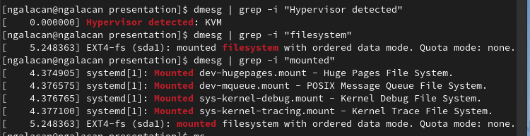

---
## Front matter
title: "Отчет по лабораторной работе №1"
subtitle: "Установка и конфигурация операционной системы на виртуальную машину"
author: "Галацан Николай, НПИбд-01-22"

## Generic otions
lang: ru-RU
toc-title: "Содержание"

## Bibliography
bibliography: bib/cite.bib
csl: pandoc/csl/gost-r-7-0-5-2008-numeric.csl

## Pdf output format
toc: true # Table of contents
toc-depth: 2
lof: true # List of figures
fontsize: 12pt
linestretch: 1.5
papersize: a4
documentclass: scrreprt
## I18n polyglossia
polyglossia-lang:
  name: russian
  options:
	- spelling=modern
	- babelshorthands=true
polyglossia-otherlangs:
  name: english
## I18n babel
babel-lang: russian
babel-otherlangs: english
## Fonts
mainfont: PT Serif
romanfont: PT Serif
sansfont: PT Sans
monofont: PT Mono
mainfontoptions: Ligatures=TeX
romanfontoptions: Ligatures=TeX
sansfontoptions: Ligatures=TeX,Scale=MatchLowercase
monofontoptions: Scale=MatchLowercase,Scale=0.9
## Biblatex
biblatex: true
biblio-style: "gost-numeric"
biblatexoptions:
  - parentracker=true
  - backend=biber
  - hyperref=auto
  - language=auto
  - autolang=other*
  - citestyle=gost-numeric
## Pandoc-crossref LaTeX customization
figureTitle: "Рис."
tableTitle: "Таблица"
listingTitle: "Листинг"
lofTitle: "Список иллюстраций"
lolTitle: "Листинги"
## Misc options
indent: true
header-includes:
  - \usepackage{indentfirst}
  - \usepackage{float} # keep figures where there are in the text
  - \floatplacement{figure}{H} # keep figures where there are in the text
---

# Цель работы

Целью данной работы является приобретение практических навыков установки операционной системы на виртуальную машину, настройки минимально необходимых для дальнейшей работы сервисов.

# Выполнение лабораторной работы

Запускаю VirtualBox для создания виртуальной машины. Перехожу в настройки для проверки месторасположения виртуальных машин. Выбираю *Файл => Свойства => Общие*.
Проверяю соответствие папки, нажимаю «ОК». 

Меняю комбинацию хост-клавиши, которая используется для освобождения курсора мыши, который может захватить виртуальная машина.  Выбираю *Файл => Свойства => Ввод => Виртуальная машина* и произвожу смену.

Приступаю к созданию виртуальной машины. Выбираю *Машина => Создать*.
Указываю имя виртуальной машины (логин в ДК), выбираю тип ОС и версию, проверяю корректность пути для папки машины (рис. @fig:1).

{#fig:1 width=70%}

Указываю размер основной памяти виртуальной машины – 4096 МБ.
Создаю жесткий диск. Выбираю «Создать новый виртуальный жесткий диск» (рис. @fig:2)

{#fig:2 width=70%}

Задаю конфигурацию жесткого диска. Выбираю «VDI» (рис. @fig:3) далее «Динамический виртуальный диск».

{#fig:3 width=70%}

Задаю размер диска – 80 ГБ, проверяю расположение диска, нажимаю
«Создать».

Увеличиваю доступный объем видеопамяти до 128 МБ. Для этого выбираю вкладку *Дисплей => Экран*. Увеличиваю объем и нажимаю «ОК» 

В настройках виртуальной машины во вкладке «Носители» добавляю новый привод оптических дисков и выбираю образ, заранее скачанный с сайта, так как произвожу установку на собственную технику (рис. @fig:4).
Скачано с `https://getfedora.org/ru/workstation/download/`

{#fig:4 width=70%}

Настройка VirtualBox завершена.

Запускаю виртуальную машину: Машина => Запустить. Дожидаюсь конца загрузки, в появившемся окне выбираю «Install to Hard Drive» (рис. @fig:5)

{#fig:5 width=70%}

Выбираю в следующем окне русский язык, настраиваю часовой пояс, выбираю раскладку клавиатуры. Проверяю место установки, проследив за тем, чтобы на диске стояла галочка.
Убедившись, что все настройки проставлены верно, продолжаю. Нажимаю «Начать установку».

Наблюдаю, что ОС загрузилась. Согласно инструкции, выключаю систему. После этого во вкладке «Носители» изымаю образ диска из дисковода, нажавна значок диска и выбрав нужный пункт. В соответствующей строке теперь пусто.

Снова запускаю виртуальную машину (*Машина => Запустить*). Предлагается создать пользователя и пароль. Задаю полное имя и имя пользователя в соответствии с соглашением об именовании (рис. @fig:6) устанавливаю пароль.

{#fig:6 width=70%}

Меняю имя хоста на удовлетворяющее соглашению об именовании. В терминале ввожу `hostnamectl` и проверяю имя хоста. Меняю `fedora` на `ngalacan` и снова проверяю (рис. @fig:7).

{#fig:7 width=70%}

Программное обеспечения для создания документации (pandoc, texlive) было установлено в I семестре и работает исправно. Отчеты и презентации из Markdown генерируются успешно.

# Выводы

Я приобрел практические навыки установки операционной системы на виртуальную машину, ознакомился и научился использовать VirtualBox. В ходе работы были настроены минимально необходимые для дальнейшей работы сервисы, установлено необходимое ПО.

# Ответы на контрольные вопросы

1. Какую информацию содержит учётная запись пользователя?

Имя пользователя, пароль, домашний каталог, идентификационные номера пользователя и группы.

2. Укажите команды терминала и приведите примеры:

* для получения справки по команде - `man`, пример: `man man`;
* для перемещения по файловой системе - `cd`, пример: `cd ~`;
* для просмотра содержимого каталога - `ls`, пример: `ls lab01`;
* для определения объёма каталога - `du`, пример: `du report`;
* для создания / удаления каталогов / файлов - `mkdir`, пример: `mkdir newdir` (для создания каталогов); `touch`, пример: `touch 1.txt` (для создания файлов); `rm`, пример: `rm 1.txt` (для удаления);
* для задания определённых прав на файл / каталог - `chmod`, пример: `chmod 136 readme.txt`;
* для просмотра истории команд - `history`, пример: `history`;

3. Файловая система -  способ организации данных и информации в ОС, часть операционной системы для обеспечения удобного интерфейса для работы пользователя с данными, хранящимися на диске, а также для совместного использования файлов несколькими пользователями.
Примеры: 

Ext2, Ext3, Ext4 и др. - стандартные файловые системы Linux.

FAT12, FAT16, FAT32, NTFS - файловые системы Windows.

XFS - высокопроизводительная файловая система с высокой скоростью работы с большими данными.

4. Как посмотреть, какие файловые системы подмонтированы в ОС?

С помощью команды `mounted`.

5. Как удалить зависший процесс?

С помощью команды `kill`.

# Отчет о выполнении дополнительного задания

Открываю терминал и просматриваю последовательность загрузки системы, выполнив команду `dmesg` (рис. @fig:8).

{#fig:8 width=70%}

Воспользовавшись поиском с помощью команды `dmesg | grep -i "то, что ищем"`, получаю следующую информацию:

* Версия ядра Linux  (`"Linux version"`)
* Частота процессора (введя `"Mhz"`)
* Модель процессора (`"CPU0"`)
* Объем доступной оперативной памяти (введя `"Memory"`, так как ввод `"Memory available"` ничего не выводит, и нахожу нужную строку вручную) (рис. @fig:9)

{#fig:9 width=70%}

* Тип обнаруженного гипервизора (`"Hypervisor detected"`)
* Тип файловой системы корневого раздела (`"filesystem"`)
* Последовательность монтирования файловых систем (`"mounted"`) (рис. [-@fig:10]).

{#fig:10 width=70%}

