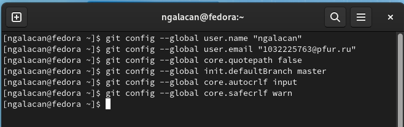
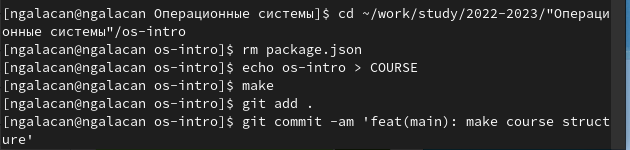
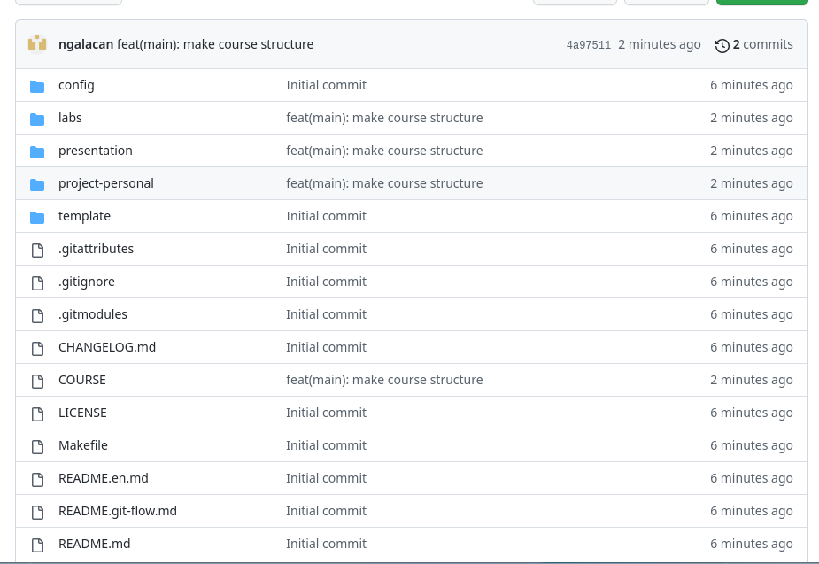

---
## Front matter
lang: ru-RU
title: Презентация по лабораторной работе №2
subtitle: Первоначальная настройка git
author:
  - Галацан Николай
institute:
  - Российский университет дружбы народов, Москва, Россия

## i18n babel
babel-lang: russian
babel-otherlangs: english

## Formatting pdf
toc: false
toc-title: Содержание
slide_level: 2
aspectratio: 169
section-titles: true
theme: metropolis
header-includes:
 - \metroset{progressbar=frametitle,sectionpage=progressbar,numbering=fraction}
 - '\makeatletter'
 - '\beamer@ignorenonframefalse'
 - '\makeatother'
---

# Информация

## Докладчик

  * Галацан Николай
  * 1032225763
  * уч. группа: НПИбд-01-22
  * Факультет физико-математических и естественных наук
  * Российский университет дружбы народов

# Выполнение лабораторной работы

## Актуальность

Системы контроля версий (Version Control System, VCS) применяются при работе нескольких человек над одним проектом. Обычно основное дерево проекта хранится в локальном или удалённом репозитории, к которому настроен доступ для участников проекта. При внесении изменений в содержание проекта система контроля версий позволяет их фиксировать, совмещать изменения, произведённые разными участниками проекта, производить откат к любой более ранней версии проекта, если это требуется.

Система контроля версий Git представляет собой набор программ командной строки. Доступ к ним можно получить из терминала посредством ввода команды git с различными опциями.
Благодаря тому, что Git является распределённой системой контроля версий, резервную копию локального хранилища можно сделать простым копированием или архивацией.

## Актуальность

Настройка git необходима для правильной организации рабочего пространства предмета. Рабочее пространство не нужно создавать вручную, можно воспользоваться рядом команд для подключения git и создания локального и удаленного репозитория. В дальнейшем это сделает работу более удобной и защитит от потерь файлов, так как они будут продублированы в удаленном и локальном репозитории.

## Цели и задачи

 * Изучить идеологию и применение средств контроля версий.
 * Освоить умения по работе с git.

## Выполнение лабораторной работы

Лабораторная работа предполагает создание учетной записи в системе контроля версий git. Для подключения создания удаленного и локального репозиториев требуется произвести предварительную конфигурацию (заполнить данные пользователя), сгенерировать ключи для идентификации (SSH и GPG).

{ width=50% }

## Выполнение лабораторной работы

Далее создается каталог для предмета в соответствии со стандартным именованием: `mkdir -p ~/work/study/2022-2023/"Операционные системы"`, после чего в этот каталог клонируется шаблон удаленного репозитория.

## Выполнение лабораторной работы

После завершения клонирования необходимо удалить лишние файлы и создать необходимые каталоги (для лабораторных работ, для индивидуального проекта и т.д.). Отправка файлов на сервер производит обновление удаленного репозитория и создает структуру курса.

{ width=50% }

 После выполнения всех этапов можно пользоваться удаленным репозиторием и производить коммиты изменений.

## Результаты

* Была настроена система контроля версий git 
* Создано рабочее пространство предмета для работы в соответствии со стандартами, что облегчит выполнение следующих заданий.

{ width=50% }

## Вывод

Была изучена идеология и применение средств контроля версий. Была настроена система git для удобства работы. Приобретены практические навыки по работе с системой
git, изучены все необходимые команды (для загрузки, сохранения изменений, отправки файлов на сервер и др.).

