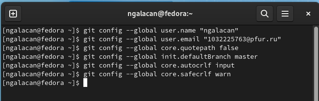

---
## Front matter
title: "Отчет по лабораторной работе №2"
subtitle: "Первоначальная настройка git"
author: "Галацан Николай, НПИбд-01-22"

## Generic otions
lang: ru-RU
toc-title: "Содержание"

## Bibliography
bibliography: bib/cite.bib
csl: pandoc/csl/gost-r-7-0-5-2008-numeric.csl

## Pdf output format
toc: true # Table of contents
toc-depth: 2
lof: true # List of figures
fontsize: 12pt
linestretch: 1.5
papersize: a4
documentclass: scrreprt
## I18n polyglossia
polyglossia-lang:
  name: russian
  options:
	- spelling=modern
	- babelshorthands=true
polyglossia-otherlangs:
  name: english
## I18n babel
babel-lang: russian
babel-otherlangs: english
## Fonts
mainfont: PT Serif
romanfont: PT Serif
sansfont: PT Sans
monofont: PT Mono
mainfontoptions: Ligatures=TeX
romanfontoptions: Ligatures=TeX
sansfontoptions: Ligatures=TeX,Scale=MatchLowercase
monofontoptions: Scale=MatchLowercase,Scale=0.9
## Biblatex
biblatex: true
biblio-style: "gost-numeric"
biblatexoptions:
  - parentracker=true
  - backend=biber
  - hyperref=auto
  - language=auto
  - autolang=other*
  - citestyle=gost-numeric
## Pandoc-crossref LaTeX customization
figureTitle: "Рис."
tableTitle: "Таблица"
listingTitle: "Листинг"
lofTitle: "Список иллюстраций"
lolTitle: "Листинги"
## Misc options
indent: true
header-includes:
  - \usepackage{indentfirst}
  - \usepackage{float} # keep figures where there are in the text
  - \floatplacement{figure}{H} # keep figures where there are in the text
---

# Цель работы

Изучить идеологию и применение средств контроля версий. Освоить умения по работе с git.

# Теоретическое введение

Системы контроля версий (Version Control System, VCS) применяются при работе нескольких человек над одним проектом. 

В классических системах контроля версий используется централизованная модель, предполагающая наличие единого репозитория для хранения файлов. Выполнение большинства функций по управлению версиями осуществляется специальным сервером. Участник проекта (пользователь) перед началом работы посредством определённых команд получает нужную ему версию файлов. После внесения изменений, пользователь размещает новую версию в хранилище. При этом предыдущие версии не удаляются из центрального хранилища и к ним можно вернуться в любой момент. Сервер может сохранять не полную версию изменённых файлов, а производить так называемую дельта-компрессию — сохранять только изменения между последовательными версиями, что позволяет уменьшить объём хранимых данных.

Система контроля версий Git представляет собой набор программ командной строки. Доступ к ним можно получить из терминала посредством ввода команды git с различными опциями.
 
Благодаря тому, что Git является распределённой системой контроля версий, резервную копию локального хранилища можно сделать простым копированием или архивацией.

# Выполнение лабораторной работы

Устанавливаю git:  `dnf install git`

Создаю учетную запись на сайте репозитория Github (https://github.com/) и заполняю основные данные (рис. @fig:11)

{ #fig:11 width=70% }

Делаю предварительную конфигурацию git (рис. @fig:12). Открываю терминал и ввожу команды, указав имя и email владельца репозитория:

`git config --global user.name "ngalacan"`

`git config --global user.email "1032225763@pfur.ru"`

Настраиваю utf-8 в выводе сообщений git:

`git config --global core.quotepath false`

Задаю имя начальной ветки (master):

`git config --global init.defaultBranch master`

Параметр autocrlf:

`git config --global core.autocrlf input`

Параметр safecrlf:

`git config --global core.safecrlf warn`

{ #fig:12 width=70% }


Генерирую ключи SSH для идентификации пользователя на сервере репозиториев (рис. @fig:13).

{ #fig:13 width=70% }

Загружаю открытый ключ на Github. На сайте перехожу *Setting => SSH and
GPG keys => New SSH key*.
Ввожу в терминал `cat ~/.ssh/id_rsa.pub | xclip -sel clip` и копирую ключ. Вставляю в появившееся на сайте поле скопированный ключ и указываю имя (рис. @fig:14).

{ #fig:14 width=70% }

Создаю ключи GPG с помощью команды `gpg --full-generate-key` и выбираю из предложенных опций тип *RSA and RSA*, размер *4096*; срок действия - значение по умолчанию — 0. Заполняю личную информацию (рис. @fig:1).

{ #fig:1 width=70% }

Добавляю ключ GPG на github, предварительно выведя список ключей и скопировав отпечаток приватного ключа (рис. @fig:2, @fig:3).

{ #fig:2 width=70% }

{ #fig:3 width=70% }

Настраиваю автоматические подписи коммитов git (рис. @fig:4).

{ #fig:4 width=70% }

Устанавливаю и настраиваю gh для авторизации в github, привязываю устройство (рис. @fig:6).

{ #fig:6 width=70% }

Создаю через терминал каталог для предмета "Операционные системы" и клонирую репозиторий с помощью команд
```
mkdir -p ~/work/study/2022-2023/"Операционные системы"
cd ~/work/study/2022-2023/"Операционные системы"
gh repo create study_2022-2023_os-intro --template=yamadharma/course-directory-student-template --public
git clone --recursive git@github.com:<owner>/study_2022-2023_os-intro.git os-intro
```
(рис. @fig:7).

{ #fig:7 width=70% }

Перехожу в каталог курса и удаляю лишние файлы, используя команды `cd` и `rm`. Создаю необходимые каталоги и отправляю файлы на сервер (рис. @fig:8).

{ #fig:8 width=70% }

Проверяю, отправились ли файлы на github (рис. @fig:9).

{ #fig:9 width=70% }

Файлы соответствуют.


# Выводы

Была изучена идеология и применение средств контроля версий. Была настроена система git. Приобретены практические навыки по работе с системой git.

# Ответы на контрольные вопросы

1. Что такое системы контроля версий (VCS) и для решения каких задач они предназначаются?

Системы контроля версий (Version Control System, VCS) - система регистрации изменений в одном или нескольких файлах. Применяются при работе нескольких человек над одним проектом. 

2. Объясните следующие понятия VCS и их отношения: хранилище, commit, история, рабочая копия.

Хранилище - область на локальном или удаленном репозитории, где хранятся файлы проекта. 

Сommit - внесение правок или изменение файлов в репозитории.

История - история изменений в репозитории.

Рабочая копия - копия главного удаленного репозитория, в которой работает пользователь.

3. Что представляют собой и чем отличаются централизованные и децентрализованные VCS? Приведите примеры VCS каждого вида.

Централизованная модель предполагает наличие единого репозитория для хранения файлов. В отличие от централизованных, в распределённых (децентрализованных) системах контроля версий центральный репозиторий не является обязательным. Примеры централизованных VCS: CVS, Subversion; примеры децентрализованных: Git, Bazaar.

4. Опишите действия с VCS при единоличной работе с хранилищем.

Сохранение файлов на удаленном репозитории, коммит, отправка на сервер и др.

5. Опишите порядок работы с общим хранилищем VCS.


Обновление до текущей версии репозитория (например, git pull), сохранение файлов на удаленном репозитории, коммит, отправка на сервер и др.

6. Каковы основные задачи, решаемые инструментальным средством git?

Объединение изменений, выбор нужной версии, отменение изменений или блокировка и др.

7. Назовите и дайте краткую характеристику командам git.

Создание основного дерева репозитория: git init

Получение обновлений текущего дерева из центрального репозитория: git pull

Отправка всех произведённых изменений локального дерева в центральный репозиторий: git push

Просмотр списка изменённых файлов в текущей директории: git status

добавить все изменённые и/или созданные файлы и/или каталоги: git add .

сохранить все добавленные изменения и все изменённые файлы: git commit -am 'Описание коммита'


8. Приведите примеры использования при работе с локальным и удалённым репозиториями.

git pull - для обновления локального репозитория.

git status - для просмотра изменений локального репозитория.

git add . - для добавления всех изменений в удаленный репозиторий.

git push - для отправки всех изменений на удаленный репозиторий.

9. Что такое и зачем могут быть нужны ветви (branches)?

Ветви - последовательность коммитов и изменений. Они нужны для работы  нескольких пользователей над одним проектом.

10. Как и зачем можно игнорировать некоторые файлы при commit?

С помощью команды `git rm имена_файлов`. Это нужно для того, чтобы файл не отправился в удаленный репозиторий (например, если работа не завершена или он не нужен, то и в коммит он попасть не должен).


