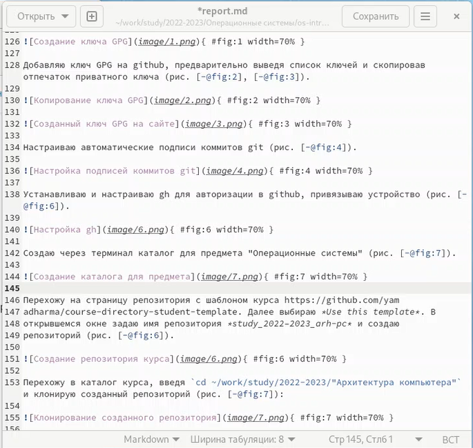
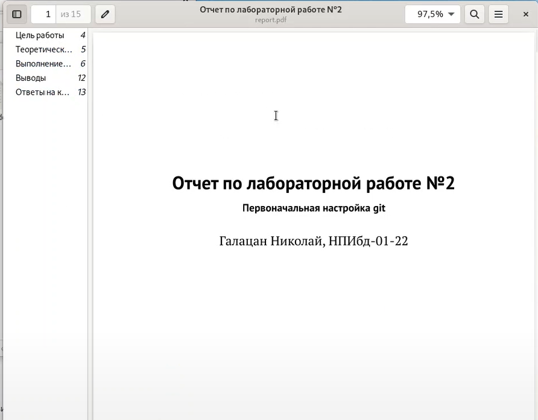

---
## Front matter
lang: ru-RU
title: Презентация по лабораторной работе №3
subtitle: Markdown
author:
  - Галацан Николай
institute:
  - Российский университет дружбы народов, Москва, Россия

## i18n babel
babel-lang: russian
babel-otherlangs: english

## Formatting pdf
toc: false
toc-title: Содержание
slide_level: 2
aspectratio: 169
section-titles: true
theme: metropolis
header-includes:
 - \metroset{progressbar=frametitle,sectionpage=progressbar,numbering=fraction}
 - '\makeatletter'
 - '\beamer@ignorenonframefalse'
 - '\makeatother'
---

## Докладчик

  * Галацан Николай
  * 1032225763
  * уч. группа: НПИбд-01-22
  * Факультет физико-математических и естественных наук
  * Российский университет дружбы народов
  
## Актуальность

Markdown — облегчённый язык разметки, созданный с целью обозначения форматирования в простом тексте, с максимальным сохранением его читаемости человеком, и пригодный для машинного преобразования в языки для продвинутых публикаций. Использование данного языка упрощает подготовку и работу с документами. Информация редактируется как простой текст и после преобразуется в необходимые форматы.

## Цели и задачи

Научиться оформлять отчёты и презентации с помощью легковесного языка разметки Markdown

## Материалы и методы

- Использование Makefile для компиляции документов
- Использование необходимого ПО (pandoc, texlive) для преобразования в форматы docx и pdf

## Выполнение лабораторной работы

Для создания отчетов в формате Markdown необходимо открыть для редактирования файл `report.md` в соответствующем каталоге с помощью команды `gedit report.md`.

Все изменения вносятся в данный файл.

## Прикрепление изображений

Для прикрепления изображений необходимо разместить все файлы в каталоге `image` соответствующей лабораторной работы. Для прикрепления изображений указывается их адрес в следующем формате:
```

{ #fig:fig1 width=70% }
```

## Прикрепление изображений

{ width=60% }

## Форматирование текста

- Участки кода заключаются в  \` \`
- Жирный текст заключается в двойные звездочки
- Курсивный текст заключается в одинарные звездочки

## Результаты

После проведения компиляции с использованием Makefile получаем отчет в форматах docx и pdf.

{ width=50% }

## Вывод

Было изучено оформление отчетов с помощью легковесного языка разметки
Markdown. Освоен синтаксис языка и команды для прикрепления изображений,
форматирования текста, организации списков и др


