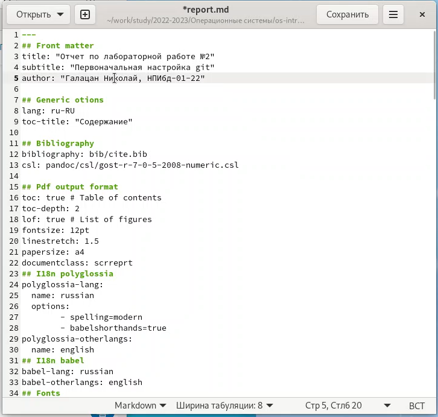

---
## Front matter
title: "Отчет по лабораторной работе №3"
subtitle: "Markdown"
author: "Галацан Николай, НПИбд-01-22"

## Generic otions
lang: ru-RU
toc-title: "Содержание"

## Bibliography
bibliography: bib/cite.bib
csl: pandoc/csl/gost-r-7-0-5-2008-numeric.csl

## Pdf output format
toc: true # Table of contents
toc-depth: 2
lof: true # List of figures
fontsize: 12pt
linestretch: 1.5
papersize: a4
documentclass: scrreprt
## I18n polyglossia
polyglossia-lang:
  name: russian
  options:
	- spelling=modern
	- babelshorthands=true
polyglossia-otherlangs:
  name: english
## I18n babel
babel-lang: russian
babel-otherlangs: english
## Fonts
mainfont: PT Serif
romanfont: PT Serif
sansfont: PT Sans
monofont: PT Mono
mainfontoptions: Ligatures=TeX
romanfontoptions: Ligatures=TeX
sansfontoptions: Ligatures=TeX,Scale=MatchLowercase
monofontoptions: Scale=MatchLowercase,Scale=0.9
## Biblatex
biblatex: true
biblio-style: "gost-numeric"
biblatexoptions:
  - parentracker=true
  - backend=biber
  - hyperref=auto
  - language=auto
  - autolang=other*
  - citestyle=gost-numeric
## Pandoc-crossref LaTeX customization
figureTitle: "Рис."
tableTitle: "Таблица"
listingTitle: "Листинг"
lofTitle: "Список иллюстраций"
lolTitle: "Листинги"
## Misc options
indent: true
header-includes:
  - \usepackage{indentfirst}
  - \usepackage{float} # keep figures where there are in the text
  - \floatplacement{figure}{H} # keep figures where there are in the text
---

# Цель работы

Научиться оформлять отчёты с помощью легковесного языка разметки Markdown.

# Выполнение лабораторной работы

**Задание**: Сделать отчет по предыдущей лабораторной работе в формате Markdown.

С помощью команды `cd ~/work/study/2022-2023/"Операционные системы"/os-intro/labs/lab02/report` перехожу в папку отчета и открываю для редактирования файл отчета: `gedit report.md`

Редактирую его (рис. @fig:1).

{ #fig:1 width=70% }

Все скриншоты размещаю в каталоге `image` соответствующей лабораторной работы. В необходимых местах прикрепляю скриншоты, указав адрес изображения в следующем формате (рис. @fig:2):

```
{ #fig:fig1 width=70% }
```
{ #fig:2 width=70% }

Выделяю участки кода с помощью символов \`   \`, жирный текст заключаю в двойные звездочки, курсивный - в одинарные. После окончания редактирования отчета компилирую его в форматах *docx* и *pdf* с помощью команды `make`. Открываю файл для проверки (рис. @fig:3).

{ #fig:3 width=70% }

Подготовка отчета завершена успешно.

# Выводы

Было изучено оформление отчетов с помощью легковесного языка разметки Markdown. Освоен синтаксис языка и команды для прикрепления изображений, форматирования текста, организации списков и др.


