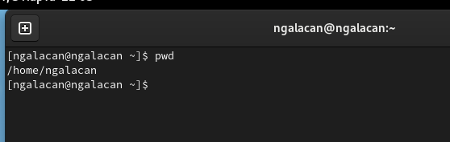
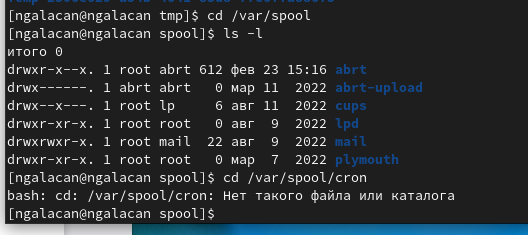
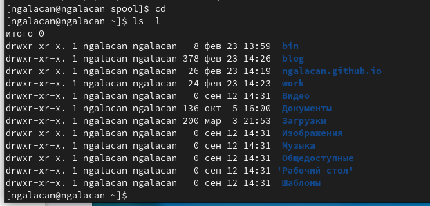
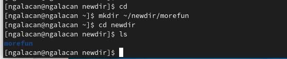
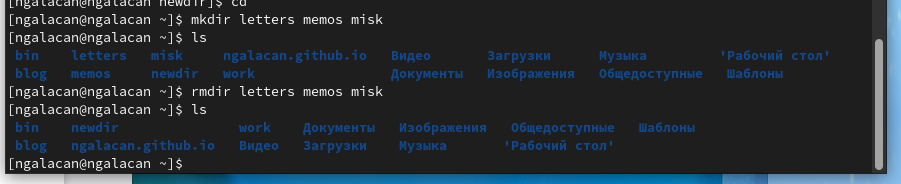
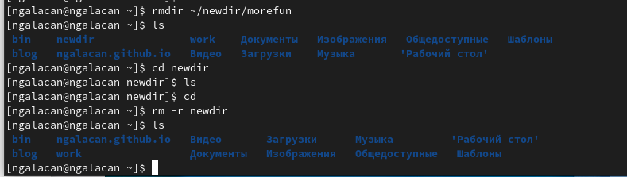
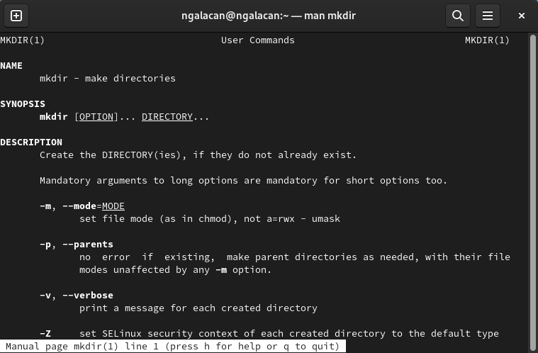
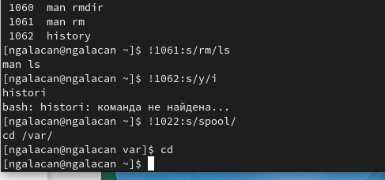

---
## Front matter
lang: ru-RU
title: Презентация по лабораторной работе №4
subtitle: Основы интерфейса взаимодействия пользователя с системой Unix на уровне командной строки
author:
  - Галацан Николай
institute:
  - Российский университет дружбы народов, Москва, Россия

## i18n babel
babel-lang: russian
babel-otherlangs: english

## Formatting pdf
toc: false
toc-title: Содержание
slide_level: 2
aspectratio: 169
section-titles: true
theme: metropolis
header-includes:
 - \metroset{progressbar=frametitle,sectionpage=progressbar,numbering=fraction}
 - '\makeatletter'
 - '\beamer@ignorenonframefalse'
 - '\makeatother'
---

## Докладчик

  * Галацан Николай
  * 1032225763
  * уч. группа: НПИбд-01-22
  * Факультет физико-математических и естественных наук
  * Российский университет дружбы народов

## Актуальность

- Изучение основ интерфейса взаимодействия с системой необходимо для дальнейшей работы в терминале Linux.
- Приобретение практических навыков по работе через терминал - важная составляющая для того, чтобы стать уверенным пользователем системы.

## Цели и задачи

Приобретение практических навыков взаимодействия пользователя с системой посредством командной строки.

## Выполнение лабораторной работы

**Команда pwd**. Для определения абсолютного пути к текущему каталогу используется
команда pwd (print working directory).

{ #fig:1 width=70% }

## Выполнение лабораторной работы

**Команда cd**. Команда cd используется для перемещения по файловой системе опера-
ционной системы типа Linux.

**Команда ls**. Команда ls используется для просмотра содержимого каталога.

{#fig:2 width=70%} 

## Выполнение лабораторной работы

Использую опцию `ls -l` и получаю развернутое описание файлов домашнего каталога.

{#fig:3 width=70%} 

## Выполнение лабораторной работы

**Команда mkdir**. Команда mkdir используется для создания каталогов.

Создаю в домашнем каталоге новый каталог с именем `newdir`, в каталоге `~/newdir` создаю новый каталог с именем `morefun`, проверяю.

{#fig:4 width=70%} 

## Выполнение лабораторной работы

**Команда rmdir**. Команда rmdir используется для удаления пустых каталогов.

{#fig:5 width=70%} 

## Выполнение лабораторной работы

**Команда rm**. Команда rm используется для удаления файлов и/или каталогов.

Для удаления непустых каталогов используется команда `rm -r`.
Удаляю каталог `~/newdir/morefun` из домашнего каталога. Проверяю.

{#fig:6 width=70%} 

## Выполнение лабораторной работы

**Команда man**. Команда man используется для просмотра в диалоговом режиме руководства (manual) по основным командам операционной системы типа Linux.

{#fig:7 width=40%} 

Основные опции: `-p` - создание вложенных каталогов, `-v` - для вывода сообщения о каждом созданном каталоге.

## Выполнение лабораторной работы

**Команда history**. Используется для вывода на экран списка ранее выполненных команд. Формат для модификации команд: `!<номер_команды>:s/<что_меняем>/<на_что_меняем>`. 

Например, чтобы поменять в команде `history` с номером 1062 букву "y" на "i" ввожу `!1062:s/y/i`. В результате получаю команду `histori`, которой не существует, о чем говорится в ошибке.

{#fig:8 width=40%} 

## Результаты

Были проделаны различные операции с использованием различных команд с их опциями. Созданы и удалены каталоги.

## Вывод

В ходе выполнения работы были приобретены практические навыки взаимодействия пользователя с системой посредством командной строки. Были изучены команды для перехода в каталог, вывода содержимого, создания и удаления каталогов и др., а также их опции.

