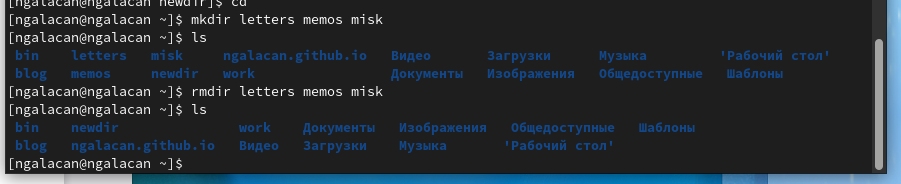

---
## Front matter
title: "Отчет по лабораторной работе №4"
subtitle: "Основы интерфейса взаимодействия пользователя с системой Unix на уровне командной строки"
author: "Галацан Николай, НПИбд-01-22"

## Generic otions
lang: ru-RU
toc-title: "Содержание"

## Bibliography
bibliography: bib/cite.bib
csl: pandoc/csl/gost-r-7-0-5-2008-numeric.csl

## Pdf output format
toc: true # Table of contents
toc-depth: 2
lof: true # List of figures
fontsize: 12pt
linestretch: 1.5
papersize: a4
documentclass: scrreprt
## I18n polyglossia
polyglossia-lang:
  name: russian
  options:
	- spelling=modern
	- babelshorthands=true
polyglossia-otherlangs:
  name: english
## I18n babel
babel-lang: russian
babel-otherlangs: english
## Fonts
mainfont: PT Serif
romanfont: PT Serif
sansfont: PT Sans
monofont: PT Mono
mainfontoptions: Ligatures=TeX
romanfontoptions: Ligatures=TeX
sansfontoptions: Ligatures=TeX,Scale=MatchLowercase
monofontoptions: Scale=MatchLowercase,Scale=0.9
## Biblatex
biblatex: true
biblio-style: "gost-numeric"
biblatexoptions:
  - parentracker=true
  - backend=biber
  - hyperref=auto
  - language=auto
  - autolang=other*
  - citestyle=gost-numeric
## Pandoc-crossref LaTeX customization
figureTitle: "Рис."
tableTitle: "Таблица"
listingTitle: "Листинг"
lofTitle: "Список иллюстраций"
lolTitle: "Листинги"
## Misc options
indent: true
header-includes:
  - \usepackage{indentfirst}
  - \usepackage{float} # keep figures where there are in the text
  - \floatplacement{figure}{H} # keep figures where there are in the text
---

# Цель работы

Приобретение практических навыков взаимодействия пользователя с системой посредством командной строки.

# Задание

1. Определите полное имя вашего домашнего каталога. Далее относительно этого ката-
лога будут выполняться последующие упражнения.
2. Выполните следующие действия:
	
	2.1. Перейдите в каталог /tmp.
	
	2.2. Выведите на экран содержимое каталога /tmp. Для этого используйте команду ls
с различными опциями. Поясните разницу в выводимой на экран информации.
	
	2.3. Определите, есть ли в каталоге /var/spool подкаталог с именем cron?
	
	2.4. Перейдите в Ваш домашний каталог и выведите на экран его содержимое. Опре-
делите, кто является владельцем файлов и подкаталогов?

3. Выполните следующие действия:
	
	3.1. В домашнем каталоге создайте новый каталог с именем newdir.
	
	3.2. В каталоге ~/newdir создайте новый каталог с именем morefun.
	
	3.3. В домашнем каталоге создайте одной командой три новых каталога с именами
letters, memos, misk. Затем удалите эти каталоги одной командой.
	
	3.4. Попробуйте удалить ранее созданный каталог ~/newdir командой rm. Проверьте,
был ли каталог удалён.
	
	3.5. Удалите каталог ~/newdir/morefun из домашнего каталога. Проверьте, был ли
каталог удалён.

4. С помощью команды man определите, какую опцию команды ls нужно использо-
вать для просмотра содержимое не только указанного каталога, но и подкаталогов,
входящих в него.
5. С помощью команды man определите набор опций команды ls, позволяющий отсорти-
ровать по времени последнего изменения выводимый список содержимого каталога
с развёрнутым описанием файлов.
6. Используйте команду man для просмотра описания следующих команд: cd, pwd, mkdir,
rmdir, rm. Поясните основные опции этих команд.
7. Используя информацию, полученную при помощи команды history, выполните мо-
дификацию и исполнение нескольких команд из буфера команд

# Теоретическое введение

**Формат команды.** Командой в операционной системе называется записанный по
специальным правилам текст (возможно с аргументами), представляющий собой ука-
зание на выполнение какой-либо функций (или действий) в операционной системе.
Обычно первым словом идёт имя команды, остальной текст — аргументы или опции,
конкретизирующие действие.
Общий формат команд можно представить следующим образом:
`<имя_команды><разделитель><аргументы>`

**Команда man**. Команда man используется для просмотра (оперативная помощь) в диа-
логовом режиме руководства (manual) по основным командам операционной системы
типа Linux.
Формат команды:
`man <команда>`

**Команда **cd**. Команда cd используется для перемещения по файловой системе опера-
ционной системы типа Linux.
Файловая система ОС типа Linux — иерархическая система каталогов,
подкаталогов и файлов, которые обычно организованы и сгруппированы по функ-
циональному признаку. Самый верхний каталог в иерархии называется корневым
и обозначается символом /. Корневой каталог содержит системные файлы и другие
каталоги.
Формат команды:
`cd [путь_к_каталогу]`

**Команда pwd**. Для определения абсолютного пути к текущему каталогу используется
команда `pwd` (print working directory).

**Команда ls**. Команда ls используется для просмотра содержимого каталога.
Формат команды:
`ls [-опции] [путь]`

**Команда mkdir**. Команда mkdir используется для создания каталогов.
Формат команды:
`mkdir имя_каталога1 [имя_каталога2...]`

**Команда rm**. Команда rm используется для удаления файлов и/или каталогов.
Формат команды:
`rm [-опции] [файл]`

**Команда history**. Используется для вывода на экран списка ранее выполненных команд. Выводимые на экран команды в списке нумеруются. К любой команде из выведенного на экран списка можно обратиться по её номеру в списке, воспользовавшись конструкцией `!<номер_команды>`

# Выполнение лабораторной работы

1. Определяю полное имя домашнего каталога с помощью команды `pwd` (рис. @fig:1).

{#fig:1 width=70%}

2. 

2.1. Перехожу в каталог `/tmp`.
	
2.2. Вывожу содержимое каталога с помощью `ls`, применяя разные опции (рис. @fig:2, рис. @fig:3).

{#fig:2 width=80%}

{#fig:3 width=80%}

При использовании `ls -a` на экран выводятся все файлы, в том числе скрытые. При использовании `ls -alF` на экран выводятся все файлы, в том числе скрытые, а также информация о файлах (права доступа, владелец, дата создания и т.п.) и их тип. 

2.3. Определяю, есть ли в каталоге `/var/spool` подкаталог с именем `cron`. Для этого перехожу в этот каталог, вывожу содержимое и убеждаюсь в отсутствии. Также попытаюсь зайти в этот каталог напрямую (рис. @fig:4).

{#fig:4 width=70%} 

2.4. Перехожу в домашний каталог, вывожу содержимое. Определяю владельца с помощью `ls -l`: `ngalacan` (рис. @fig:5).

{#fig:5 width=70%} 

3. 

3.1. Создаю в домашнем каталоге новый каталог с именем `newdir`.

3.2. В каталоге `~/newdir` создаю новый каталог с именем `morefun`, проверяю (рис. @fig:6).

{#fig:6 width=70%} 

3.3. В домашнем каталоге создаю командой `mkdir` три новых каталога с именами `letters`, `memos`, `misk`. Затем удаляю эти каталоги командой `rmdir` и проверяю (рис. @fig:7).

{#fig:7 width=70%} 

3.4. Пробую удалить каталог `newdir` командой `rm`. Так как каталог не пустой, выводится сообщение об ошибке. Для удаления непустых каталогов нужно использовать `rm -r`, где удаление происходит рекурсивно.
	
3.5. Удаляю каталог `~/newdir/morefun` из домашнего каталога. Проверяю (рис. @fig:8).

{#fig:8 width=70%} 

4. Определяем с помощью команды `man`, какую опцию команды  `ls` нужно использовать для просмотра содержимого не только указанного каталога, но и подкаталогов, входящих в него. Это опция `-R` (рис. @fig:9).

{#fig:9 width=70%} 

5. Определяем с помощью команды `man`, какие опции команды  `ls` нужно использовать, чтобы отсортировать по времени изменения выводимый список содержимого каталога с развернутым описанием файлов. Это опции `-c -lt` (рис. @fig:10).

{#fig:10 width=70%} 

6. Используем команду `man` для просмотра описания некоторых команд (рис. @fig:11, рис. @fig:12, рис. @fig:13, рис. @fig:14, рис. @fig:15).

{#fig:11 width=70%} 

Основные опции: `-L`, `-P [-e]`.

{#fig:12 width=70%} 

 Основные опции: `-L`, `-P`.
 
{#fig:13 width=70%} 

Основные опции: `-p` - создание вложенных каталогов, `-v` - для вывода сообщения о каждом созданном каталоге.

{#fig:14 width=70%} 

Основные опции: `-p` - удаление вложенных пустых каталогов, `-v` - для вывода сообщения о каждом обработанном каталоге.

{#fig:15 width=70%} 

Основные опции: `-i` - запрос подтверждения на удаление, `-r` - для удаления непустых каталогов.

7. Выполняю модификацию и исполнение команд, полученных при помощи команды `history`.  

Формат: `!<номер_команды>:s/<что_меняем>/<на_что_меняем>`. Например, чтобы поменять в команде `history` с номером 1062 букву "y" на "i" ввожу `!1062:s/y/i`. В результате получаю команду `histori`, которой не существует, о чем говорится в ошибке (рис. @fig:16)

{#fig:16 width=70%} 

# Выводы

В ходе выполнения работы были приобретены практические навыки взаимодействия пользователя с системой посредством командной строки. Были изучены команды для перехода в каталог, вывода содержимого, создания и удаления каталогов и др., а также их опции.

# Ответы на контрольные вопросы

1. Что такое командная строка?

Интерфейс для взаимодействия пользователя с системой посредством построчного ввода команд.

2. При помощи какой команды можно определить абсолютный путь текущего каталога?
Приведите пример.

При помощи `pwd`. Пример: `pwd`.

3. При помощи какой команды и каких опций можно определить только тип файлов
и их имена в текущем каталоге? Приведите примеры.

При помощи `ls -F`. Пример: `ls -F`.

4. Каким образом отобразить информацию о скрытых файлах? Приведите примеры.

При помощи `ls -a`. Пример: `ls -a`.

5. При помощи каких команд можно удалить файл и каталог? Можно ли это сделать
одной и той же командой? Приведите примеры.

При помощи `rmdir` можно удалить пустой каталог. Пример: `rmdir newdir`. При помощи `rm -r` можно удалить непустой каталог. Пример: `rm -r newdir`. При помощи `rm` можно удалить файл. Пример: `rm file.txt`.

6. Каким образом можно вывести информацию о последних выполненных пользователем командах?

При помощи `history`. 

7. Как воспользоваться историей команд для их модифицированного выполнения? При-
ведите примеры.

Формат: `!<номер_команды>:s/<что_меняем>/<на_что_меняем>`. Например, чтобы поменять в команде `history` с номером 1062 букву "y" на "i" ввожу `!1062:s/y/i`. В результате получаю команду `histori`.

8. Приведите примеры запуска нескольких команд в одной строке.

Нужно использовать ";". Пример: `cd; ls`.

9. Дайте определение и приведите пример символов экранирования.

Экранирование символов — замена в тексте управляющих символов на соответствующие текстовые подстановки. Один из символов экранирования - обратный слэш "\".

10. Охарактеризуйте вывод информации на экран после выполнения команды ls с опцией l.

Чтобы вывести на экран подробную информацию о файлах и каталогах, необходимо
использовать опцию l. При этом о каждом файле и каталоге будет выведена следующая
информация: тип файла, право доступа, число ссылок, владелец, размер, дата последней ревизии, имя файла или каталога.

11. Что такое относительный путь к файлу? Приведите примеры использования относительного и абсолютного пути при выполнении какой-либо команды.

Относительный путь к файлу - путь относительно текущего каталога. Относительный путь используем, если работаем с файлами или подкаталогами внутри текущего. Абсолютный путь - полный путь к текущему файлу или каталогу, начиная от корневого. Примеры: `cd newdir` - относительный путь, `cd /home/ngalacan//newdir` - абсолютный путь.

12. Как получить информацию об интересующей вас команде?

При помощи `man`.

13. Какая клавиша или комбинация клавиш служит для автоматического дополнения
вводимых команд?

`Tab`

