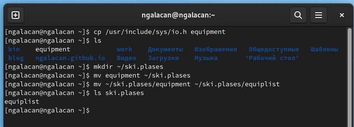
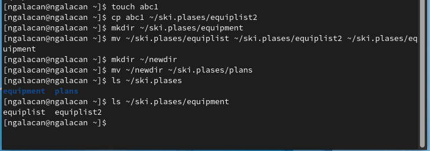
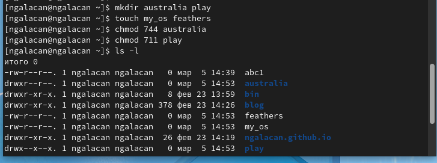
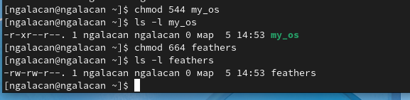
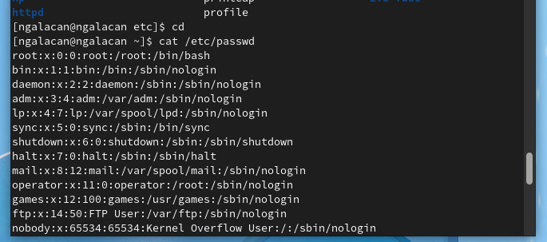
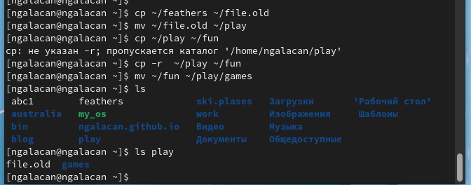
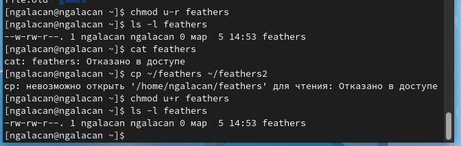
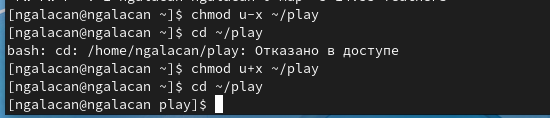
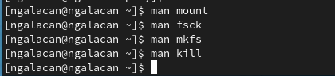

---
## Front matter
lang: ru-RU
title: Презентация по лабораторной работе №5
subtitle: Анализ файловой структуры UNIX. Команды для работы с файлами и каталогами
author:
  - Галацан Николай
institute:
  - Российский университет дружбы народов, Москва, Россия
  
## i18n babel
babel-lang: russian
babel-otherlangs: english

## Formatting pdf
toc: false
toc-title: Содержание
slide_level: 2
aspectratio: 169
section-titles: true
theme: metropolis
header-includes:
 - \metroset{progressbar=frametitle,sectionpage=progressbar,numbering=fraction}
 - '\makeatletter'
 - '\beamer@ignorenonframefalse'
 - '\makeatother'
---

## Докладчик

  * Галацан Николай
  * 1032225763
  * уч. группа: НПИбд-01-22
  * Факультет физико-математических и естественных наук
  * Российский университет дружбы народов

## Актуальность

Выполнение лабораторной работы позволит приобрести практические навыки работы с файлами, с каталогами, правами доступа на уровне командной строки. Наличие таких навыков упрощает дальнейшее взаимодействие с системой.

## Цель работы

Ознакомление с файловой системой Linux, её структурой, именами и содержанием
каталогов. Приобретение практических навыков по применению команд для работы
с файлами и каталогами, по управлению процессами (и работами), по проверке исполь-
зования диска и обслуживанию файловой системы

## Выполнение лабораторной работы

1. Выполняю все примеры, приведенные в первой части лабораторной работы.

2. Изучаю команды для создания, копирования файлов, перемещения и переименования файлов. Произвожу различные манипуляции с файлами и проверяю правильность

:::::::::::::: {.columns align=center}
::: {.column width="50%"}

{#fig:1 width=100%}

:::
::: {.column width="50%"}

{#fig:2 width=100%}

:::
::::::::::::::

## Выполнение лабораторной работы

3. Изучаю применение команды `chmod` для изменения прав доступа. Использую цифровую запись прав доступа согласно табл. 5.2. в инструкции. Использование цифровой записи позволяет напрямую предоставить необходимые права вводом всего одной команды. Проверяю с помощью `ls -l`

:::::::::::::: {.columns align=center}
::: {.column width="50%"}

{#fig:3 width=100%}

:::
::: {.column width="50%"}

{#fig:4 width=100%}

:::
::::::::::::::

## Выполнение лабораторной работы

4. Применяю команды для просмотра содержимого файлов, копирования под новым именем, перемещения и переименования файлов, вывода содержимого, а также для изменения прав доступа.

:::::::::::::: {.columns align=center}
::: {.column width="50%"}

{#fig:5 width=100%}

:::
::: {.column width="50%"}

{#fig:6 width=100%}

:::
::::::::::::::

## Выполнение лабораторной работы
 
{#fig:7 width=70%}

{#fig:8 width=70%}
 
## Выполнение лабораторной работы

5. Читаю `man` по командам  `mount`, `fsck`, `mkfs`, `kill`.

{#fig:15 width=60%}

## Выполнение лабораторной работы

Команда `mount` служит для просмотра используемых в операционной системе файловых систем.

С помощью команды `fsck` можно проверить (а в ряде случаев восстановить) целостность файловой системы, указав в аргументе имя устройства, к которому подключена ФС.

С помощью команды `mkfs` можно создать файловую систему. В качестве аргумента `filesys` для файловой системы может выступать или название устройства (например, `/dev/hda1`, `/dev/sdb2`) или точка монтирования (например, `/`, `/usr`, `/home`). 

Команда `kill` служит для завершения процессов. Команда отправляет сигнал процессу(-ам), указанному с помощью идентификатора процесса. По умолчанию утилита `kill` отправляет сигнал `SIGTERM`.

## Вывод

Была изучена файловая система Linux, её структура, имена и содержание каталогов. Приобретены практические навыки по применению команд для работы с файлами и каталогами, по управлению процессами (и работами), по проверке использования диска и обслуживанию файловой системы

