---
## Front matter
title: "Отчет по лабораторной работе №5"
subtitle: "Анализ файловой структуры UNIX. Команды для работы с файлами и каталогами"
author: "Галацан Николай, НПИбд-01-22"

## Generic otions
lang: ru-RU
toc-title: "Содержание"

## Bibliography
bibliography: bib/cite.bib
csl: pandoc/csl/gost-r-7-0-5-2008-numeric.csl

## Pdf output format
toc: true # Table of contents
toc-depth: 2
lof: true # List of figures
fontsize: 12pt
linestretch: 1.5
papersize: a4
documentclass: scrreprt
## I18n polyglossia
polyglossia-lang:
  name: russian
  options:
	- spelling=modern
	- babelshorthands=true
polyglossia-otherlangs:
  name: english
## I18n babel
babel-lang: russian
babel-otherlangs: english
## Fonts
mainfont: PT Serif
romanfont: PT Serif
sansfont: PT Sans
monofont: PT Mono
mainfontoptions: Ligatures=TeX
romanfontoptions: Ligatures=TeX
sansfontoptions: Ligatures=TeX,Scale=MatchLowercase
monofontoptions: Scale=MatchLowercase,Scale=0.9
## Biblatex
biblatex: true
biblio-style: "gost-numeric"
biblatexoptions:
  - parentracker=true
  - backend=biber
  - hyperref=auto
  - language=auto
  - autolang=other*
  - citestyle=gost-numeric
## Pandoc-crossref LaTeX customization
figureTitle: "Рис."
tableTitle: "Таблица"
listingTitle: "Листинг"
lofTitle: "Список иллюстраций"
lolTitle: "Листинги"
## Misc options
indent: true
header-includes:
  - \usepackage{indentfirst}
  - \usepackage{float} # keep figures where there are in the text
  - \floatplacement{figure}{H} # keep figures where there are in the text
---

# Цель работы

Ознакомление с файловой системой Linux, её структурой, именами и содержанием
каталогов. Приобретение практических навыков по применению команд для работы
с файлами и каталогами, по управлению процессами (и работами), по проверке исполь-
зования диска и обслуживанию файловой системы

# Задание

1. Выполните все примеры, приведённые в первой части описания лабораторной работы.

2. Выполните следующие действия, зафиксировав в отчёте по лабораторной работе
используемые при этом команды и результаты их выполнения:

2.1. Скопируйте файл /usr/include/sys/io.h в домашний каталог и назовите его
equipment. Если файла io.h нет, то используйте любой другой файл в каталоге
/usr/include/sys/ вместо него.

2.2. В домашнем каталоге создайте директорию ~/ski.plases.

2.3. Переместите файл equipment в каталог ~/ski.plases.

2.4. Переименуйте файл ~/ski.plases/equipment в ~/ski.plases/equiplist.

2.5. Создайте в домашнем каталоге файл abc1 и скопируйте его в каталог ~/ski.plases, назовите его equiplist2.

2.6. Создайте каталог с именем equipment в каталоге ~/ski.plases.

2.7. Переместите файлы ~/ski.plases/equiplist и equiplist2 в каталог ~/ski.plases/equipment.

2.8. Создайте и переместите каталог ~/newdir в каталог ~/ski.plases и назовите
его plans.

3. Определите опции команды chmod, необходимые для того, чтобы присвоить перечис-
ленным ниже файлам выделенные права доступа, считая, что в начале таких прав
нет:
```
3.1. drwxr--r-- ... australia
3.2. drwx--x--x ... play
3.3. -r-xr--r-- ... my_os
3.4. -rw-rw-r-- ... feathers
```

При необходимости создайте нужные файлы.

4. Проделайте приведённые ниже упражнения, записывая в отчёт по лабораторной работе используемые при этом команды:

4.1. Просмотрите содержимое файла /etc/password.

4.2. Скопируйте файл ~/feathers в файл ~/file.old.

4.3. Переместите файл ~/file.old в каталог ~/play.

4.4. Скопируйте каталог ~/play в каталог ~/fun.

4.5. Переместите каталог ~/fun в каталог ~/play и назовите его games.

4.6. Лишите владельца файла ~/feathers права на чтение.

4.7. Что произойдёт, если вы попытаетесь просмотреть файл ~/feathers командой
cat?

4.8. Что произойдёт, если вы попытаетесь скопировать файл ~/feathers?

4.9. Дайте владельцу файла ~/feathers право на чтение.

4.10. Лишите владельца каталога ~/play права на выполнение.

4.11. Перейдите в каталог ~/play. Что произошло?

4.12. Дайте владельцу каталога ~/play право на выполнение.

5. Прочитайте man по командам mount, fsck, mkfs, kill и кратко их охарактеризуйте,
приведя примеры.


# Теоретическое введение

Для создания текстового файла можно использовать команду `touch`.
Формат команды: `touch имя-файла`

Для просмотра файлов небольшого размера можно использовать команду `cat`.
Формат команды: `cat имя-файла`

Команда `cp` используется для копирования файлов и каталогов. Формат команды: `cp [-опции] исходный_файл целевой_файл`

Опция `i` в команде `cp` выведет на экран запрос подтверждения о перезаписи файла.
Для рекурсивного копирования каталогов, содержащих файлы, используется команда
`cp` с опцией `r`.

Команды `mv` и `mvdir` предназначены для перемещения и переименования файлов
и каталогов. Формат команды: `mv [-опции] старый_файл новый_файл` Если необходим запрос подтверждения о перезаписи файла, то нужно использовать
опцию `i`.

Каждый файл или каталог имеет права доступа. В сведениях о файле или каталоге указываются:
- тип файла (символ (-) обозначает файл, а символ (d) — каталог);

- права для владельца файла (r — разрешено чтение, w — разрешена запись, x — разре-
шено выполнение, - — право доступа отсутствует);

- права для членов группы (r — разрешено чтение, w — разрешена запись, x — разрешено
выполнение, - — право доступа отсутствует);

- права для всех остальных (r — разрешено чтение, w — разрешена запись, x — разрешено
выполнение, - — право доступа отсутствует)

Права доступа к файлу или каталогу можно изменить, воспользовавшись командой `chmod`. Сделать это может владелец файла (или каталога) или пользователь с правами администратора. Формат команды: `chmod режим имя_файла`

Режим (в формате команды) имеет следующие компоненты структуры и способ записи:

**=** установить право

**-** лишить права

**+** дать право

**r** чтение

**w** запись

**x** выполнение

**u (user)** владелец файла

**g (group)** группа, к которой принадлежит владелец файла

**o (others)** все остальные

В работе с правами доступа можно использовать их цифровую запись (восьмеричное значение) вместо символьной

Для просмотра используемых в операционной системе файловых систем можно воспользоваться командой `mount` без параметров. Другой способ определения смонтированных в операционной системе файловых систем — просмотр файла `/etc/fstab`. Для определения объёма свободного пространства на файловой системе можно воспользоваться командой `df`, которая выведет на экран список всех файловых систем
в соответствии с именами устройств, с указанием размера и точки монтирования. С помощью команды fsck можно проверить (а в ряде случаев восстановить) целостность файловой системы. Формат команды: `fsck имя_устройства`.

# Выполнение лабораторной работы

1. Выполняю все примеры, приведенные в первой части лабораторной работы. Создаю и копирую указанные файлы и каталоги, проверяю (рис. @fig:1, рис. @fig:2, рис. @fig:3).

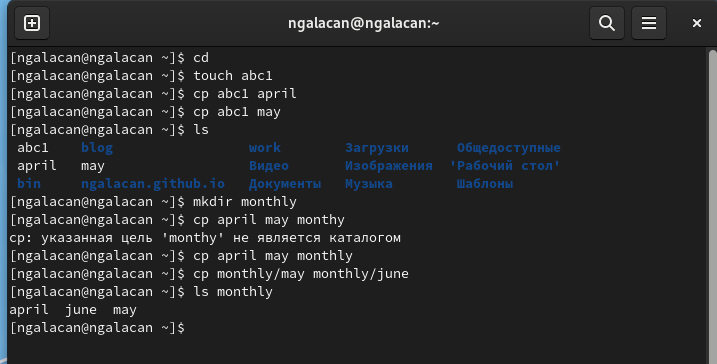{#fig:1 width=70%}

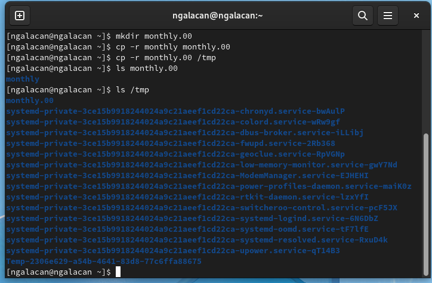{#fig:2 width=70%}

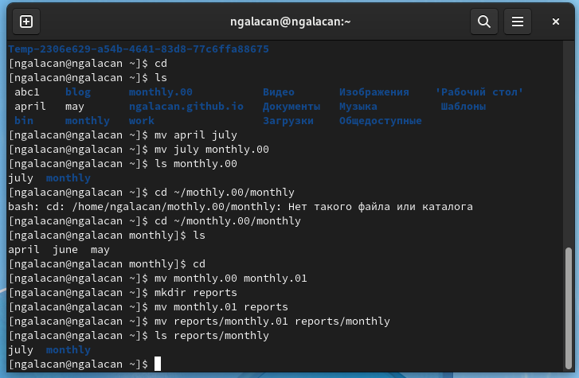{#fig:3 width=70%}

Создаю файлы и корректирую права доступа, а так же изменяю права уже созданных каталогов, проверяю (рис. @fig:4).

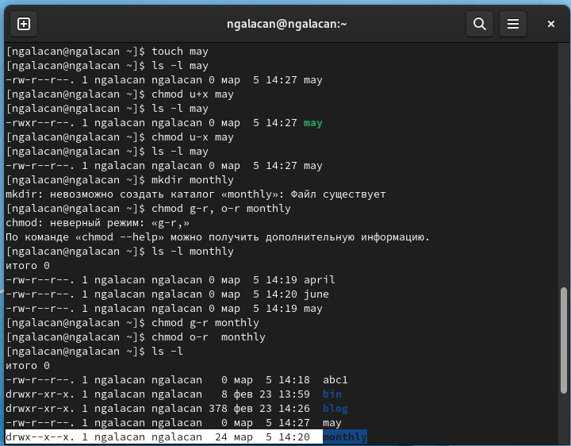{#fig:4 width=70%}

Просматриваю монтированные файловые системы (рис. @fig:5).

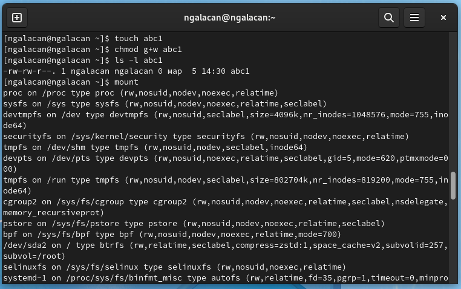{#fig:5 width=70%}

Просматриваю в файле `/etc/fstab` монтированные файловые системы, объем свободного пространства с помощью `df`, применяю команду `fsck /dev/sda1` (рис. @fig:6).

{#fig:6 width=70%}

2. 2.1. Ввожу `cp /usr/include/sys/io.h equipment` для копирования файла `/usr/include/sys/io.h` под именем `equipment`, проверяю.

2.2. Создаю директорию: `mkdir ~/ski.plases`.

2.3. Перемещаю `equipment` в `~/ski.plases`.

2.4. Переименовываю файл с помощью команды `mv ~/ski.plases/equipment ~/ski.plases/equiplist `

В результате в каталоге `~/ski.plases` оказывается файл с именем `equiplist` (рис. @fig:7).

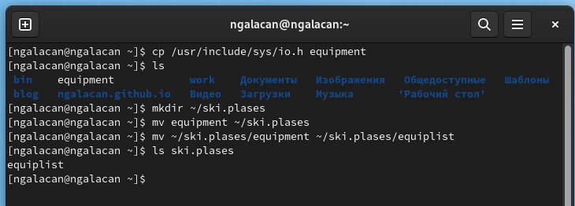{#fig:7 width=70%}

2.5. Создаю файл: `touch abc1`, копирую его в каталог `~/ski.plases` под именем `equiplist2`.

2.6. Ввожу команду `mkdir ~/ski.plases/equipment` для создания каталога.

2.7. Перемещаю файлы `equiplist` и `equiplist2` в `~/ski.plases/equipment`.

2.8. Создаю и перемещаю каталог `~/newdir` в каталог `~/ski.plases` под именем `plans`, проверяю правильность выполненных действий (рис. @fig:8).

В результате в каталоге `~/ski.plases` оказываются подкаталоги `equipment` и `plans`, а в каталоге `equipment` - файлы `equiplist` и `equiplist2`.

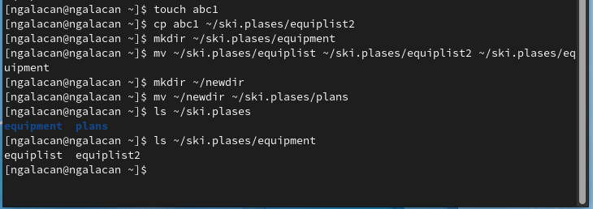{#fig:8 width=70%}


3. Создаю каталоги: `mkdir australia play`. Создаю файлы: `touch my_os feathers`. Изменяю права доступа к каталогам, применяя команду `chmod`, используя цифровую запись прав доступа согласно табл. 5.2. в инструкции. Использование цифровой записи позволяет напрямую предоставить необходимые права вводом всего одной команды. Проверяю с помощью `ls -l` (рис. @fig:9).

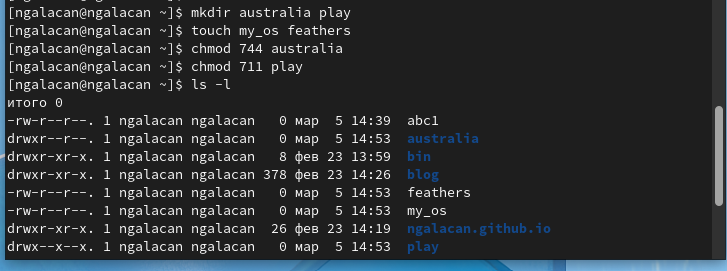{#fig:9 width=70%}

Аналогичным образом меняю права доступа к файлам `my_os` и `feathers`, проверяю (рис. @fig:10).

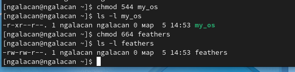{#fig:10 width=70%}

4. 4.1. Просматриваю содержимое файла `/etc/password`. Такого файла нет, поэтому просматриваю похожий файл, введя `cat /etc/passwd`  (рис. @fig:11).

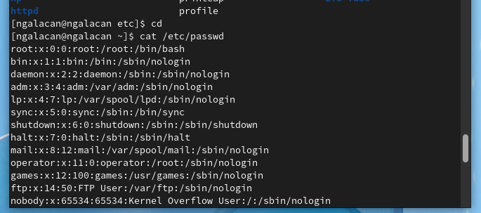{#fig:11 width=70%}

4.2. Ввожу `cp ~/feathers ~/file.old` для копирования файла под новым именем.

4.3. Перемещаю этот файл с помощью команды `mv ~/file.old ~/play`.

4.4. Для копирования каталогов использую `cp -r ~/play ~/fun`

4.5. Перемещаю каталог `~/fun` в каталог `~/play` под именем `games`:   `mv ~/fun ~play/games`. Проверяю, выводя содержимое каталогов (рис. @fig:12).

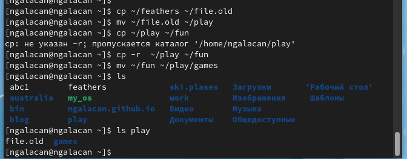{#fig:12 width=70%}

4.6. Лишаю владельца права на чтение: `chmod  u-r feathers`, проверяю.

4.7. Если попытаться посмотреть содержимое файла, то происходит отказ в доступе.

4.8. Если попытаться скопировать файл, то происходит отказ в доступе.

4.9. Даю владельцу право на чтение: `chmod  u+r feathers`, проверяю (рис. @fig:13).

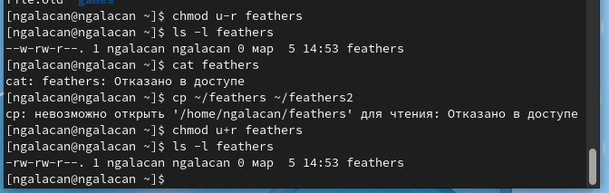{#fig:13 width=70%}

4.10. Лишаю владельца каталога права на выполнение: `chmod  u-x ~/play`.

4.11. Перехожу в каталог с помощью `cd`, но получаю отказ в доступе.

4.12. Даю владельцу каталога право на выполнение: `chmod  u+x ~/play`. Теперь перейти в каталог возможно (рис. @fig:14).

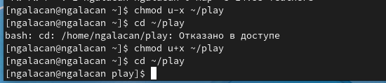{#fig:14 width=70%}

5. Читаю `man` по командам  `mount`, `fsck`, `mkfs`, `kill` (рис. @fig:15).

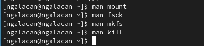{#fig:15 width=70%}

Команда `mount` служит для просмотра используемых в операционной системе файловых систем.

С помощью команды `fsck` можно проверить (а в ряде случаев восстановить) целостность файловой системы, указав в аргументе имя устройства, к которому подключена ФС.

С помощью команды `mkfs` можно создать файловую систему. В качестве аргумента `filesys` для файловой системы может выступать или название устройства (например, `/dev/hda1`, `/dev/sdb2`) или точка монтирования (например, `/`, `/usr`, `/home`). 

Команда `kill` служит для завершения процессов. Команда отправляет сигнал процессу(-ам), указанному с помощтю идентификатора процесса. По умолчанию утилита `kill` отправляет сигнал `SIGTERM`.


# Выводы

Была изучена файловая система Linux, её структура, имена и содержание каталогов. Приобретены практические навыки по применению команд для работы с файлами и каталогами, по управлению процессами (и работами), по проверке использования диска и обслуживанию файловой системы

# Ответы на контрольные вопросы

1. Дайте характеристику каждой файловой системе, существующей на жёстком диске компьютера, на котором вы выполняли лабораторную работу.

Ext2, Ext3, Ext4 или Extended Filesystem - это стандартная файловая система для Linux. Она была разработана еще для Minix. Она самая стабильная из всех существующих, кодовая база изменяется очень редко и эта файловая система содержит больше всего функций. Версия ext2 была разработана уже именно для Linux и получила много улучшений. В 2001 году вышла ext3, которая добавила еще больше стабильности благодаря использованию журналирования. В 2006 была выпущена версия ext4, которая используется во всех дистрибутивах Linux до сегодняшнего дня. В ней было внесено много улучшений, в том числе увеличен максимальный размер раздела до одного экзабайта.


Btrfs или B-Tree File System - это совершенно новая файловая система, которая сосредоточена на отказоустойчивости, легкости администрирования и восстановления данных. Файловая система объединяет в себе очень много новых интересных возможностей, таких как размещение на нескольких разделах, поддержка подтомов, изменение размера не лету, создание мгновенных снимков, а также высокая производительность. Но многими пользователями файловая система Btrfs считается нестабильной. Тем не менее, она уже используется как файловая система по умолчанию в OpenSUSE и SUSE Linux.

2. Приведите общую структуру файловой системы и дайте характеристику каждой директории первого уровня этой структуры.

/ — root каталог. Содержит в себе всю иерархию системы;

/bin — здесь находятся двоичные исполняемые файлы. Основные общие команды, хранящиеся отдельно от других программ в системе (прим.: pwd, ls, cat, ps);

/boot — тут расположены файлы, используемые для загрузки системы (образ initrd, ядро vmlinuz);

/dev — в данной директории располагаются файлы устройств (драйверов). С помощью этих файлов можно взаимодействовать с устройствами. К примеру, если это жесткий диск, можно подключить его к файловой системе. В файл принтера же можно написать напрямую и отправить задание на печать;

/etc — в этой директории находятся файлы конфигураций программ. Эти файлы позволяют настраивать системы, сервисы, скрипты системных демонов;

/home — каталог, аналогичный каталогу Users в Windows. Содержит домашние каталоги учетных записей пользователей (кроме root). При создании нового пользователя здесь создается одноименный каталог с аналогичным именем и хранит личные файлы этого пользователя;

/lib — содержит системные библиотеки, с которыми работают программы и модули ядра;

/lost+found — содержит файлы, восстановленные после сбоя работы системы. Система проведет проверку после сбоя и найденные файлы можно будет посмотреть в данном каталоге;

/media — точка монтирования внешних носителей. Например, когда вы вставляете диск в дисковод, он будет автоматически смонтирован в директорию /media/cdrom;

/mnt — точка временного монтирования. Файловые системы подключаемых устройств обычно монтируются в этот каталог для временного использования;

/opt — тут расположены дополнительные (необязательные) приложения. Такие программы обычно не подчиняются принятой иерархии и хранят свои файлы в одном подкаталоге (бинарные, библиотеки, конфигурации);

/proc — содержит файлы, хранящие информацию о запущенных процессах и о состоянии ядра ОС;

/root — директория, которая содержит файлы и личные настройки суперпользователя;

/run — содержит файлы состояния приложений. Например, PID-файлы или UNIX-сокеты;

/sbin — аналогично /bin содержит бинарные файлы. Утилиты нужны для настройки и администрирования системы суперпользователем;

/srv — содержит файлы сервисов, предоставляемых сервером (прим. FTP или Apache HTTP);

/sys — содержит данные непосредственно о системе. Тут можно узнать информацию о ядре, драйверах и устройствах;

/tmp — содержит временные файлы. Данные файлы доступны всем пользователям на чтение и запись. Стоит отметить, что данный каталог очищается при перезагрузке;

/usr — содержит пользовательские приложения и утилиты второго уровня, используемые пользователями, а не системой. Содержимое доступно только для чтения (кроме root). Каталог имеет вторичную иерархию и похож на корневой;

/var — содержит переменные файлы. Имеет подкаталоги, отвечающие за отдельные переменные. Например, логи будут храниться в /var/log, кэш в /var/cache, очереди заданий в /var/spool/ и так далее.

3. Какая операция должна быть выполнена, чтобы содержимое некоторой файловой системы было доступно операционной системе?

Монтирование тома.

4. Назовите основные причины нарушения целостности файловой системы. Как устранить повреждения файловой системы?

Отсутствие синхронизации между образом файловой системы в памяти и ее данными на диске в случае аварийного останова может привести к появлению следующих ошибок:

- Один блок адресуется несколькими mode (принадлежит нескольким файлам).
- Блок помечен как свободный, но в то же время занят (на него ссылается onode).
- Блок помечен как занятый, но в то же время свободен (ни один inode на него не ссылается).
- Неправильное число ссылок в inode (недостаток или избыток ссылающихся записей в каталогах).
- Несовпадение между размером файла и суммарным размером адресуемых inode блоков.
- Недопустимые адресуемые блоки (например, расположенные за пределами файловой системы).
- "Потерянные" файлы (правильные inode, на которые не ссылаются записи каталогов).
- Недопустимые или неразмещенные номера inode в записях каталогов.

С помощью команды `fsck` можно проверить (а в ряде случаев восстановить) целостность файловой системы.

5. Как создаётся файловая система?

С помощью команды `mkfs` можно создать файловую систему. 

6. Дайте характеристику командам для просмотра текстовых файлов.

Для просмотра файлов небольшого размера можно использовать команду `cat`. Для просмотра файлов постранично удобнее использовать команду `less`. Команда `head` выводит по умолчанию первые 10 строк файла.

7. Приведите основные возможности команды cp в Linux.

Команда `cp` используется для копирования файлов и каталогов. Формат команды: `cp [-опции] исходный_файл целевой_файл`

8. Приведите основные возможности команды mv в Linux.

Команда `mv` предназначена для перемещения и переименования файлов и каталогов.

9. Что такое права доступа? Как они могут быть изменены?

Каждый файл или каталог имеет права доступа. В сведениях о файле или каталоге указываются:
- тип файла (символ (-) обозначает файл, а символ (d) — каталог);

- права для владельца файла (r — разрешено чтение, w — разрешена запись, x — разре-
шено выполнение, - — право доступа отсутствует);

- права для членов группы (r — разрешено чтение, w — разрешена запись, x — разрешено
выполнение, - — право доступа отсутствует);

- права для всех остальных (r — разрешено чтение, w — разрешена запись, x — разрешено
выполнение, - — право доступа отсутствует)

Права доступа к файлу или каталогу можно изменить, воспользовавшись командой `chmod`. Сделать это может владелец файла (или каталога) или пользователь с правами администратора. Формат команды: `chmod режим имя_файла`

