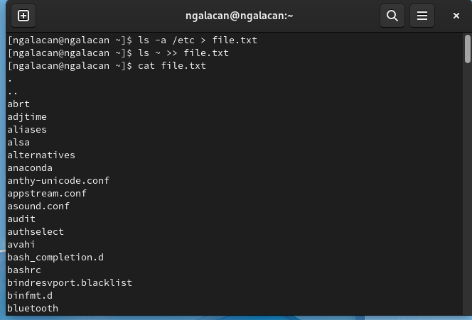
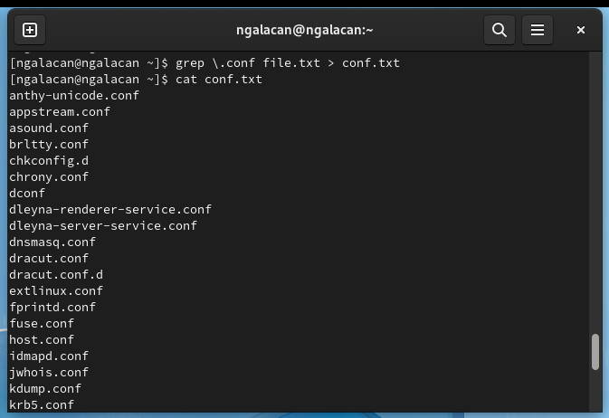
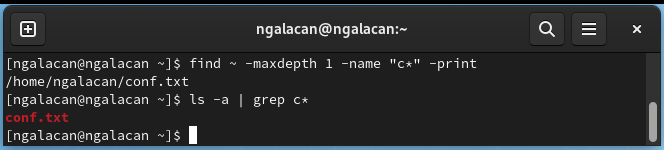
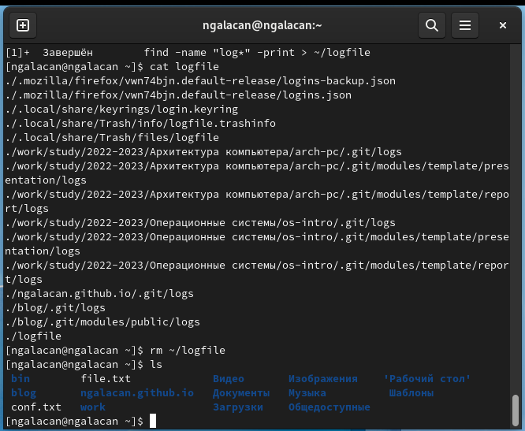
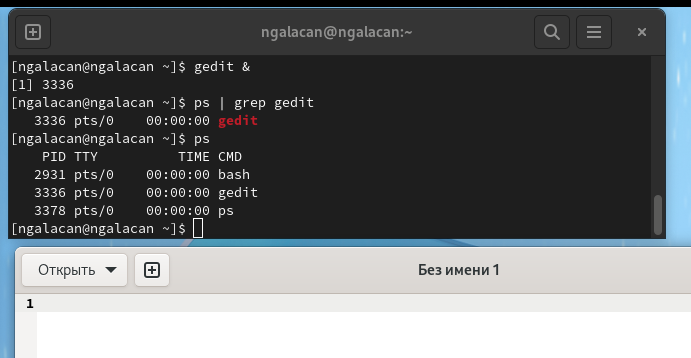
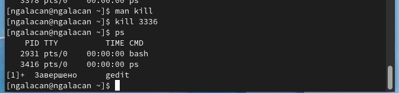
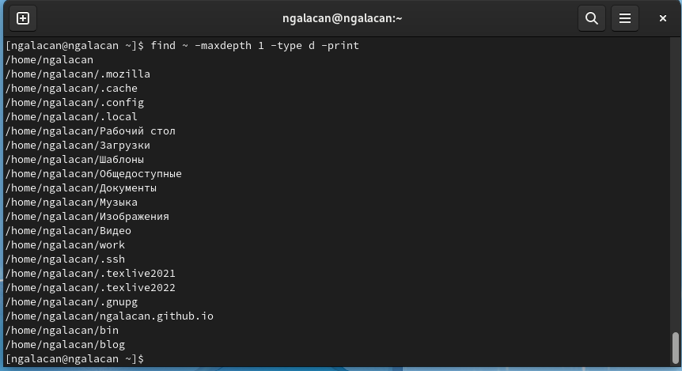

---
## Front matter
lang: ru-RU
title: Презентация по лабораторной работе №6
subtitle: Поиск файлов. Перенаправление ввода-вывода. Просмотр запущенных процессов
author:
  - Галацан Николай
institute:
  - Российский университет дружбы народов, Москва, Россия
  
## i18n babel
babel-lang: russian
babel-otherlangs: english

## Formatting pdf
toc: false
toc-title: Содержание
slide_level: 2
aspectratio: 169
section-titles: true
theme: metropolis
header-includes:
 - \metroset{progressbar=frametitle,sectionpage=progressbar,numbering=fraction}
 - '\makeatletter'
 - '\beamer@ignorenonframefalse'
 - '\makeatother'
---

## Докладчик

  * Галацан Николай
  * 1032225763
  * уч. группа: НПИбд-01-22
  * Факультет физико-математических и естественных наук
  * Российский университет дружбы народов

## Актуальность

Приобретение практических навыков для поиска файлов и фильтрации текстовых данных, по управлению процессами, по проверке использования диска и обслуживанию файловых систем позволит оптимизировать работу с системой и упростить взаимодействие.

## Цель работы

Ознакомление с инструментами поиска файлов и фильтрации текстовых данных.
Приобретение практических навыков: по управлению процессами (и заданиями), по
проверке использования диска и обслуживанию файловых систем.

## Выполнение лабораторной работы

1. Вхожу в систему под именем пользователя `ngalacan`.

2. Записываю в файл `file.txt` названия файлов, содержащихся в каталоге `/etc`. Допишу в этот же файл названия файлов, содержащихся в домашнем каталоге. Для этого использую перенаправление вывода с помощью **\>>**, чтобы открыть файл в режиме добавления. Вывожу содержимое файла 

## Выполнение лабораторной работы

{#fig:1 width=70%}

## Выполнение лабораторной работы

3. Вывожу имена всех файлов из `file.txt`, имеющих расширение `.conf` с помощью команды `grep`, после чего
записываю их в новый текстовый файл `conf.txt` с помощью перенаправления вывода **>**. Вывожу содержимое нового файла.

{#fig:2 width=50%}

## Выполнение лабораторной работы

4. Применяю команду `find` для поиска файлов, начинающихся с символа **с**.

{#fig:3 width=70%}

5. Вывожу постранично на экран имена файлов из `/etc`, начинающиеся с символа **h**.

{#fig:4 width=70%}

## Выполнение лабораторной работы
 
:::::::::::::: {.columns align=center}
::: {.column width="50%"}

6. Запускаю в фоновом режиме процесс для записи в файл `~/logfile` файлов, имена которых начинаются с `log`, вывожу содержимое. Команда: `find -name "log*" -print > ~/logfile &`

7. Удаляю файл и проверяю

:::
::: {.column width="50%"}

{#fig:6 width=100%}

:::
::::::::::::::

 
## Выполнение лабораторной работы

:::::::::::::: {.columns align=center}
::: {.column width="50%"}

8. Запускаю в фоновом режиме редактор текста: `gedit &`.

9. Определяю идентификатор процесса `gedit`

{#fig:7 width=100%}

:::
::: {.column width="50%"}

10. Читаю справку по команде `kill`. Она нужна для завершения процессов. Завершаю процесс gedit с помощью команды `kill 3336`.

{#fig:9 width=100%}

:::
::::::::::::::

## Выполнение лабораторной работы

11. Читаю справки по командам `df` и `du`. Команда `df` используется для определения размера каждого смонтированного раздела диска. Команда `du` используетсядля определения числа Кб, используемых каталогом. 

{#fig:10 width=40%}

## Выполнение лабораторной работы

12. Читаю справку команды `find`, чтобы найти опцию для выведения всех директорий: `-type d`.

{#fig:12 width=70%}

## Вывод

Я ознакомился с инструментами поиска файлов и фильтрации текстовых данных. Были приобретены практические навыки: по управлению процессами (и заданиями), по проверке использования диска и обслуживанию файловых систем.

