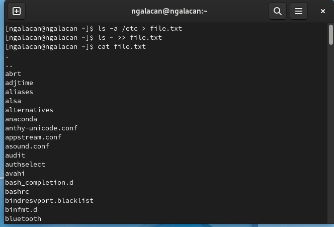
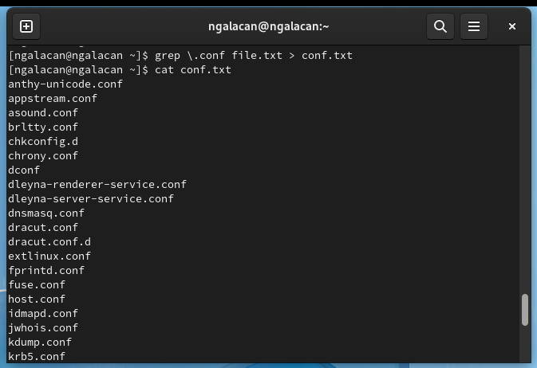
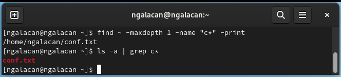
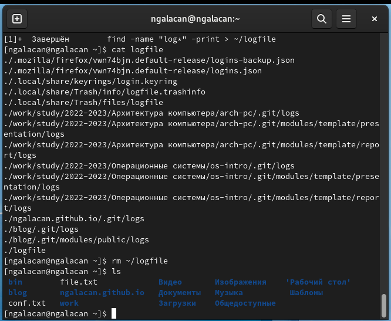
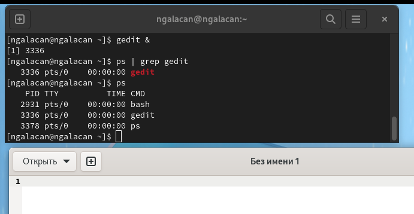
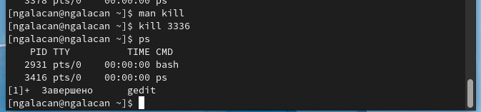
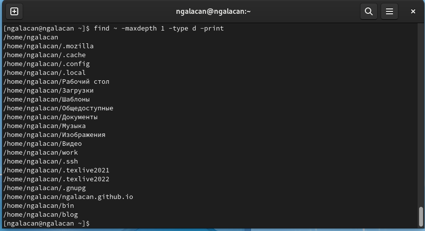

---
## Front matter
title: "Отчет по лабораторной работе №6"
subtitle: "Поиск файлов. Перенаправление ввода-вывода. Просмотр запущенных процессов"
author: "Галацан Николай, НПИбд-01-22"

## Generic otions
lang: ru-RU
toc-title: "Содержание"

## Bibliography
bibliography: bib/cite.bib
csl: pandoc/csl/gost-r-7-0-5-2008-numeric.csl

## Pdf output format
toc: true # Table of contents
toc-depth: 2
lof: true # List of figures
fontsize: 12pt
linestretch: 1.5
papersize: a4
documentclass: scrreprt
## I18n polyglossia
polyglossia-lang:
  name: russian
  options:
	- spelling=modern
	- babelshorthands=true
polyglossia-otherlangs:
  name: english
## I18n babel
babel-lang: russian
babel-otherlangs: english
## Fonts
mainfont: PT Serif
romanfont: PT Serif
sansfont: PT Sans
monofont: PT Mono
mainfontoptions: Ligatures=TeX
romanfontoptions: Ligatures=TeX
sansfontoptions: Ligatures=TeX,Scale=MatchLowercase
monofontoptions: Scale=MatchLowercase,Scale=0.9
## Biblatex
biblatex: true
biblio-style: "gost-numeric"
biblatexoptions:
  - parentracker=true
  - backend=biber
  - hyperref=auto
  - language=auto
  - autolang=other*
  - citestyle=gost-numeric
## Pandoc-crossref LaTeX customization
figureTitle: "Рис."
tableTitle: "Таблица"
listingTitle: "Листинг"
lofTitle: "Список иллюстраций"
lolTitle: "Листинги"
## Misc options
indent: true
header-includes:
  - \usepackage{indentfirst}
  - \usepackage{float} # keep figures where there are in the text
  - \floatplacement{figure}{H} # keep figures where there are in the text
---

# Цель работы

Ознакомление с инструментами поиска файлов и фильтрации текстовых данных.
Приобретение практических навыков: по управлению процессами (и заданиями), по
проверке использования диска и обслуживанию файловых систем.

# Задание

1. Осуществите вход в систему, используя соответствующее имя пользователя.

2. Запишите в файл file.txt названия файлов, содержащихся в каталоге /etc. Допи-
шите в этот же файл названия файлов, содержащихся в вашем домашнем каталоге.

3. Выведите имена всех файлов из file.txt, имеющих расширение .conf, после чего
запишите их в новый текстовой файл conf.txt.

4. Определите, какие файлы в вашем домашнем каталоге имеют имена, начинавшиеся
с символа c? Предложите несколько вариантов, как это сделать.

5. Выведите на экран (по странично) имена файлов из каталога /etc, начинающиеся
с символа h.

6. Запустите в фоновом режиме процесс, который будет записывать в файл ~/logfile
файлы, имена которых начинаются с log.

7. Удалите файл ~/logfile.

8. Запустите из консоли в фоновом режиме редактор gedit.

9. Определите идентификатор процесса gedit, используя команду ps, конвейер и фильтр
grep. Как ещё можно определить идентификатор процесса?

10. Прочтите справку (man) команды kill, после чего используйте её для завершения
процесса gedit.

11. Выполните команды df и du, предварительно получив более подробную информацию
об этих командах, с помощью команды man.

12. Воспользовавшись справкой команды find, выведите имена всех директорий, имею-
щихся в вашем домашнем каталоге.

# Теоретическое введение

В системе по умолчанию открыто три специальных потока:

- stdin — стандартный поток ввода (по умолчанию: клавиатура), файловый дескриптор
0;

- stdout — стандартный поток вывода (по умолчанию: консоль), файловый дескриптор
1;

- stderr — стандартный поток вывод сообщений об ошибках (по умолчанию: консоль),
файловый дескриптор 2.


Большинство используемых в консоли команд и программ записывают результаты
своей работы в стандартный поток вывода `stdout`. Например, команда `ls` выводит в стан-
дартный поток вывода (консоль) список файлов в текущей директории. Потоки вывода
и ввода можно перенаправлять на другие файлы или устройства. Проще всего это делается
с помощью символов **>, \>>, <, \<<.**

**Конвейер** (pipe) служит для объединения простых команд или утилит в цепочки, в ко-
торых результат работы предыдущей команды передаётся последующей. Синтаксис
следующий:

`1 команда 1 | команда 2`

**Команда find** используется для поиска и отображения на экран имён файлов, соответ-
ствующих заданной строке символов.
Формат команды:

` find путь [-опции]`

Найти в текстовом файле указанную строку символов позволяет **команда grep**.
Формат команды:

`grep строка имя_файла`

Кроме того, команда grep способна обрабатывать стандартный вывод других команд
(любой текст). Для этого следует использовать конвейер, связав вывод команды с вводом
`grep`.

**Команда df** показывает размер каждого смонтированного раздела диска.
Формат команды:

`df [-опции] [файловая_система`]

**Команда du** показывает число килобайт, используемое каждым файлом или каталогом.
Формат команды:

`du [-опции] [имя_файла...]`

Любую выполняющуюся в консоли команду или внешнюю программу можно запустить
в фоновом режиме. Для этого следует в конце имени команды указать знак амперсанда
**&**.

**Запущенные фоном программы** называются задачами (jobs). Ими можно управлять
с помощью команды `jobs`, которая выводит список запущенных в данный момент задач.
Для завершения задачи необходимо выполнить команду

`kill %номер задачи`

Любой команде, выполняемой в системе, присваивается *идентификатор процесса*
(process ID). Получить информацию о процессе и управлять им, пользуясь идентифи-
катором процесса, можно из любого окна командного интерпретатора.

**Команда ps** используется для получения информации о процессах.
Формат команды:

`ps [-опции]`

# Выполнение лабораторной работы

1. Вхожу в систему под именем пользователя `ngalacan`.

2. Записываю в файл `file.txt` названия файлов, содержащихся в каталоге `/etc`. Допишу в этот же файл названия файлов, содержащихся в домашнем каталоге. Для этого использую перенаправление вывода с помощью **\>>**, чтобы открыть файл в режиме добавления. Вывожу содержимое файла (рис. @fig:1).

{#fig:1 width=70%}

3. Вывожу имена всех файлов из `file.txt`, имеющих расширение `.conf` с помощью команды `grep`, после чего
записываю их в новый текстовой файл `conf.txt` с помощью перенаправления вывода **>**. Вывожу содержимое нового файла (рис. @fig:2).

{#fig:2 width=70%}

4. Нахожу файлы в домашнем каталоге, начинающиеся с символа **с**. В первом случае использую команду `find`, где в опции с именем файла ввожу условие поиска `-name c*`. Также использую опцию `-maxdepth 1`, чтобы поиск осуществлялся только на первом уровне каталога, без поиска в подкаталогах. Во втором случае использую `ls -a`, конвейер и поиск с помощью `grep c*` (рис. @fig:3).

{#fig:3 width=70%}

5. Вывожу постранично на экран имена файлов из `/etc`, начинающиеся с символа **h**. Для этого воспользуюсь командой `find`, конвейером и командой `less` (рис. @fig:4).

{#fig:4 width=70%}

Вывод введенной команды на рис. @fig:5.

{#fig:5 width=70%}

6. Запускаю в фоновом режиме процесс для записи в файл `~/logfile` файлов, имена которых начинаются с `log`. Для запуска в фоновом режиме ставлю **&**:
```
find -name "log*" -print > ~/logfile &
```
Вывожу содержимое файла после завершения процесса 

7. Удаляю файл и проверяю (рис. @fig:6).

{#fig:6 width=70%}


8. Запускаю в фоновом режиме редактор текста: `gedit &`. Открывается окно редактора и выводится идентификатор запущенного процесса.

9. Определяю идентификатор процесса `gedit`, используя команду `ps`, конвейер и фильтр `grep`. Также идентификатор процесса можно определить после запуска процесса в фоновом режиме, а также применив команду `ps` и найдя соответствующую строку (рис. @fig:7).

{#fig:7 width=70%}

10. Читаю справку по команде `kill` (рис. @fig:8).

{#fig:8 width=70%}

Завершаю процесс gedit с помощью команды `kill 3336`, где в качестве аргумента выступает идентификатор процесса. Проверяю, завершен ли процесс (рис. @fig:9).

{#fig:9 width=70%}

11. Читаю справки по командам `df` и `du`. Выполняю команду `df` для определения размера каждого смонтированного раздела диска. Выполняю `du` для определения числа Кб, используемых каталогом `~/work` (рис. @fig:10).

{#fig:10 width=70%}
  
Весь каталог занимает более 102 тыс. килобайт

12. Читаю справку команды `find`, чтобы найти опцию для выведения всех директорий (рис. @fig:11).

{#fig:11 width=70%}

 Использую опцию `-type d` для выведения всех директорий домашнего каталога на первом уровне (`-maxdepth 1`) (рис. @fig:12).

{#fig:12 width=70%}

# Выводы

Я ознакомился с инструментами поиска файлов и фильтрации текстовых данных. Были приобретены практические навыки: по управлению процессами (и заданиями), по проверке использования диска и обслуживанию файловых систем.

# Ответы на контрольные вопросы

1. Какие потоки ввода вывода вы знаете?

вод и вывод распределяется между тремя стандартными потоками:
- stdin — стандартный ввод (клавиатура),
- stdout — стандартный вывод (экран),
- stderr — стандартная ошибка (вывод ошибок на экран).


2. Объясните разницу между операцией > и >>.

В первом случае файл открывается либо создается для записи, во втором случае - для добавления новых данных в тот же самый файл без потери уже содержащихся в нем.

3. Что такое конвейер?

Конвейер (pipe) служит для объединения простых команд или утилит в цепочки, в которых результат работы предыдущей команды передаётся последующей. Синтаксис следующий:

`1 команда 1 | команда 2`

4. Что такое процесс? Чем это понятие отличается от программы?

Процесс - это:
- программа на стадии выполнения
- "объект", которому выделено процессорное время
- асинхронная работа 

5. Что такое PID и GID?

Идентификатор процесса (PID). Каждому новому процессу ядро  присваивает уникальный идентификационный номер. В любой момент времени идентификатор процесса является уникальным, хотя после завершения процесса он может использоваться снова для другого процесса. Некоторые идентификаторы зарезервированы системой для особых процессов. Так, процесс с идентификатором 1 - это процесс инициализации init, являющийся предком всех других процессов в системе.

Идентификатор группы GID и эффективный идентификатор группы (EGID) GID - это идентификационный номер группы данного процесса. EGID связан с GID также, как EUID с UID.

6. Что такое задачи и какая команда позволяет ими управлять?

Задача - команда, запущенная в фоновом режиме. Ими можно управлять с помощью команды `jobs`, которая выводит список запущенных в данный момент задач

7. Найдите информацию об утилитах top и htop. Каковы их функции?

`top` - интерактивный просмотр процессов. `htop` - аналог `top`. Программа `top` динамически выводит в режиме реального времени информации о работающей системе, т.е. о фактической активности процессов. По умолчанию она выдает задачи, наиболее загружающие процессор сервера, и обновляет список каждые две секунды. 


8. Назовите и дайте характеристику команде поиска файлов. Приведите примеры использования этой команды.

Команда find спользуется для поиска и отображения на экран имён файлов, соответствующих заданной строке символов. 

Формат команды: ` find путь [-опции]`

*Пример*. Поиск файлов в `/etc`, начинающихся с h: `find /etc -name "h*" -print`

9. Можно ли по контексту (содержанию) найти файл? Если да, то как?

Для поиска файла по содержимому проще всего воспользоваться командой grep (вместо find).

*Пример*: `grep -r строка_поиска каталог`


10. Как определить объем свободной памяти на жёстком диске?

С помощью команды `df`.

11. Как определить объем вашего домашнего каталога?

С помощью команды `du ~`.

12. Как удалить зависший процесс?

С помощью команды `kill`, найдя PID процесса.

