---
## Front matter
lang: ru-RU
title: Презентация по лабораторной работе №7
subtitle: Командная оболочка Midnight Commander.
author:
  - Галацан Николай
institute:
  - Российский университет дружбы народов, Москва, Россия
  
## i18n babel
babel-lang: russian
babel-otherlangs: english

## Formatting pdf
toc: false
toc-title: Содержание
slide_level: 2
aspectratio: 169
section-titles: true
theme: metropolis
header-includes:
 - \metroset{progressbar=frametitle,sectionpage=progressbar,numbering=fraction}
 - '\makeatletter'
 - '\beamer@ignorenonframefalse'
 - '\makeatother'
---

## Докладчик

  * Галацан Николай
  * 1032225763
  * уч. группа: НПИбд-01-22
  * Факультет физико-математических и естественных наук
  * Российский университет дружбы народов

## Цель работы

Освоение основных возможностей командной оболочки Midnight Commander. Приоб
ретение навыков практической работы по просмотру каталогов и файлов; манипуляций
с ними

## Выполнение лабораторной работы

**Задание по mc**

1. Изучаю нформацию о `mc`. 2. Запускаю `mc`. 

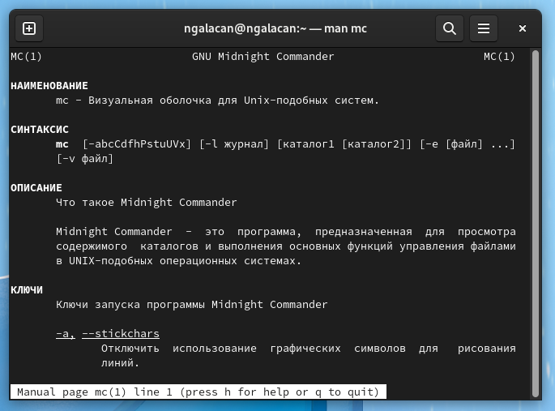{#fig:1 width=40%}

## Выполнение лабораторной работы

3. Выполняю операции в mc, используя управляющие клавиши 

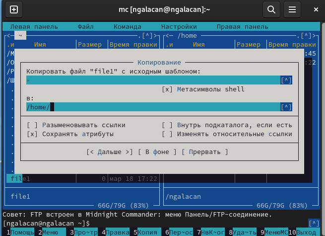{#fig:2 width=55%}

## Выполнение лабораторной работы

4. Выполняю основные команды меню правой панели. 

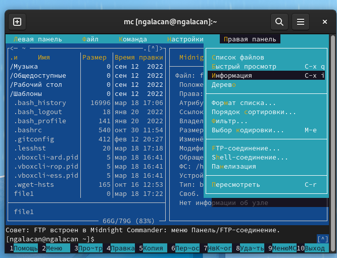{#fig:3 width=50%}

На правой панели выводится информация о выделенном файле, в том числе расположение, права доступа, владелец, дата изменения и т.д.

## Выполнение лабораторной работы

5. Изучаю возможности подменю "Файл"

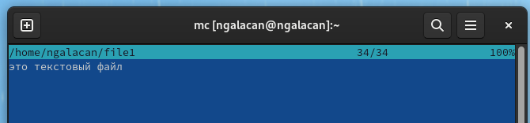{#fig:4 width=50%}

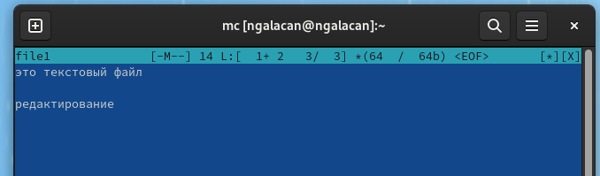{#fig:5 width=50%}

## Выполнение лабораторной работы
 
:::::::::::::: {.columns align=center}
::: {.column width="50%"}

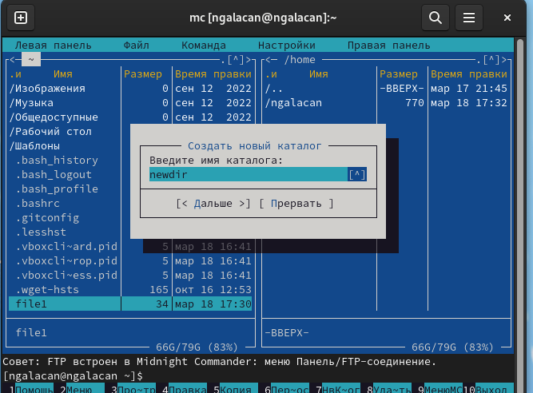{#fig:6 width=100%}

:::
::: {.column width="50%"}

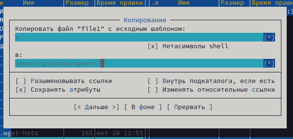{#fig:7 width=90%}

:::
::::::::::::::

## Выполнение лабораторной работы

6. Изучаю подменю "Команда"

:::::::::::::: {.columns align=center}
::: {.column width="50%"}

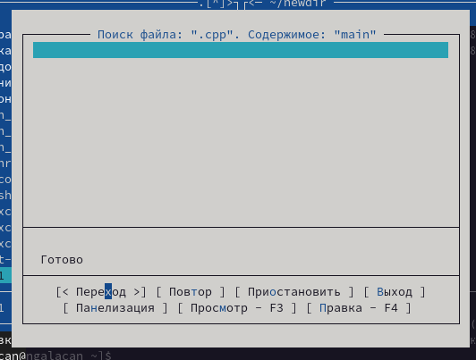{#fig:8 width=100%}

:::
::: {.column width="50%"}

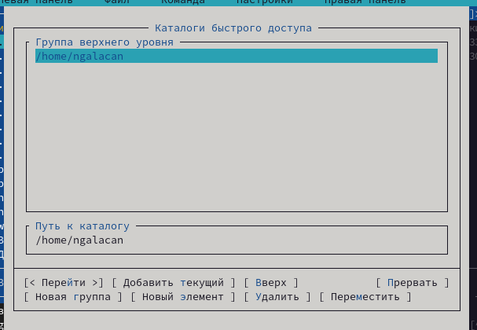{#fig:9 width=100%}

:::
::::::::::::::

## Выполнение лабораторной работы

Анализирую файл меню и файл расширений

:::::::::::::: {.columns align=center}
::: {.column width="50%"}

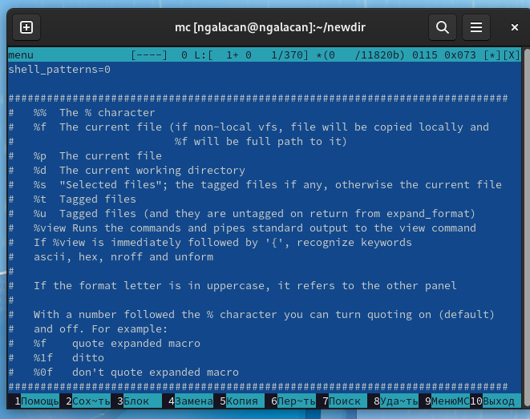{#fig:11 width=70%}

:::
::: {.column width="50%"}

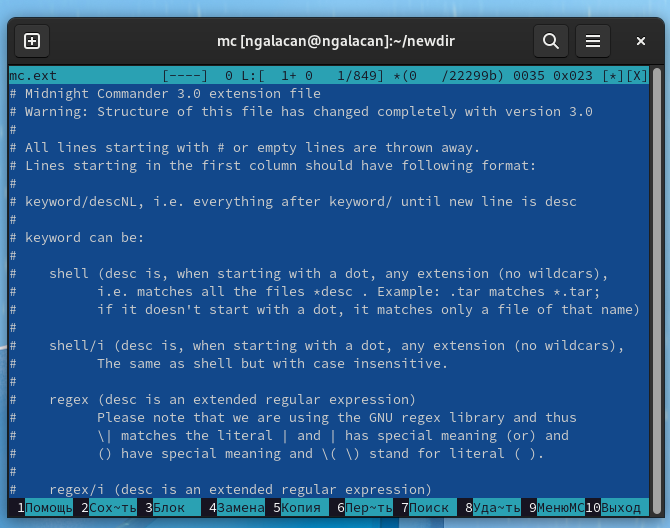{#fig:12 width=70%}

:::
::::::::::::::

## Выполнение лабораторной работы

7. Изучаю подменю "Настройки"

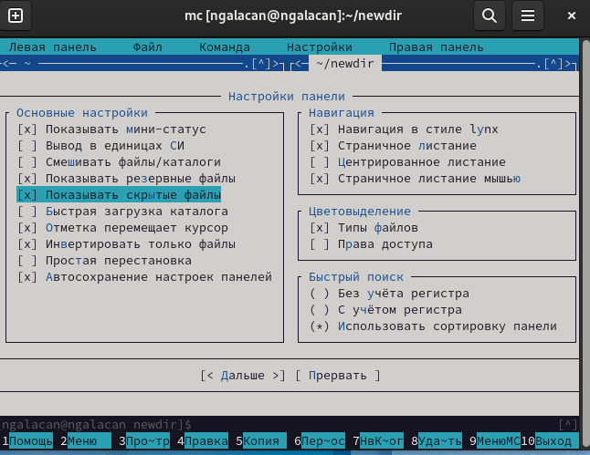{#fig:13 width=45%}

## Выполнение лабораторной работы

**Задание по встроенному редактору mc**

1. Создаю файл: `touch text.txt`. 2. Открываю файл для редактирования с помощью F4. 3. Добавляю текст в файл. 4. Удаляю строку с помощью `ctrl+y`, выделяю фрагмент с помощью F3 и копирую его на новую строку с помощью F5.

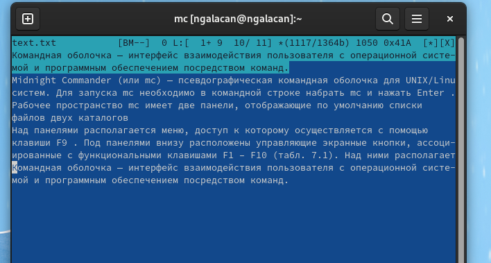{#fig:14 width=50%}

## Выполнение лабораторной работы

Далее выделяю фрагмент с помощью F3 и переношу на новую строку с помощью F6, сохраняю с помощью F2, отменяю сохранение с помощью `ctrl+u`, перехожу в конец файла нажатием `ctrl+End` и дописываю текст, перехожу в начало файла нажатием `ctrl+Home` и дописываю текст, сохраняю (F2) и закрываю (F10).

## Выполнение лабораторной работы

5. Открываю файл с исходным текстом программы на языке ассемблера. 6. С помощью меню редактора включаю подсветку синтаксиса 

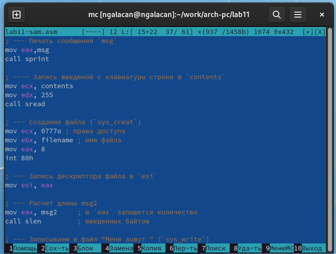{#fig:15 width=45%}

## Вывод

Изучены и освоены основные возможности командной оболочки Midnight Commander. Приоб
ретены навыки практической работы по просмотру каталогов и файлов; манипуляций
с ними.

