---
## Front matter
title: "Отчет по лабораторной работе №7"
subtitle: "Командная оболочка Midnight Commander"
author: "Галацан Николай, НПИбд-01-22"

## Generic otions
lang: ru-RU
toc-title: "Содержание"

## Bibliography
bibliography: bib/cite.bib
csl: pandoc/csl/gost-r-7-0-5-2008-numeric.csl

## Pdf output format
toc: true # Table of contents
toc-depth: 2
lof: true # List of figures
fontsize: 12pt
linestretch: 1.5
papersize: a4
documentclass: scrreprt
## I18n polyglossia
polyglossia-lang:
  name: russian
  options:
	- spelling=modern
	- babelshorthands=true
polyglossia-otherlangs:
  name: english
## I18n babel
babel-lang: russian
babel-otherlangs: english
## Fonts
mainfont: PT Serif
romanfont: PT Serif
sansfont: PT Sans
monofont: PT Mono
mainfontoptions: Ligatures=TeX
romanfontoptions: Ligatures=TeX
sansfontoptions: Ligatures=TeX,Scale=MatchLowercase
monofontoptions: Scale=MatchLowercase,Scale=0.9
## Biblatex
biblatex: true
biblio-style: "gost-numeric"
biblatexoptions:
  - parentracker=true
  - backend=biber
  - hyperref=auto
  - language=auto
  - autolang=other*
  - citestyle=gost-numeric
## Pandoc-crossref LaTeX customization
figureTitle: "Рис."
tableTitle: "Таблица"
listingTitle: "Листинг"
lofTitle: "Список иллюстраций"
lolTitle: "Листинги"
## Misc options
indent: true
header-includes:
  - \usepackage{indentfirst}
  - \usepackage{float} # keep figures where there are in the text
  - \floatplacement{figure}{H} # keep figures where there are in the text
---

# Цель работы

Освоение основных возможностей командной оболочки Midnight Commander. Приоб
ретение навыков практической работы по просмотру каталогов и файлов; манипуляций
с ними

# Задание

**Задание по mc**

1. Изучите информацию о mc, вызвав в командной строке man mc.

2. Запустите из командной строки mc, изучите его структуру и меню.

3. Выполните несколько операций в mc, используя управляющие клавиши (операции
с панелями; выделение/отмена выделения файлов, копирование/перемещение фай-
лов, получение информации о размере и правах доступа на файлы и/или каталоги
и т.п.)

4. Выполните основные команды меню левой (или правой) панели. Оцените степень
подробности вывода информации о файлах.

5. Используя возможности подменю Файл , выполните:

- просмотр содержимого текстового файла;

- редактирование содержимого текстового файла (без сохранения результатов
редактирования);
- создание каталога;
- копирование в файлов в созданный каталог.

6. С помощью соответствующих средств подменю Команда осуществите:
– поиск в файловой системе файла с заданными условиями (например, файла
с расширением .c или .cpp, содержащего строку main);
– выбор и повторение одной из предыдущих команд;
– переход в домашний каталог;
– анализ файла меню и файла расширений.

7. Вызовите подменю Настройки . Освойте операции, определяющие структуру экрана mc
(Full screen, Double Width, Show Hidden Files и т.д.)

**Задание по встроенному редактору mc**

1. Создайте текстовой файл text.txt.

2. Откройте этот файл с помощью встроенного в mc редактора.

3. Вставьте в открытый файл небольшой фрагмент текста, скопированный из любого
другого файла или Интернета.

4. Проделайте с текстом следующие манипуляции, используя горячие клавиши:

4.1. Удалите строку текста.

4.2. Выделите фрагмент текста и скопируйте его на новую строку.

4.3. Выделите фрагмент текста и перенесите его на новую строку.

4.4. Сохраните файл.

4.5. Отмените последнее действие.

4.6. Перейдите в конец файла (нажав комбинацию клавиш) и напишите некоторый
текст.

4.7. Перейдите в начало файла (нажав комбинацию клавиш) и напишите некоторый
текст.

4.8. Сохраните и закройте файл.

5. Откройте файл с исходным текстом на некотором языке программирования (напри-
мер C или Java)

6. Используя меню редактора, включите подсветку синтаксиса, если она не включена,
или выключите, если она включена.

# Выполнение лабораторной работы

## Задание по mc

1. Изучаю нформацию о `mc` (рис. @fig:1).

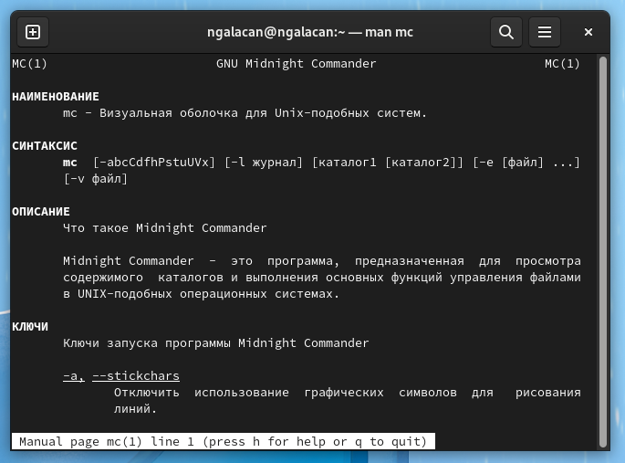{#fig:1 width=70%}

2. Запускаю `mc`. 

3. Выполняю операции в mc, используя управляющие клавиши (Tab, стрелки, функциональные клавиши F1-F10 и т.п.). Например, применяю F5 для копирования созданного файла  `file1` (рис. @fig:2).

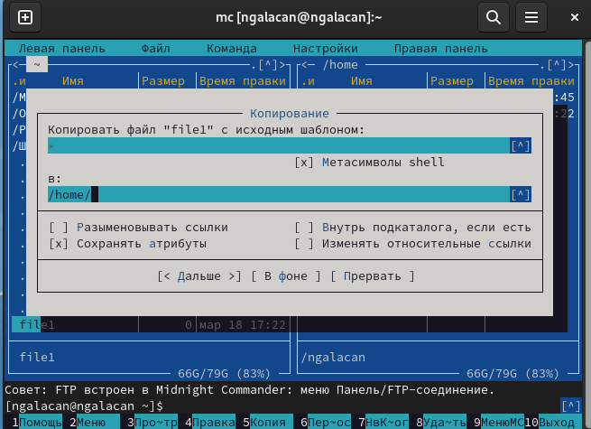{#fig:2 width=70%}

4. Выполняю основные команды меню правой панели. Например, вывожу на правой панели информацию о файлах (рис. @fig:3).

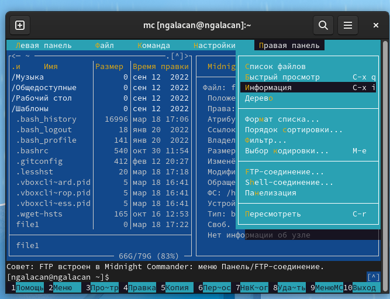{#fig:3 width=70%}

На правой панели выводится информация о выделенном файле, в том числе расположение, права доступа, владелец, дата изменения и т.д.

5. С помощью подменю "Файл" просматриваю содержимое текстового файла (рис. @fig:4), редактирую его содержимое (рис. @fig:5), создаю каталог `newdir` (рис. @fig:6), копирую `file1` в созданный каталог (рис. @fig:7).

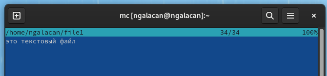{#fig:4 width=70%}

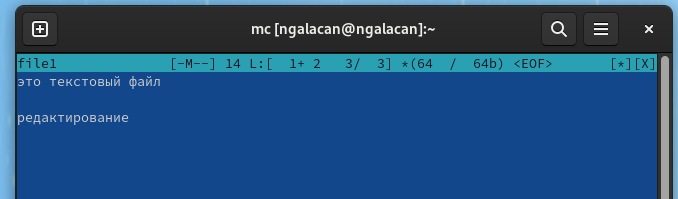{#fig:5 width=70%}

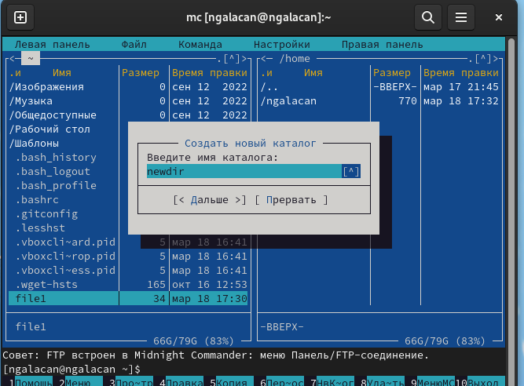{#fig:6 width=70%}

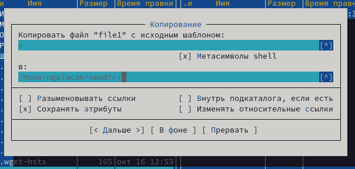{#fig:7 width=70%}

6. С помощью подменю "Команда" осуществляю поиск в файловой системе файла с расширением `.cpp`, содержащего строку `main`, но такой файл отсутствует (рис. @fig:8).

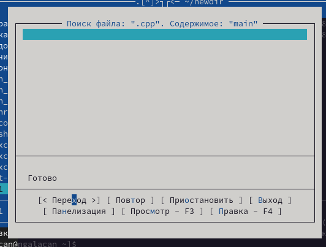{#fig:8 width=70%}

Нажав "История командной строки" получаю список с введенными командами в оболочке, нажатием Enter повторяю предыдущую команду (рис. @fig:9).

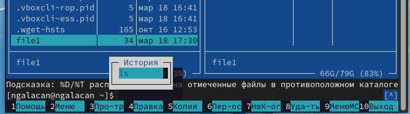{#fig:9 width=70%}

Перехожу в домашний каталог через вкладку "Каталоги быстрого доступа" (рис. @fig:10).

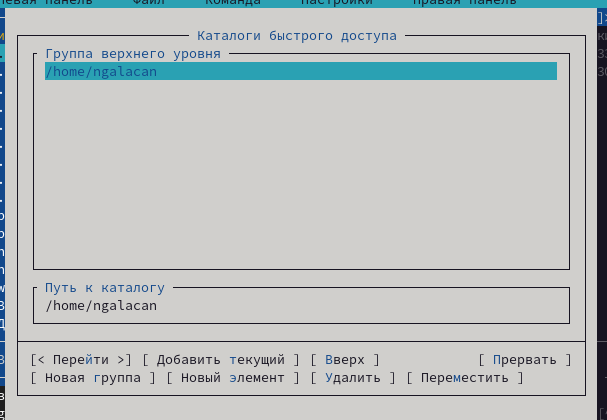{#fig:10 width=70%}

Анализирую файл меню (рис. @fig:11) и файл расширений (рис. @fig:12).

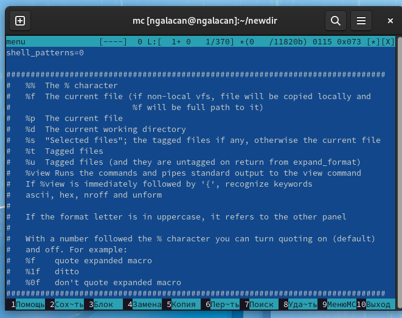{#fig:11 width=70%}

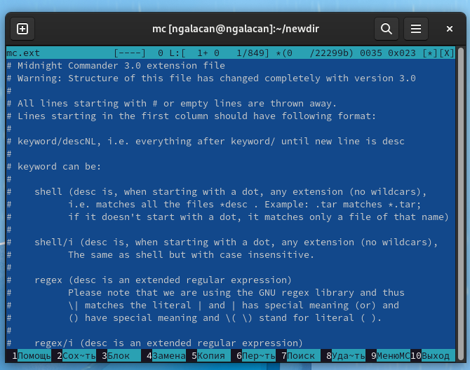{#fig:12 width=70%}

7. В подменю "Настройки" изучаю операции, определяющие структуру экрана mc. Например, параметр отображения скрытых файлов (рис. @fig:13).

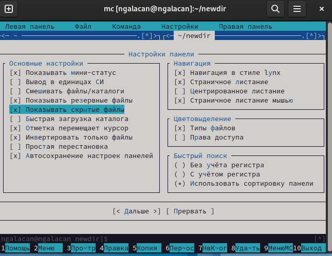{#fig:13 width=70%}

## Задание по встроенному редактору mc

1. Создаю файл: `touch text.txt`.

2. Открываю файл для редактирования с помощью F4.

3. Добавляю текст в файл.

4. Проделываю манипуляции с текстом: удаляю строку с помощью `ctrl+y`, выделяю фрагмент с помощью F3 и копирую его на новую строку с помощью F5 (рис. @fig:14).

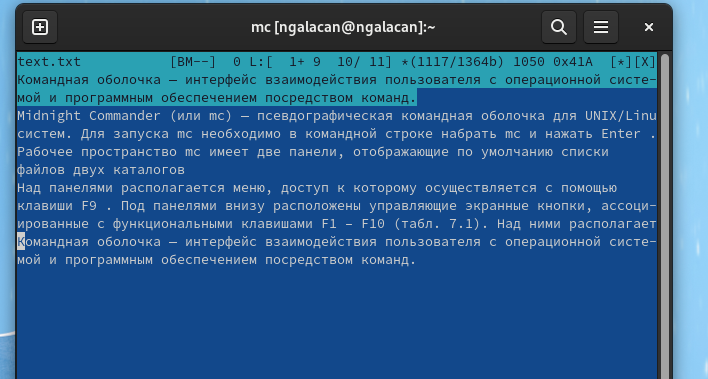{#fig:14 width=70%}

Далее выделяю фрагмент с помощью F3 и переношу на новую строку с помощью F6, сохраняю с помощью F2, отменяю сохранение с помощью `ctrl+u`, перехожу в конец файла нажатием `ctrl+End` и дописываю текст, перехожу в начало файла нажатием `ctrl+Home` и дописываю текст, сохраняю (F2) и закрываю (F10).

5. Открываю файл с исходным текстом программы на языке ассемблера из программ, написанных в первом семестре.

6. С помощью меню редактора включаю подсветку синтаксиса (*"Команда" => "Включить/выключить подсветку синтаксиса"*) (рис. @fig:15).

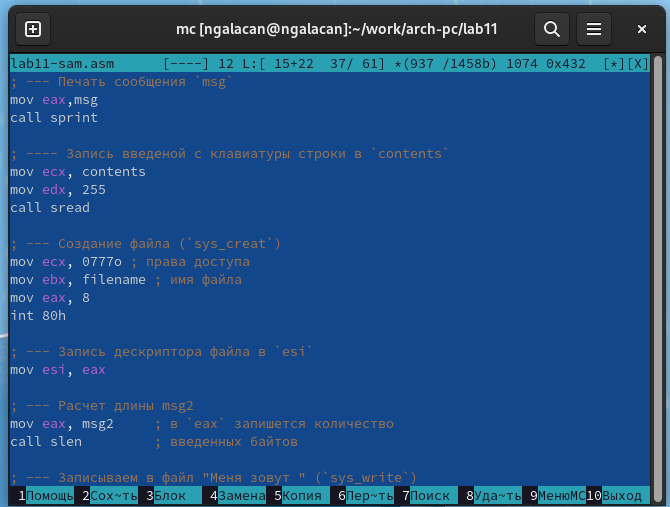{#fig:15 width=70%}

# Выводы

Изучены и освоены основные возможности командной оболочки Midnight Commander. Приоб
ретены навыки практической работы по просмотру каталогов и файлов; манипуляций
с ними.

# Ответы на контрольные вопросы

1. Какие режимы работы есть в mc. Охарактеризуйте их.

Панели могут дополнительно быть переведены в один из двух режимов: «Информация» или «Дерево». В режиме «Информация» на панель выводятся сведения о файле и текущей файловой системе, расположенных на активной панели. В режиме «Дерево» на одной из панелей выводится структура дерева каталогов. 

2. Какие операции с файлами можно выполнить как с помощью команд shell, так и с помощью меню (комбинаций клавиш) mc? Приведите несколько примеров.

- копирование «F5» (`cp имя_файла имя_каталога`) 
- перемещение/переименование «F6» (`mv имя_файла имя_каталога `) 
- создание каталога «F7» (`mkdir имя_каталога`)
- удаление «F8» (`rm имя_файла`)
- изменение прав доступа «ctrl+x» (`chmod u+x имя_файла`)
 
3. Опишите структуру меню левой (или правой) панели mc, дайте характеристику командам.

Перейти в строку меню панелей mc можно с помощью функциональной клавиши «F9». В строке меню имеются пять меню: «Левая панель», «Файл», «Команда», «Настройки» и «Правая панель».

Под пункт меню «Быстрый просмотр» позволяет выполнить быстрый просмотр содержимого панели.

Подпункт меню «Информация» позволяет посмотреть информацию о файле или каталоге. В меню каждой (левой или правой) панели можно выбрать «Формат списка»:

- стандартный: выводит список файлов и каталогов с указанием размера и времени правки;
- ускоренный: позволяет задать число столбцов, на которые разбивается панель при выводе списка имён файлов или каталогов без дополнительной информации;
- расширенный: помимо названия файла или каталога выводит сведения о правах доступа, владельце, группе, размере, времени правки;
- определённый пользователем: позволяет вывести те сведения о файле или каталоге, которые задаст сам пользователь.

Подпункт меню «Порядок сортировки» позволяет задать критерии сортировки при выводе списка файлов и каталогов: без сортировки, по имени, расширенный, время правки, время доступа, время изменения атрибута, размер, узел. 

4. Опишите структуру меню "Файл" mc, дайте характеристику командам.

 Команды меню «Файл»:
 
- Просмотр(«F3»): позволяет посмотреть содержимое текущего (или выделенного) файла без возможности редактирования.
- Просмотр вывода команды («М»+«!»): функция запроса команды с параметрами (аргумент к текущему выбранному файлу).
- Правка(«F4»): открывает текущий (или выделенный) файл для его редактирования.
- Копирование(«F5»): осуществляет копирование одного или нескольких файлов или каталогов в указанное пользователем во всплывающем окне место.
- Права доступа («Ctrl-x»«c»): позволяет указать (изменить) права доступа к одному или нескольким файлам или каталогам.
- Жёсткая ссылка («Ctrl-x»«l»): позволяет создать жёсткую ссылку к текущему(или выделенному) файлу.
- Символическая ссылка («Ctrl-x»«s»): позволяет создать символическую ссылку к текущему (или выделенному) файлу.
- Владелец/группа («Ctrl-x»«o»): позволяет задать (изменить) владельца и имя группы для одного или нескольких файлов или каталогов.
- Права(расширенные): позволяет изменить права доступа и владения для одного или нескольких файлов или каталогов.
- Переименование («F6»): позволяет переименовать (или переместить) один или несколько файлов или каталогов.
- Создание каталога («F7»): позволяет создать каталог.
- Удалить («F8»): позволяет удалить один или несколько файлов или каталогов.
- Выход («F10»): завершает работу mc.
 
5. Опишите структуру меню "Команда" mc, дайте характеристику командам.

Команды меню Команда:

- Дерево каталогов: отображает структуру каталогов системы.
- Поиск файла: выполняет поиск файлов по заданным параметрам.
- Переставить панели: меняет местами левую и правую панели.
- Сравнить каталоги («Ctrl-x»«d»): сравнивает содержимое двух каталогов.
- Размеры каталогов: отображает размер и время изменения каталога (по умолчанию в mc размер каталога корректно не отображается).
- История командной строки: выводит на экран список ранее выполненных в оболочке команд.
- Каталоги быстрого доступа(Ctrl-»): при вызове выполняется быстрая смена текущего каталога на один из заданного списка.
- Восстановление файлов: позволяет восстановить файлы на файловых системах ext2 и ext3.
- Редактировать файл расширений: позволяет задать с
- Редактировать файл меню: позволяет отредактировать контекстное меню пользователя, вызываемое по клавише «F2».
- Редактировать файл расцветки имён: позволяет подобрать оптимальную для пользователя расцветку имён файлов в зависимости от их типа. 

6. Опишите структуру меню "Настройки" mc, дайте характеристику командам.

Меню Настройки содержит:

- Конфигурация: позволяет скорректировать настройки работы с панелями.
- Внешний вид и Настройки панелей: определяет элементы (строка меню, командная строка, подсказки и прочее), отображаемые при вызове mc, а также геометрию расположения панелей и цветовыделение.
- Биты символов: задаёт формат обработки информации локальным терминалом.
- Подтверждение: позволяет установить или убрать вывод окна с запросом подтверждения действий при операциях удаления и перезаписи файлов, а также при выходе из программы.
- Распознание клавиш: диалоговое окно используется для тестирования функциональных клавиш, клавиш управления курсором и прочее.
- Виртуальные ФС: настройки виртуальной файловой системы: тайм-аут, пароль и прочее.
 
7. Назовите и дайте характеристику встроенным командам mc.

Функциональные клавиши mc:

- F1: вызов контекстно-зависимой подсказки
- F2: вызов пользовательского меню с возможностью создания и/или дополнения дополнительных функций
- F3: просмотр содержимого файла, на который указывает подсветка в активной панели (без возможности редактирования)
- F4: вызов встроенного в mc редактора для изменения содержания файла, на который указывает подсветка в активной панели
- F5: копирование одного или нескольких файлов, отмеченных впервой (активной) панели, в каталог, отображаемый на второй панели
- F6: перенос одного или нескольких файлов, отмеченных в первой (активной) панели, в каталог, отображаемый на второй панели
- F7: создание подкаталога в каталоге, отображаемом в активной панели
- F8: удаление одного или нескольких файлов (каталогов), отмеченных в первой (активной) панели файлов
- F9: вызов меню mc
- F10: выход из mc 

8. Назовите и дайте характеристику командам встроенного редактора mc.

Встроенный в mc редактор вызывается с помощью функциональной клавиши «F4». В нём удобно использовать различные комбинации клавиш при редактировании содержимого (как правило текстового) файла. Клавиши для редактирования файла:

- «Ctrl-y»: удалить строку
- «Ctrl-u»: отмена последней операции
- «ins»: вставка/замена
- «F7»: поиск (можно использовать регулярные выражения)
- «F4»: замена
- «F3»: первое нажатие: начало выделения, второе: окончание выделения
- «F5»: копировать выделенный фрагмент
- «F6»: переместить выделенный фрагмент
- «F8»: удалить выделенный фрагмент
- «F2»: записать изменения в файл
- «F10»: выйти из редактора

9. Дайте характеристику средствам mc, которые позволяют создавать меню, определяемые пользователем.

Для редактирования меню пользователя, которое вызывается клавишей «F2», необходимо перейти в пункт «Редактировать файл меню» «Команда» и изменить настройки файла.
 
10. Дайте характеристику средствам mc, которые позволяют выполнять действия, определяемые пользователем, над текущим файлом.

Часть команд «Меню пользователя», а также меню «Файл» позволяют выполнять действия, определяемые пользователем, над текущим файлом. Например, копирование каталога или файла, переименование, перемещение, архивирование.

