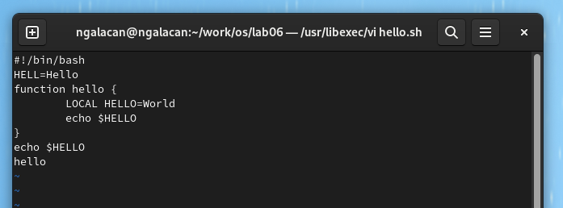
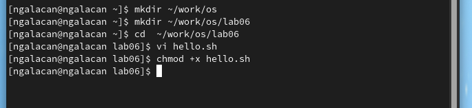
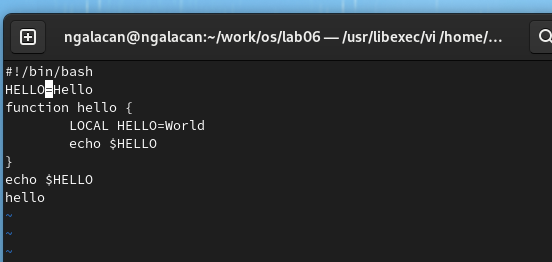
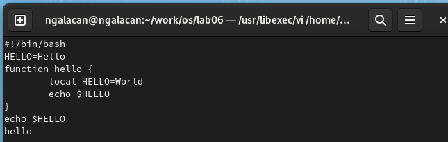
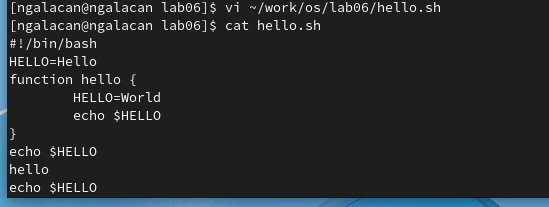

---
## Front matter
lang: ru-RU
title: Презентация по лабораторной работе №8
subtitle: Текстовый редактор vi
author:
  - Галацан Николай
institute:
  - Российский университет дружбы народов, Москва, Россия
  
## i18n babel
babel-lang: russian
babel-otherlangs: english

## Formatting pdf
toc: false
toc-title: Содержание
slide_level: 2
aspectratio: 169
section-titles: true
theme: metropolis
header-includes:
 - \metroset{progressbar=frametitle,sectionpage=progressbar,numbering=fraction}
 - '\makeatletter'
 - '\beamer@ignorenonframefalse'
 - '\makeatother'
---

## Докладчик

  * Галацан Николай
  * 1032225763
  * уч. группа: НПИбд-01-22
  * Факультет физико-математических и естественных наук
  * Российский университет дружбы народов

## Цель работы

Познакомиться с операционной системой Linux. Получить практические навыки работы с редактором vi, установленным по умолчанию практически во всех дистрибутивах.

## Выполнение лабораторной работы

**Задание 1. Создание нового файла с использованием vi:**

Создаю каталог с именем `~/work/os/lab06`. Перехожу во вновь созданный каталог. Вызываю vi: `vi hello.sh`. Нажимаю клавишу **i** и ввожу текст

{#fig:1 width=60%}

## Выполнение лабораторной работы

Перехожу в командный режим, а затем в режим последней строки после завершения ввода текста. Ввожу `:wq`, чтобы записать и выйти, нажимаю клавишу **Enter**.

Применяю команду `chmod +x hello.sh`

{#fig:2 width=60%}

## Выполнение лабораторной работы

**Задание 2. Редактирование существующего файла:**

Ввожу `vi ~/work/os/lab06/hello.sh`. Устанавливаю курсор стрелками в конец слова HELL второй строки. Перехожу в режим вставки нажатием клавиши **i** и заменяю на HELLO. Нажимаю **Esc**.

{#fig:3 width=60%}

## Выполнение лабораторной работы

Устанавливаю курсор на четвертую строку и стираю слово LOCAL нажатием клавиш **dw**. В режиме вставки набираю local, нажимаю **Esc**

{#fig:4 width=60%}

Устанавливаю курсор на последней строке файла нажатием **G**. Вставляю после неё строку `echo $HELLO`. Нажимаю **Esc** для перехода в командный режим.

## Выполнение лабораторной работы
 

Удаляю последнюю строку нажатием **dd**. Отменяю изменения нажатием **u**. 

Ввожу символ **:** и набираю `:wq` для записи изменений и выхода. Для проверки вывожу содержимое файла

{#fig:5 width=60%}

## Вывод

В ходе выполнения работы я познакомился с операционной системой Linux. Были получены практические навыки работы с редактором vi, установленным по умолчанию практически во всех дистрибутивах. Изучены основные режимы работы и команды vi.

