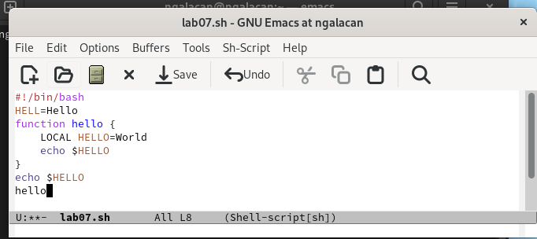
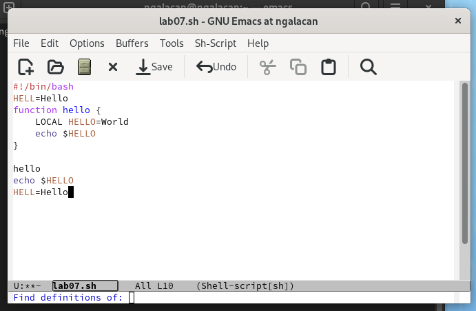
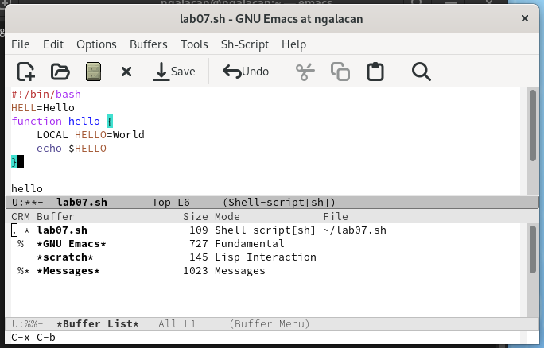
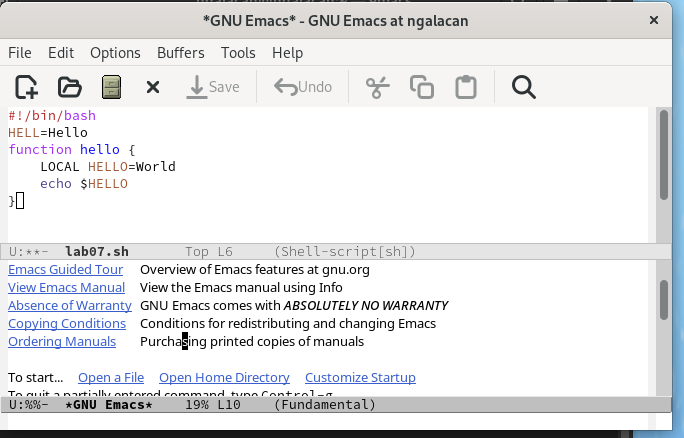
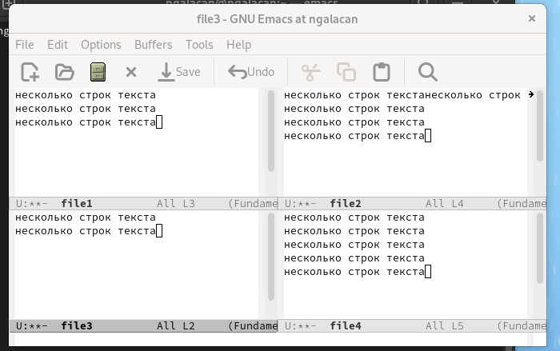
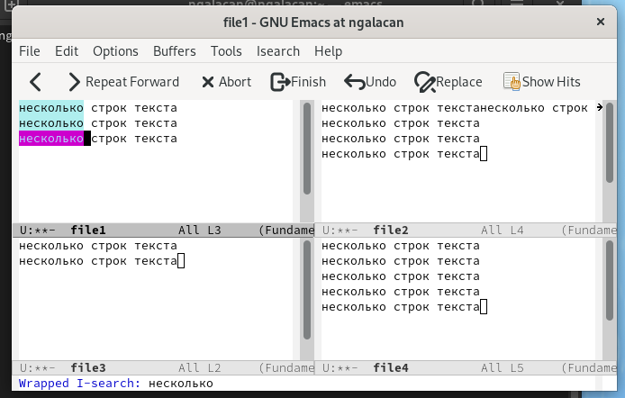
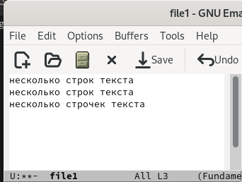
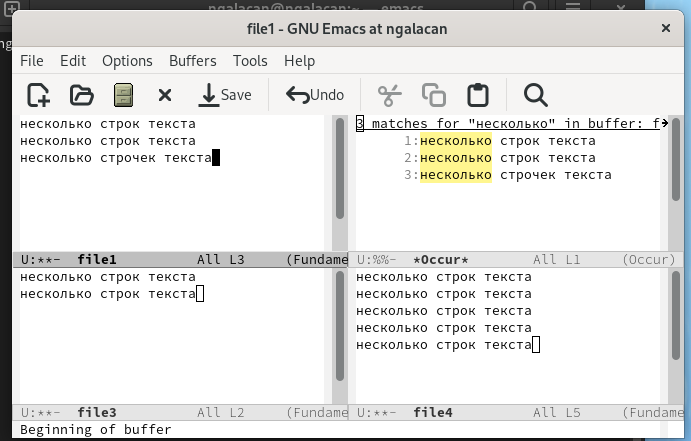

---
## Front matter
lang: ru-RU
title: Презентация по лабораторной работе №9
subtitle: Текстовый редактор emacs
author:
  - Галацан Николай
institute:
  - Российский университет дружбы народов, Москва, Россия
  
## i18n babel
babel-lang: russian
babel-otherlangs: english

## Formatting pdf
toc: false
toc-title: Содержание
slide_level: 2
aspectratio: 169
section-titles: true
theme: metropolis
header-includes:
 - \metroset{progressbar=frametitle,sectionpage=progressbar,numbering=fraction}
 - '\makeatletter'
 - '\beamer@ignorenonframefalse'
 - '\makeatother'
---

## Докладчик

  * Галацан Николай
  * 1032225763
  * уч. группа: НПИбд-01-22
  * Факультет физико-математических и естественных наук
  * Российский университет дружбы народов

## Цель работы

Познакомиться с операционной системой Linux. Получить практические навыки работы с редактором Emacs.

## Выполнение лабораторной работы

Создаю файл:  `C-x C-f`. Ввожу текст, сохраняю файл с помощью `C-x C-s`

{#fig:1 width=70%}

## Выполнение лабораторной работы

Редактирую текст: вырезаю целую строку (`C-k`), вставляю ее в конец файла (`C-y`). Выделяю вторую строку (`C-space`), копирую (`M-w`), вставляю в конец файла (`C-y`)

{#fig:2 width=40%}

Вновь выделяю эту область и на этот раз вырезаю её (`C-w`). Отменяю последнее действие (`C-/`).

## Выполнение лабораторной работы
 
:::::::::::::: {.columns align=center}
::: {.column width="50%"}

Использую команды по перемещению курсора (`C-a, C-e, M-<, M->`). Вывожу активные буферы (`C-x C-b`) 

{#fig:4 width=90%}

:::
::: {.column width="50%"}

Переключаюсь на окно (`C-x o`) и на другой буфер 

{#fig:5 width=100%}

:::
::::::::::::::

## Выполнение лабораторной работы

Делю фрейм на 4 части: на два окна по вертикали (`C-x 3`), а затем каждое из этих окон на две части по горизонтали (`C-x 2`). В каждом окне открываю новый файл (`C-x C-f`) и ввожу некоторый текст 

{#fig:7 width=50%}

## Выполнение лабораторной работы

Переключаюсь в режим поиска (`C-s`) и ищу слова. Переключаюсь между результатами поиска, нажимая `C-s` 

{#fig:8 width=50%}

## Выполнение лабораторной работы

В режиме поиска и замены нахожу слово "строк" и заменяю его на "строчек"

{#fig:9 width=50%}

## Выполнение лабораторной работы

Переключась на другой режим поиска (`M-s o`)

{#fig:10 width=60%}

## Вывод

В ходе выполнения работы я познакомился с операционной системой Linux. Были получены практические навыки работы с редактором emacs.

