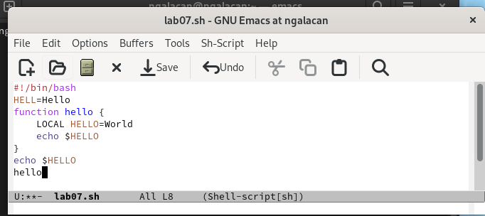
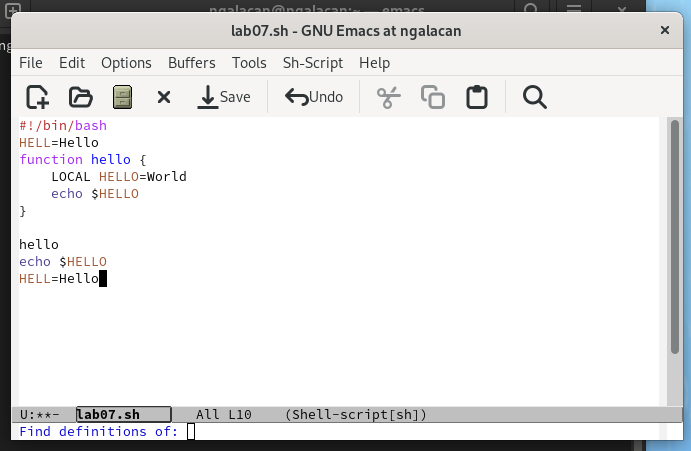
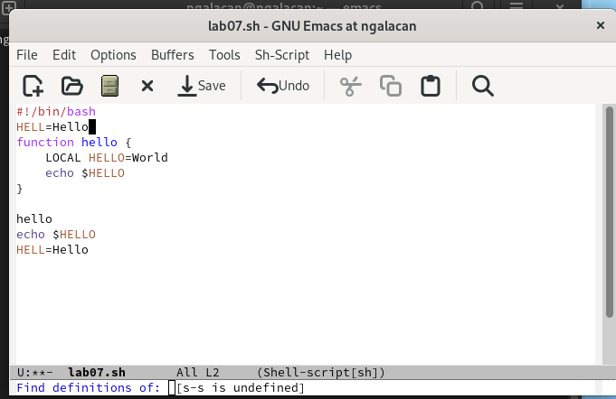
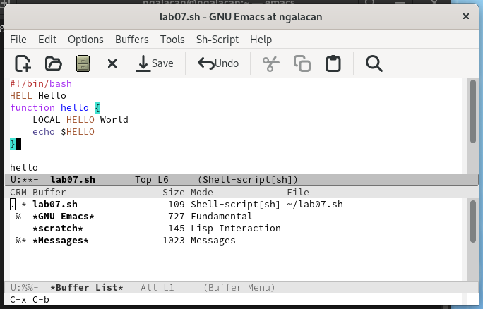
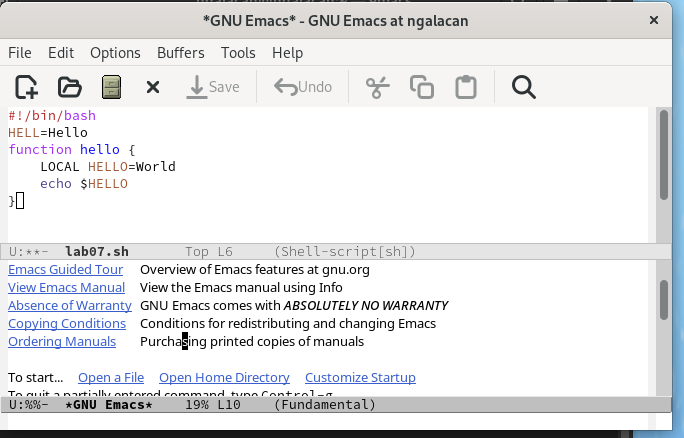
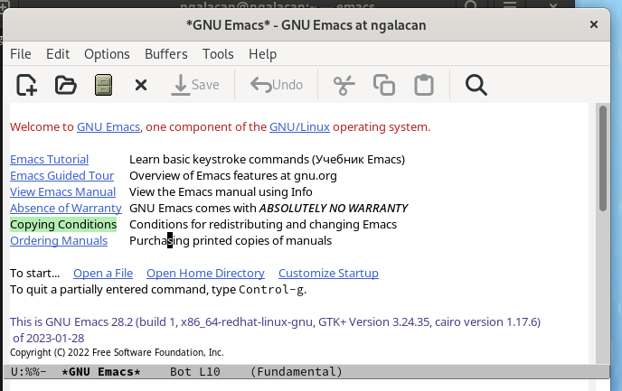
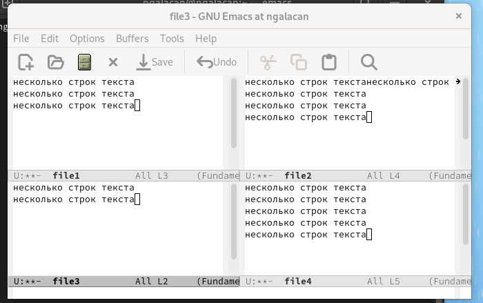
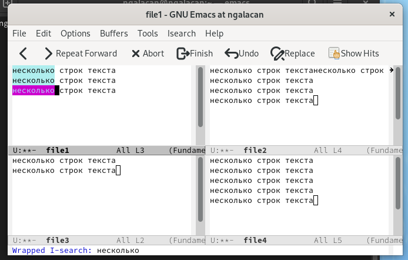
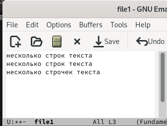
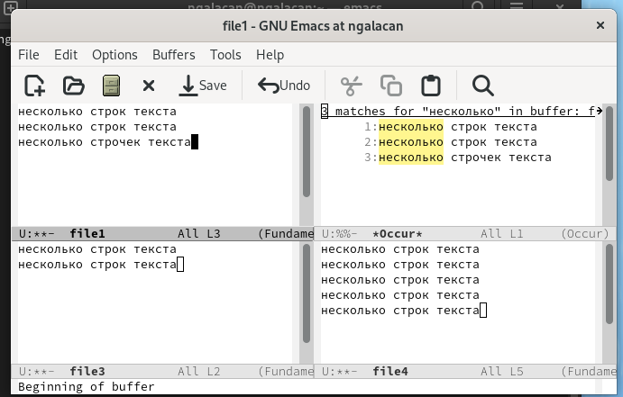

---
## Front matter
title: "Отчет по лабораторной работе №9"
subtitle: "Текстовый редактор emacs"
author: "Галацан Николай, НПИбд-01-22"

## Generic otions
lang: ru-RU
toc-title: "Содержание"

## Bibliography
bibliography: bib/cite.bib
csl: pandoc/csl/gost-r-7-0-5-2008-numeric.csl

## Pdf output format
toc: true # Table of contents
toc-depth: 2
lof: true # List of figures
fontsize: 12pt
linestretch: 1.5
papersize: a4
documentclass: scrreprt
## I18n polyglossia
polyglossia-lang:
  name: russian
  options:
	- spelling=modern
	- babelshorthands=true
polyglossia-otherlangs:
  name: english
## I18n babel
babel-lang: russian
babel-otherlangs: english
## Fonts
mainfont: PT Serif
romanfont: PT Serif
sansfont: PT Sans
monofont: PT Mono
mainfontoptions: Ligatures=TeX
romanfontoptions: Ligatures=TeX
sansfontoptions: Ligatures=TeX,Scale=MatchLowercase
monofontoptions: Scale=MatchLowercase,Scale=0.9
## Biblatex
biblatex: true
biblio-style: "gost-numeric"
biblatexoptions:
  - parentracker=true
  - backend=biber
  - hyperref=auto
  - language=auto
  - autolang=other*
  - citestyle=gost-numeric
## Pandoc-crossref LaTeX customization
figureTitle: "Рис."
tableTitle: "Таблица"
listingTitle: "Листинг"
lofTitle: "Список иллюстраций"
lolTitle: "Листинги"
## Misc options
indent: true
header-includes:
  - \usepackage{indentfirst}
  - \usepackage{float} # keep figures where there are in the text
  - \floatplacement{figure}{H} # keep figures where there are in the text
---

# Цель работы

Познакомиться с операционной системой Linux. Получить практические навыки работы с редактором Emacs.

# Задание

1. Открыть emacs.
2. Создать файл lab07.sh с помощью комбинации Ctrl-x Ctrl-f (C-x C-f).
3. Наберите текст:
```
!/bin/bash
HELL=Hello
function hello {
LOCAL HELLO=World
echo $HELLO
}
echo $HELLO
hello
```

4. Сохранить файл с помощью комбинации Ctrl-x Ctrl-s (C-x C-s).
5. Проделать с текстом стандартные процедуры редактирования, каждое действие должно осуществляться комбинацией клавиш.
- Вырезать одной командой целую строку (С-k).
- Вставить эту строку в конец файла (C-y).
- Выделить область текста (C-space).
- Скопировать область в буфер обмена (M-w).
- Вставить область в конец файла.
- Вновь выделить эту область и на этот раз вырезать её (C-w).
- Отмените последнее действие (C-/).
6. Научитесь использовать команды по перемещению курсора.
- Переместите курсор в начало строки (C-a).
- Переместите курсор в конец строки (C-e).
- Переместите курсор в начало буфера (M-<).
- Переместите курсор в конец буфера (M->).
7. Управление буферами.
- Вывести список активных буферов на экран (C-x C-b).
- Переместитесь во вновь открытое окно (C-x) o со списком открытых буферов и переключитесь на другой буфер.
- Закройте это окно (C-x 0).
- Теперь вновь переключайтесь между буферами, но уже без вывода их списка на экран (C-x b).
8. Управление окнами.
- Поделите фрейм на 4 части: разделите фрейм на два окна по вертикали (C-x 3), а затем каждое из этих окон на две части по горизонтали (C-x 2).
- В каждом из четырёх созданных окон откройте новый буфер (файл) и введите несколько строк текста.
9. Режим поиска
- Переключитесь в режим поиска (C-s) и найдите несколько слов, присутствующих в тексте.
- Переключайтесь между результатами поиска, нажимая C-s.
- Выйдите из режима поиска, нажав C-g.
- Перейдите в режим поиска и замены (M-%), введите текст, который следует найти и заменить, нажмите Enter , затем введите текст для замены. После того как будут подсвечены результаты поиска, нажмите ! для подтверждения замены.
- Испробуйте другой режим поиска, нажав M-s o. Объясните, чем он отличается от обычного режима?

# Выполнение лабораторной работы

Открываю emacs. Создаю файл `lab07.sh`, как указано в инструкции, используя комбинацию клавиш `C-x C-f`. Ввожу текст, сохраняю файл с помощью `C-x C-s`  (рис. @fig:1).

{#fig:1 width=70%}

Редактирую текст: вырезаю целую строку (`C-k`), вставляю ее в конец файла (`C-y`). Выделяю вторую строку (`C-space`), копирую (`M-w`), вставляю в конец файла (`C-y`) (рис. @fig:2).

{#fig:2 width=70%}

Вновь выделяю эту область и на этот раз вырезаю её (`C-w`). Отменяю последнее действие (`C-/`). Текст не изменился (рис. @fig:3).

{#fig:3 width=70%}

Использую команды по перемещению курсора (`C-a, C-e, M-<, M->`). Вывожу активные буферы (`C-x C-b`) (рис. @fig:4).

{#fig:4 width=70%}

Переключаюсь на окно (`C-x o`) со списком открытых буферов и переключаюсь на другой буфер (рис. @fig:5).

{#fig:5 width=70%}

Закрываю это окно (`C-x 0`). Теперь вновь переключаюсь между буферами, но уже без вывода их списка на экран (`C-x b`) (рис. @fig:6).

{#fig:6 width=70%}

Делю фрейм на 4 части: на два окна по вертикали (`C-x 3`), а затем каждое из этих окон на две части по горизонтали (`C-x 2`). В каждом окне открываю новый файл (`C-x C-f`) и ввожу некоторый текст (рис. @fig:7).

{#fig:7 width=70%}

Переключаюсь в режим поиска (`C-s`) и ищу слова. Переключаюсь между результатами поиска, нажимая `C-s` (рис. @fig:8).

{#fig:8 width=70%}

Выхожу из режима поиска, нажав `C-g`. В режиме поиска и замены нахожу слово "строк" и заменяю его на "строчек" (рис. @fig:9).

{#fig:9 width=70%}

Переключась на другой режим поиска (`M-s o`) (рис. @fig:10).

{#fig:10 width=70%}

Разница в том, что данный режим выводит результат поиска в соседнем фрейме, пронумеровывает совпадения и подсвечивает другим цветом.


# Выводы

В ходе выполнения работы я познакомился с операционной системой Linux. Были получены практические навыки работы с редактором emacs.


# Ответы на контрольные вопросы

1. Кратко охарактеризуйте редактор emacs.

Emacs это один из наиболее мощных и широко распространённых редакторов, используемых в мире Unix. По популярности он соперничает с редактором vi и его клонами. В зависимости от ситуации, Emacs может быть текстовым редактором; программой для чтения почты и новостей Usenet; интегрированной средой разработки (IDE); операционной системой и т.д. Всё это разнообразие достигается благодаря архитектуре Emacs, которая позволяет расширять возможности редактора при помощи языка Emacs Lisp. На языке C написаны лишь самые базовые и низкоуровневые части Emacs, включая полнофункциональный. интерпретатор языка Lisp. Таким образом, Emacs имеет встроенный язык программирования, который может использоваться для настройки, расширения и изменения поведения редактора. В действительности, большая часть того редактора, с которым пользователи Emacs работают в наши дни,написана на языке Lisp. 

2. Какие особенности данного редактора могут сделать его сложным для освоения новичком?

Основную трудность для новичков при освоении данного редактора могут составлять большое количество команд, комбинаций клавиш, которые не получится все запомнить с первого раза и поэтоупридется часто обращаться к справочным материалам. 

3. Своими словами опишите, что такое буфер и окно в терминологии emacs’а.

Буфер–это объект, представляющий собой текст. Если имеется несколько буферов, то редактировать можно только один. Обычно буфер считывает данные из файла или записывает в файл данные из буфера. Окно–это область экрана, отображающая буфер. При запуске редактора отображается одно окно, но при обращении к некоторым функциям могут открыться дополнительные окна. Окна Emacsи окна графической среды XWindow–разные вещи. Одно окно XWindowможет быть разбито на несколько окон в смысле Emacs, в каждом из которых отображается отдельный буфер. 

4. Можно ли открыть больше 10 буферов в одном окне?

Да, можно. 

5. Какие буферы создаются по умолчанию при запуске emacs?

При запуске Emacs по умолчанию создаются следующие буферы: «scratch» (буфер для несохраненного текста) «Messages» (журнал ошибок, включающий такжеинформацию, которая появляется в области EchoArea) «GNUEmacs» (справочный буфер о редакторе). 

6. Какие клавиши вы нажмёте, чтобы ввести следующую комбинацию C-c | и C-c C-|?

`C-c |`: сначала, удерживая «ctrl», нажимаю «c», после – отпускаю обе клавиши и нажимаю «|».

`C-c C-|`: сначала, удерживая «ctrl», нажимаю «с», после – отпускаю обе клавиши и, удерживая «ctrl», нажимаю «|». 

7. Как поделить текущее окно на две части?

Чтобы поделить окно на две части необходимо воспользоваться комбинацией «Ctrl-x 3»(по вертикали) или «Ctrl-x 2» (по горизонтали). 

8. В каком файле хранятся настройки редактора emacs?

Настройки Emacs хранятся в файле `.emacs`. 

9. Какую функцию выполняет клавиша <- и можно ли её переназначить?

По умолчанию клавиша «<-» удаляет символ перед курсором, но в редакторе её можно переназначить. Для этого необходимо изменить конфигурацию файла `.emacs`. 

10. Какой редактор вам показался удобнее в работе, vi или emacs? Поясните почему.

Более удобным я считаю редактор emacs, потому что он более привычный и удобный в использовании.


