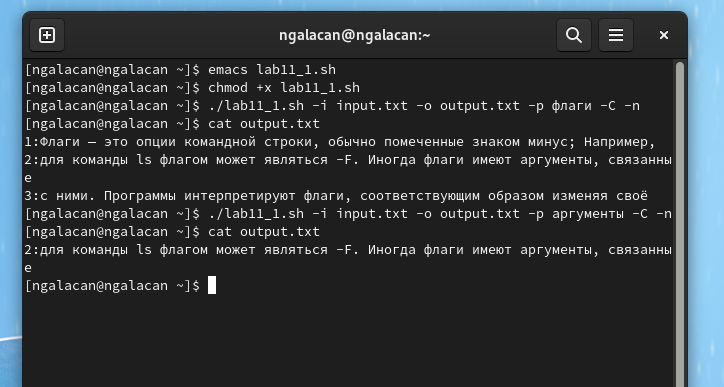
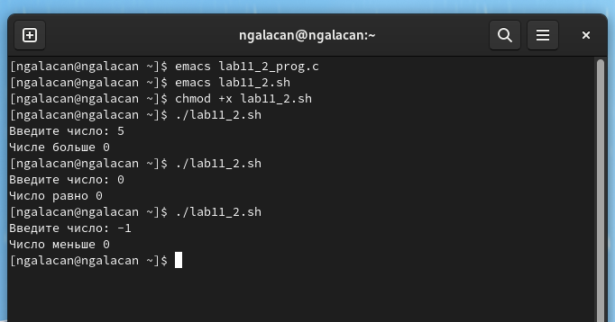
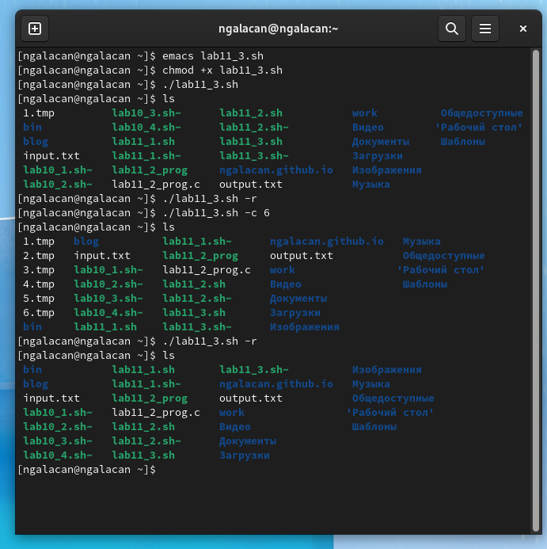
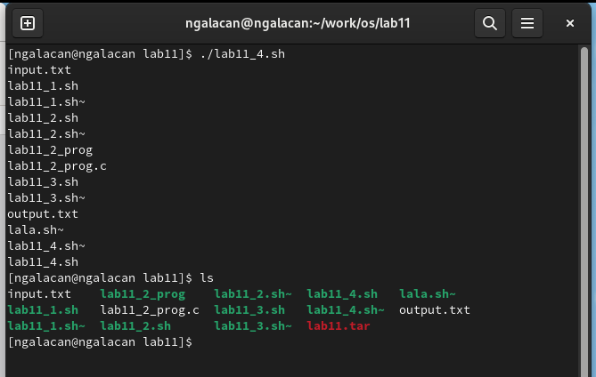

---
## Front matter
lang: ru-RU
title: Презентация по лабораторной работе №11
subtitle: Программирование в командном процессоре ОС UNIX. Ветвления и циклы.
author:
  - Галацан Николай
institute:
  - Российский университет дружбы народов, Москва, Россия
  
## i18n babel
babel-lang: russian
babel-otherlangs: english

## Formatting pdf
toc: false
toc-title: Содержание
slide_level: 2
aspectratio: 169
section-titles: true
theme: metropolis
header-includes:
 - \metroset{progressbar=frametitle,sectionpage=progressbar,numbering=fraction}
 - '\makeatletter'
 - '\beamer@ignorenonframefalse'
 - '\makeatother'
---


## Докладчик

  * Галацан Николай
  * 1032225763
  * уч. группа: НПИбд-01-22
  * Факультет физико-математических и естественных наук
  * Российский университет дружбы народов

## Цель работы

Изучить основы программирования в оболочке ОС UNIX. Научится писать более
сложные командные файлы с использованием логических управляющих конструкций
и циклов.

## Выполнение лабораторной работы


1. Используя команды getopts grep, написать командный файл, который анализирует
командную строку с ключами:
- -i inputfile — прочитать данные из указанного файла;
- -o outputfile — вывести данные в указанный файл;
- -p шаблон — указать шаблон для поиска;
- -C — различать большие и малые буквы;
- -n — выдавать номера строк.
а затем ищет в указанном файле нужные строки, определяемые ключом -p.

Открываю emacs. Создаю файл `lab11_1.sh`, набираю текст программы.

## Выполнение лабораторной работы

*Листинг программы №1:*
```
#!/bin/bash
iflag=0; oflag=0; pflag=0; Cflag=0; nflag=0;
while getopts i:o:p:Cn optletter
do case $optletter in
       i) iflag=1; ival=$OPTARG;;
       o) oflag=1; oval=$OPTARG;;
       p) pflag=1; pval=$OPTARG;;
       C) Cflag=1;;
       n) nflag=1;;
       *) echo "Недопустимая опция" $optletter
    esac
done

grep -i -n $pval $ival > $oval

```

## Выполнение лабораторной работы

Даю файлу право на исполнение и запускаю программу. 

{#fig:1 width=70%}

## Выполнение лабораторной работы

2. Написать на языке Си программу, которая вводит число и определяет, является ли оно
больше нуля, меньше нуля или равно нулю. Затем программа завершается с помощью
функции exit(n), передавая информацию в о коде завершения в оболочку. Команд-
ный файл должен вызывать эту программу и, проанализировав с помощью команды
$?, выдать сообщение о том, какое число было введено.

Создаю файл для программы на С `lab11_2_prog.c`, набираю текст программы. 

## Выполнение лабораторной работы

*Листинг программы на С:*
```
#include <stdio.h>
#include <stdlib.h>

int main(){
  printf("Введите число: ");
  int n;
  scanf("%d", &n);
  if (n<0) exit(1);
  if (n>0) exit(2);
  if (n==0) exit(3);
  return 0;
}

```


## Выполнение лабораторной работы

Создаю файл `lab11_2.sh`, набираю текст программы.

*Листинг программы №2:*
```
#!/bin/bash
gcc lab11_2_prog.c -o lab11_2_prog
./lab11_2_prog
exc=$?
case $exc in
    1) echo "Число меньше 0";;
    2) echo "Числе больше 0";;
    3) echo "Число равно 0";;
esac

```

## Выполнение лабораторной работы

Даю файлу право на исполнение и запускаю.
 
{#fig:2 width=70%}

## Выполнение лабораторной работы

3. Написать командный файл, создающий указанное число файлов, пронумерованных
последовательно от 1 до N (например 1.tmp, 2.tmp, 3.tmp,4.tmp и т.д.). Число файлов,
которые необходимо создать, передаётся в аргументы командной строки. Этот же ко
мандный файл должен уметь удалять все созданные им файлы (если они существуют).

Создаю файл `lab11_3.sh`, набираю текст программы. 

## Выполнение лабораторной работы

*Листинг программы №3:*
```
#!/bin/bash
while getopts c:r optletter
do case $optletter in
       c) cflag=1; cval=$OPTARG;;
       r) rflag=1;;
   esac
done
if ((rflag==0))
then for i in $(seq 1 $cval)
     do touch "$i.tmp"
     done
else for i in $(find -name "*.tmp")
     do rm $i;
     done
fi

```

## Выполнение лабораторной работы

Даю файлу право на исполнение и запускаю. В зависимости от введенной опции (c или r) скрипт создает или удаляет файлы с расширением `.tmp`

{#fig:3 width=40%}

## Выполнение лабораторной работы

4. Написать командный файл, который с помощью команды tar запаковывает в архив
все файлы в указанной директории. Модифицировать его так, чтобы запаковывались
только те файлы, которые были изменены менее недели тому назад (использовать
команду find)

Создаю файл `lab11_4.sh`, набираю текст программы. 


## Выполнение лабораторной работы

*Листинг программы №4:*
```
#!/bin/bash
files=$(find ./ -maxdepth 1 -mtime -7)
listing=""
for file in "$files" ; do
    file=$(echo "$file" | cut -c 3-)
    listing="$listing $file"
done
dir=$(basename $(pwd))
tar -cvf $dir.tar $listing


```


## Выполнение лабораторной работы

Даю файлу право на исполнение и запускаю

{#fig:4 width=60%}

## Вывод

Изучены основы программирования в оболочке ОС UNIX. Приобретены навыки написания более
сложных командных файлов с использованием логических управляющих конструкций
и циклов.


