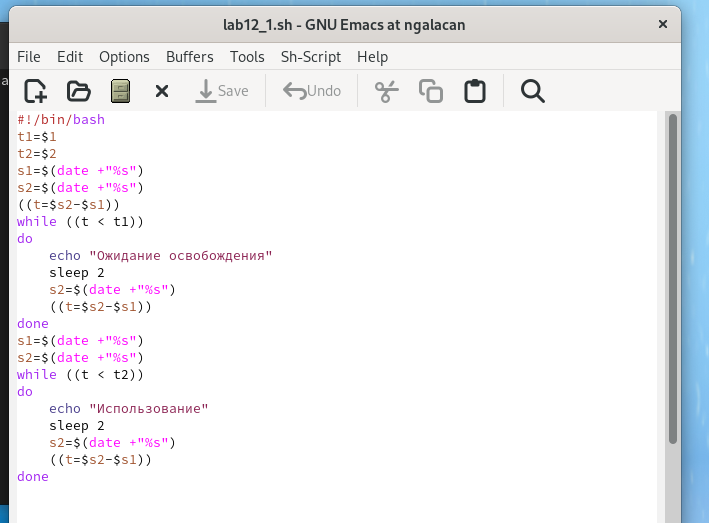
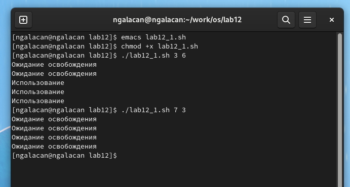
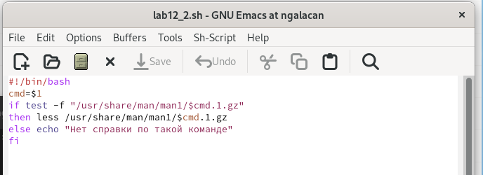
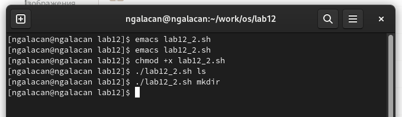
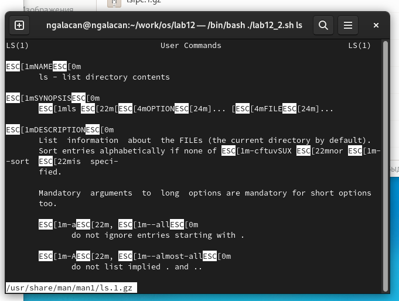
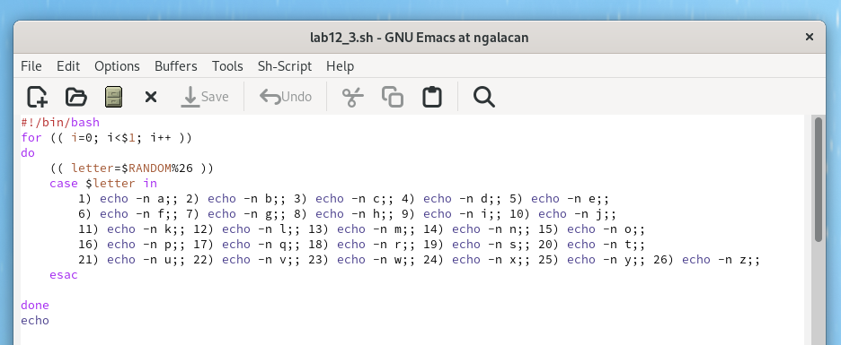
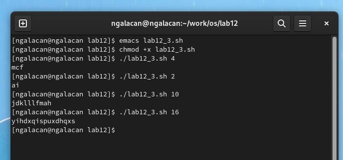

---
## Front matter
lang: ru-RU
title: Презентация по лабораторной работе №12
subtitle: Программирование в командном процессоре ОС UNIX. Расширенное программирование.
author:
  - Галацан Николай
institute:
  - Российский университет дружбы народов, Москва, Россия
  
## i18n babel
babel-lang: russian
babel-otherlangs: english

## Formatting pdf
toc: false
toc-title: Содержание
slide_level: 2
aspectratio: 169
section-titles: true
theme: metropolis
header-includes:
 - \metroset{progressbar=frametitle,sectionpage=progressbar,numbering=fraction}
 - '\makeatletter'
 - '\beamer@ignorenonframefalse'
 - '\makeatother'
---

## Докладчик

  * Галацан Николай
  * 1032225763
  * уч. группа: НПИбд-01-22
  * Факультет физико-математических и естественных наук
  * Российский университет дружбы народов

## Цель работы

Изучить основы программирования в оболочке ОС UNIX. Научиться писать более
сложные командные файлы с использованием логических управляющих конструкций
и циклов.

## Выполнение лабораторной работы

1. Написать командный файл, реализующий упрощённый механизм семафоров. 

{#fig:1 width=50%}

## Выполнение лабораторной работы

{#fig:2 width=70%}

## Выполнение лабораторной работы

2. Реализовать команду man с помощью командного файла.

{#fig:3 width=70%}

## Выполнение лабораторной работы

:::::::::::::: {.columns align=center}
::: {.column width="50%"}

{#fig:4 width=100%}

:::
::: {.column width="50%"}

{#fig:5 width=100%}

:::
::::::::::::::

## Выполнение лабораторной работы

3. Используя встроенную переменную $RANDOM, напишите командный файл, генерирующий случайную последовательность букв латинского алфавита.

{#fig:6 width=70%}

## Выполнение лабораторной работы

{#fig:7 width=70%}

## Вывод

Изучены основы программирования в оболочке ОС UNIX/Linux. Приобретен навык написания более сложных командных файлов с использованием логических управляющих конструкций и циклов.
