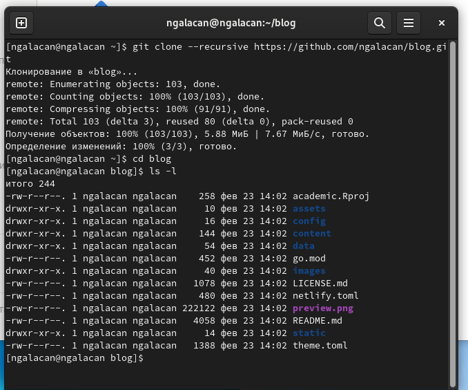
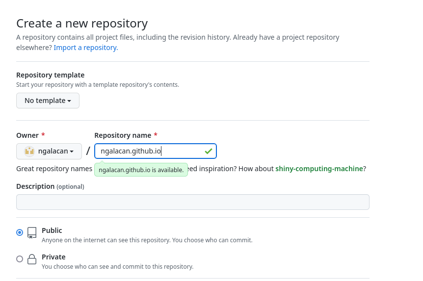
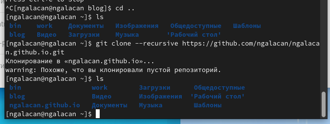
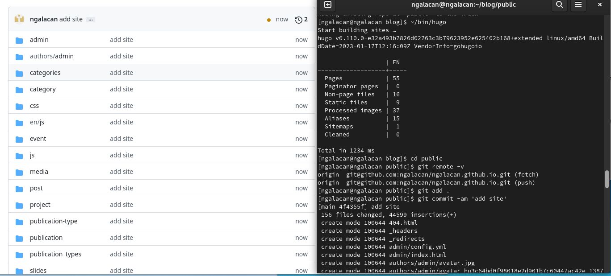

---
## Front matter
lang: ru-RU
title: Презентация по выполнению этапа №1
subtitle: Индивидуальный проект
author:
  - Галацан Николай
institute:
  - Российский университет дружбы народов, Москва, Россия

## i18n babel
babel-lang: russian
babel-otherlangs: english

## Formatting pdf
toc: false
toc-title: Содержание
slide_level: 2
aspectratio: 169
section-titles: true
theme: metropolis
header-includes:
 - \metroset{progressbar=frametitle,sectionpage=progressbar,numbering=fraction}
 - '\makeatletter'
 - '\beamer@ignorenonframefalse'
 - '\makeatother'
---

## Докладчик

  * Галацан Николай
  * 1032225763
  * уч. группа: НПИбд-01-22
  * Факультет физико-математических и естественных наук
  * Российский университет дружбы народов

## Актуальность

Статический генератор сайта — программа, которая из различных исходных файлов (картинок, шаблонов в разных форматах, текстовых файлов и т.п) генерирует статический HTML-сайт.

**Hugo** — один из самых популярных генераторов статических сайтов с открытым исходным кодом, написан на языке Go. Он подойдет как для создания лендингов, «многостраничников», так и для создания более сложных продуктов. Установить фреймворк можно практически на любую современную платформу.

## Цели и задачи

Реализовать шаблон сайта научного работника с помощью генератора статических сайтов Hugo.

## Выполнение индивидуального проекта

Скачиваю последнюю версию Hugo Extended для Linux с сайта `github.com/gohugoio/hugo/releases`.
Распаковываю архив и переношу исполняемый файл в созданный каталог bin в домашнем каталоге.

Создаю репозиторий blog в github.com на основе шаблона `https://github.com/wowchemy/starter-hugo-academic`

Клонирую данный репозиторий в домашний каталог, перехожу в него и с помощью команды `ls -l` проверяю, создались ли файлы.

## Выполнение индивидуального проекта

{ #fig:1 width=55% }

## Выполнение индивидуального проекта

С помощью команды `~/bin/hugo server` получаю ссылку на локальный сайт, открываю эту ссылку в браузере и вижу, что появился шаблон сайта.

Далее перехожу на github.com и создаю репозиторий `ngalacan.github.io`.

{ #fig:2 width=45% }

## Выполнение индивидуального проекта

Клонирую созданный репозиторий и снова проверяю правильность выполнения команды. Появляется каталог "ngalacan.github.io" 

{ #fig:3 width=60% }

Создаю ветку main. Создаю пустой файл и загружаю его в удаленный репозиторий чтобы убедиться в том, что репозиторий активирован. 

## Выполнение индивидуального проекта

Ввожу команду для подключения последнего созданного репозитория к папке "public" внутри "blog":

`git submodule add -b main git@github.com:ngalacan/ngalacan.github.io.git public`

Для успешного выполнения команды нужно убрать из игнорирования каталоги с названием "public" в `.gitignore`. Теперь все, что добавляется в public, будет оказываться в репозитории ngalacan.github.io. 

## Выполнение индивидуального проекта

Ввожу `~/bin/hugo`, тем самым запуская исполняемый файл. В каталоге public появляются файлы сайта. Загружаю их в удаленный репозиторий.

{ #fig:4 width=80% }

## Результаты

Открываю в браузере ссылку ngalacan.github.io и вижу успешно созданный шаблон сайта.

{ #fig:5 width=50% }

## Вывод

Были приобретены практические навыки создания статических сайтов с помощью генератора статических сайтов Hugo. Успешно создан шаблон сайта научного работника.

