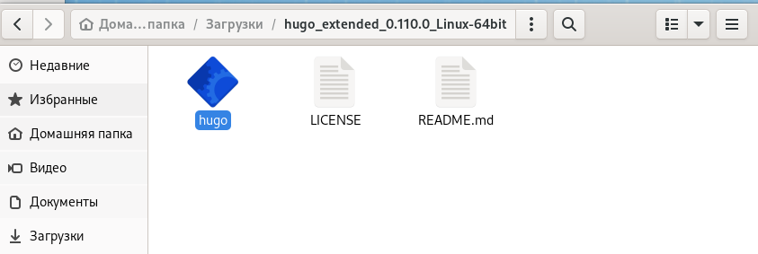
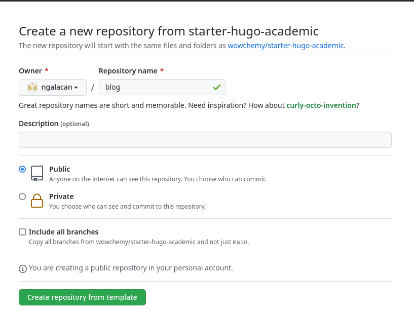
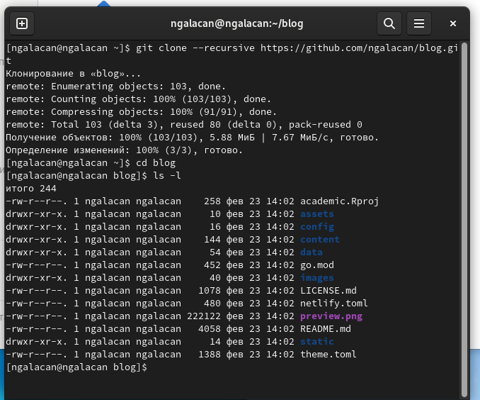
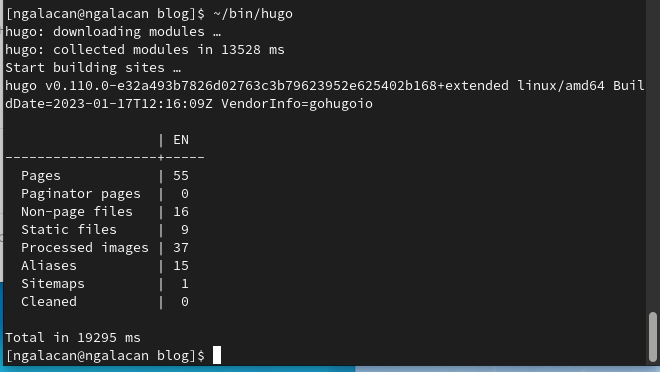
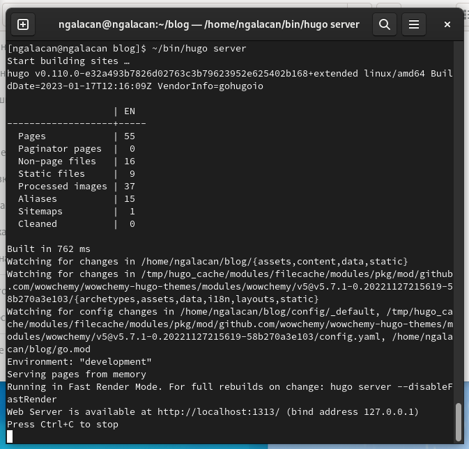
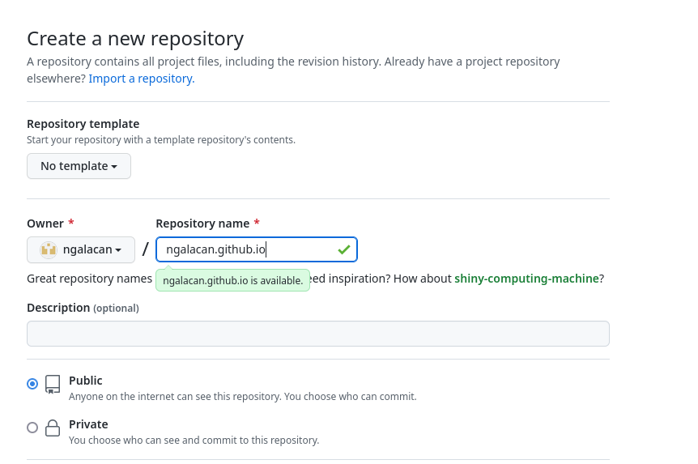
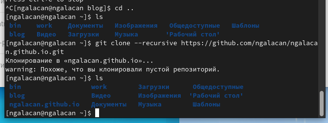
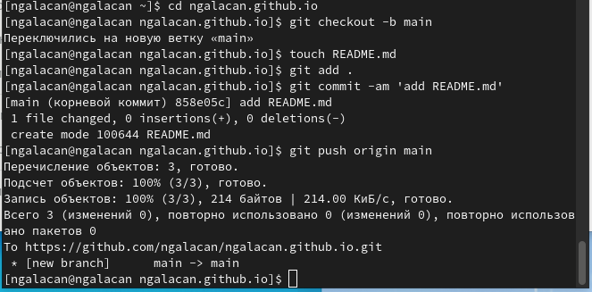
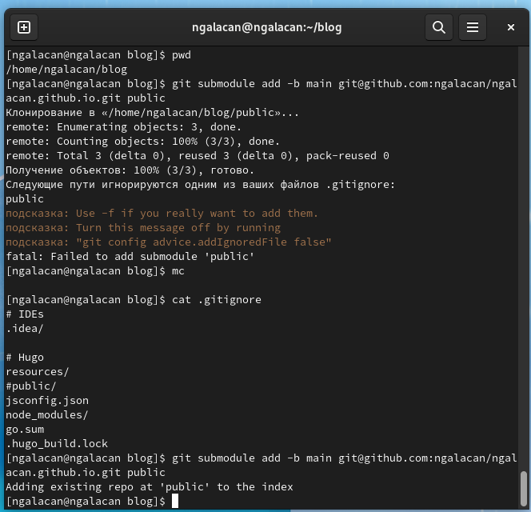
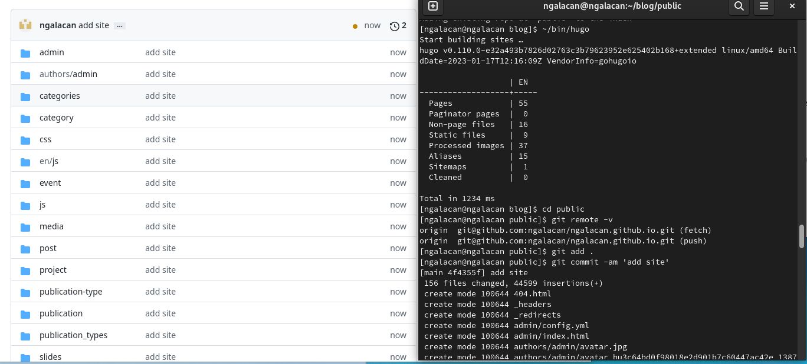

---
## Front matter
title: "Отчет по этапу №1"
subtitle: "Индивидуальный проект"
author: "Галацан Николай, НПИбд-01-22"

## Generic otions
lang: ru-RU
toc-title: "Содержание"

## Bibliography
bibliography: bib/cite.bib
csl: pandoc/csl/gost-r-7-0-5-2008-numeric.csl

## Pdf output format
toc: true # Table of contents
toc-depth: 2
lof: true # List of figures
fontsize: 12pt
linestretch: 1.5
papersize: a4
documentclass: scrreprt
## I18n polyglossia
polyglossia-lang:
  name: russian
  options:
	- spelling=modern
	- babelshorthands=true
polyglossia-otherlangs:
  name: english
## I18n babel
babel-lang: russian
babel-otherlangs: english
## Fonts
mainfont: PT Serif
romanfont: PT Serif
sansfont: PT Sans
monofont: PT Mono
mainfontoptions: Ligatures=TeX
romanfontoptions: Ligatures=TeX
sansfontoptions: Ligatures=TeX,Scale=MatchLowercase
monofontoptions: Scale=MatchLowercase,Scale=0.9
## Biblatex
biblatex: true
biblio-style: "gost-numeric"
biblatexoptions:
  - parentracker=true
  - backend=biber
  - hyperref=auto
  - language=auto
  - autolang=other*
  - citestyle=gost-numeric
## Pandoc-crossref LaTeX customization
figureTitle: "Рис."
tableTitle: "Таблица"
listingTitle: "Листинг"
lofTitle: "Список иллюстраций"
lolTitle: "Листинги"
## Misc options
indent: true
header-includes:
  - \usepackage{indentfirst}
  - \usepackage{float} # keep figures where there are in the text
  - \floatplacement{figure}{H} # keep figures where there are in the text
---

# Цель работы

Реализовать шаблон сайта научного работника с помощью генератора статических сайтов Hugo. 

# Теоретическое введение

Статический генератор сайта — программа, которая из различных исходных файлов (картинок, шаблонов в разных форматах, текстовых файлов и т.п) генерирует статический HTML-сайт. 

Hugo — один из самых популярных генераторов статических сайтов с открытым исходным кодом, написан на языке Go. Обладает удивительной скоростью и гибкостью. Он подойдет как для создания лендингов, «многостраничников» — так и для создания более сложных продуктов: блог, новостной портал и даже интернет-магазин. Установить фреймворк можно практически на любую современную платформу.

# Выполнение индивидуального проекта

Скачиваю последнюю версию Hugo Extended для Linux с сайта 

github.com/gohugoio/hugo/releases (рис. @fig:1). 

Распаковываю архив и переношу исполняемый файл в созданный каталог `bin` в домашнем каталоге.

{ #fig:1 width=70% }

Создаю репозиторий *blog* в github.com на основе шаблона  

https://github.com/wowchemy/starter-hugo-academic (рис. @fig:2).

{ #fig:2 width=70% }

Клонирую данный репозиторий в домашний каталог, перехожу в него и с помощью команды `ls -l` проверяю, создались ли файлы (рис. @fig:3).

{ #fig:3 width=70% }

Ввожу `~/bin/hugo` и запускаю исполняемый файл (рис. @fig:4). С помощью `mc` нахожу каталог `public` и удаляю его.

{ #fig:4 width=70% }

Ввожу `~/bin/hugo server` для получения ссылки на локальный сайт, открываю эту ссылку в браузере и вижу, что появился шаблон сайта (рис. @fig:5).

{ #fig:5 width=70% }

Далее перехожу на github.com и создаю репозиторий `ngalacan.github.io` (рис. @fig:6).

{ #fig:6 width=70% }

Использую `cd ..` для перехода на уровень выше от каталога "blog" и с помощью `ls` убеждаюсь в этом. Клонирую созданный репозиторий и снова проверяю правильность выполнения команды. Появляется каталог "ngalacan.github.io" (рис. @fig:7).

{ #fig:7 width=70% }

Перехожу в этот каталог. Ввожу команду `git checkout -b main` и тем самым создаю ветку main. Создаю пустой файл (`touch README.md`) и загружаю его в удаленный репозиторий чтобы убедиться в том, что репозиторий активирован (рис. @fig:8).

{ #fig:8 width=70% }

Проверяю удаленный репозиторий. Файл перенесен.

Перехожу в каталог "blog" и убеждаюсь, что нахожусь в нем. Ввожу команду для подключения последнего созданного репозитория к папке "public" внутри "blog":

`git submodule add -b main git@github.com:ngalacan/ngalacan.github.io.git public`

Появляется сообщение о том, что игнорируются каталоги с названием "public". С помощью `mc` редактирую файл ".gitignore" таким образом, чтобы каталоги не игнорировались. Проверяю с помощью `cat` и убеждаюсь, что строка `public` закомментирована. Вновь выполняю вышеуказанную команду и получаю сообщение об успешном подключении (рис. @fig:9).

{ #fig:9 width=70% }

Теперь все, что добавляется в public, будет оказываться в репозитории ngalacan.github.io. Ввожу `~/bin/hugo`, тем самым запуская исполняемый файл. В каталоге public появляются файлы сайта. Загружаю их в удаленный репозиторий (рис. @fig:10).

{ #fig:10 width=70% }

Открываю в браузере ссылку ngalacan.github.io и вижу успешно созданный шаблон сайта (рис. @fig:11).

{ #fig:11 width=70% }

# Выводы

Были приобретены практические навыки создания статических сайтов с помощью генератора статических сайтов Hugo. Успешно создан шаблон сайта научного работника.

