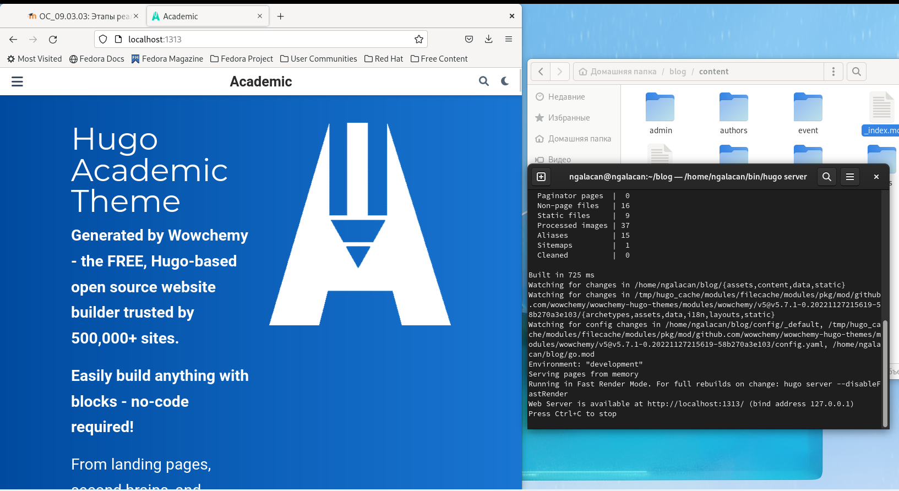
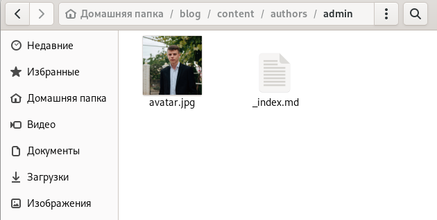
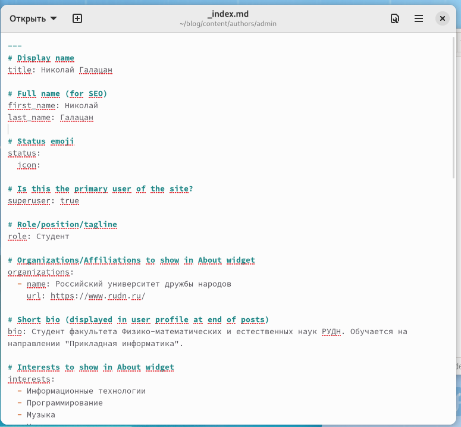
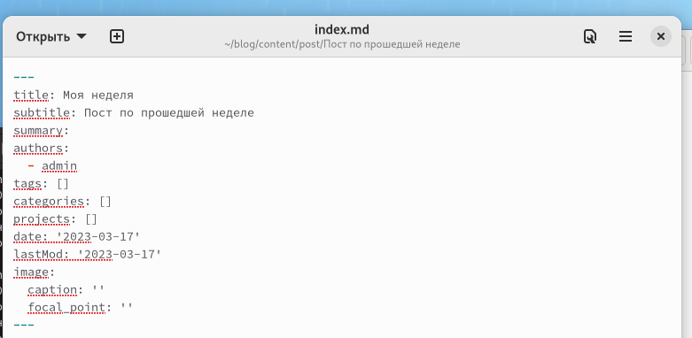
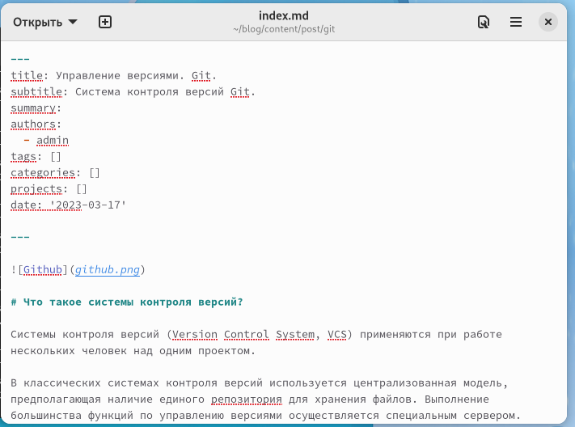
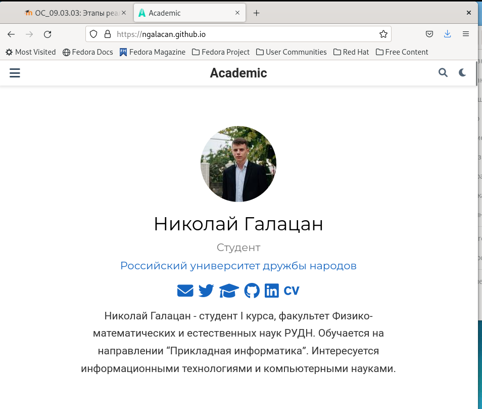

---
## Front matter
lang: ru-RU
title: Презентация по выполнению этапа №2
subtitle: Индивидуальный проект
author:
  - Галацан Николай
institute:
  - Российский университет дружбы народов, Москва, Россия

## i18n babel
babel-lang: russian
babel-otherlangs: english

## Formatting pdf
toc: false
toc-title: Содержание
slide_level: 2
aspectratio: 169
section-titles: true
theme: metropolis
header-includes:
 - \metroset{progressbar=frametitle,sectionpage=progressbar,numbering=fraction}
 - '\makeatletter'
 - '\beamer@ignorenonframefalse'
 - '\makeatother'
---

## Докладчик

  * Галацан Николай
  * 1032225763
  * уч. группа: НПИбд-01-22
  * Факультет физико-математических и естественных наук
  * Российский университет дружбы народов

## Цели и задачи

Добавить к сайту данные о себе. Написать два поста.

## Выполнение второго этапа

В первую очередь запускаю Hugo вводом команды `~/bin/hugo`. После этого получаю ссылку на локальный сайт с помощью команды `~/bin/hugo server` 

{ #fig:1 width=70% }

Открываю каталог `~/blog/content` и редактирую файл `_index.md`, чтобы убрать синюю шапку сайта, удалив соответствующий участок кода. 

## Выполнение второго этапа

{ #fig:2 width=70% }

## Выполнение второго этапа

Меняю данные о себе, редактируя файл `_index.md`. 

{ #fig:3 width=40% }

## Выполнение второго этапа

Для добавления постов перехожу в каталог `posts`. Удаляю имеющиеся шаблонные посты, создаю каталоги для новых постов с файлом `index.md` и редактирую их.

:::::::::::::: {.columns align=center}
::: {.column width="50%"}

{ #fig:4 width=100% }

:::
::: {.column width="50%"}

{ #fig:5 width=90% }

:::
::::::::::::::

## Выполнение второго этапа

После внесения всех изменений закрываю локальный сайт, вновь ввожу `~/bin/hugo` для сборки сайта, сохраняю и отправляю все изменения из каталогов `blog` и `public` на удаленный репозиторий, опубликовываю изменения. Спустя некоторое время на сайте в интернете обновляется информация.

## Результаты

Открываю в браузере ссылку ngalacan.github.io и вижу актуальную версию сайта

{ #fig:6 width=50% }

## Вывод

Были добавлены данные о себе (фотография, краткое описание владельца сайта, интересы, образование). Написаны два поста: пост по прошедшей неделе и управление версиями. Все изменения были опубликованы на сайте.

