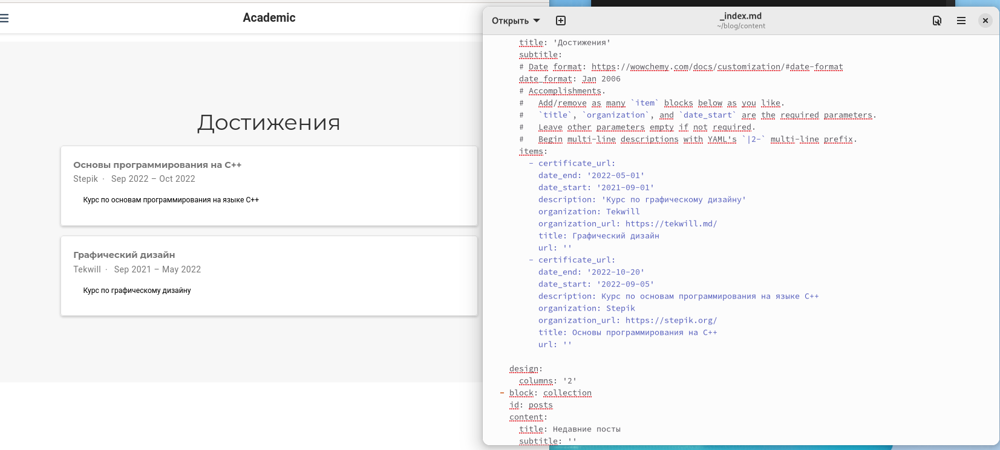
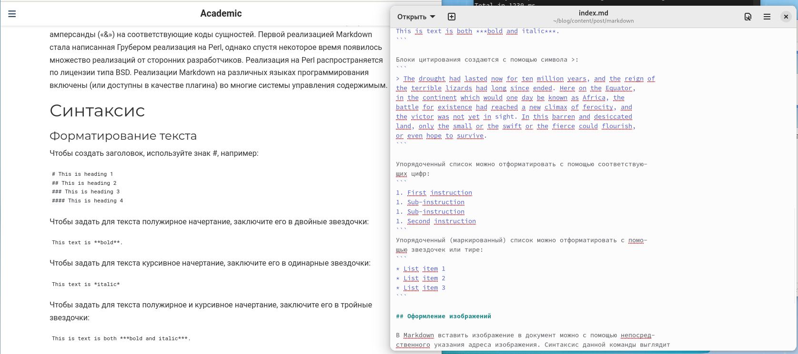
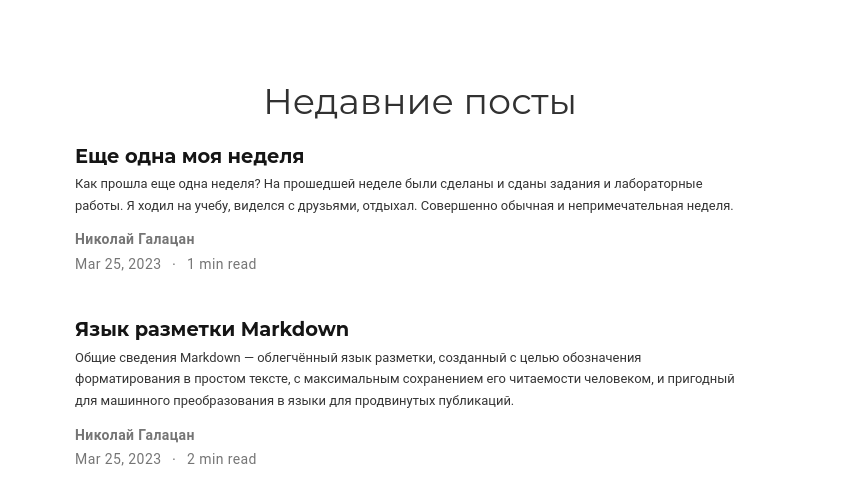

---
## Front matter
lang: ru-RU
title: Презентация по выполнению этапа №3
subtitle: Индивидуальный проект
author:
  - Галацан Николай
institute:
  - Российский университет дружбы народов, Москва, Россия

## i18n babel
babel-lang: russian
babel-otherlangs: english

## Formatting pdf
toc: false
toc-title: Содержание
slide_level: 2
aspectratio: 169
section-titles: true
theme: metropolis
header-includes:
 - \metroset{progressbar=frametitle,sectionpage=progressbar,numbering=fraction}
 - '\makeatletter'
 - '\beamer@ignorenonframefalse'
 - '\makeatother'
---

## Докладчик

  * Галацан Николай
  * 1032225763
  * уч. группа: НПИбд-01-22
  * Факультет физико-математических и естественных наук
  * Российский университет дружбы народов

## Цели и задачи

Добавить к сайту информацию о навыках, опыте, достижениях. Написать два поста.

## Выполнение третьего этапа

Запускаю Hugo вводом команды `~/bin/hugo`. После этого получаю ссылку на локальный сайт с помощью команды `~/bin/hugo server` 

Открываю файл `~/blog/content/_index.md`. Редактирую блок с навыками и опытом 

{ #fig:1 width=40% }

## Выполнение третьего этапа

Редактирую блок с достижениями 

{ #fig:2 width=80% }

## Выполнение третьего этапа

Для добавления постов перехожу в каталог `posts`. Создаю каталог для нового поста по прошедшей неделе с файлом `index.md` и редактирую его. Аналогичным образом создаю каталог и файл для поста про язык разметки Markdown, редактирую файл `index.md`.

{ #fig:3 width=70% }

## Выполнение третьего этапа

{ #fig:4 width=70% }

## Выполнение третьего этапа

После внесения всех изменений закрываю локальный сайт, вновь ввожу `~/bin/hugo` для сборки сайта, сохраняю и отправляю все изменения из каталогов `blog` и `public` на удаленный репозиторий, опубликовываю изменения. Спустя некоторое время на сайте в интернете обновляется информация.

## Результаты

 На сайте `ngalacan.github.io ` обновляется информация.

## Вывод

Были добавлены данные о себе (навыки, опыт, достижения). Написаны два поста: пост по прошедшей неделе и пост про язык разметки Markdown. Все изменения были опубликованы на сайте.

