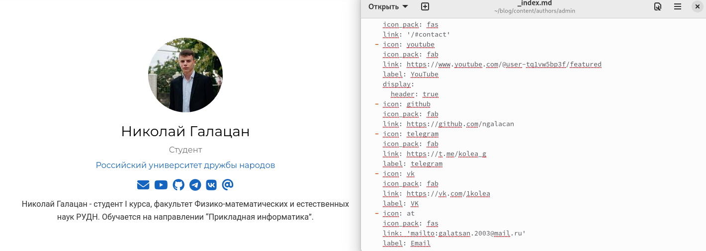
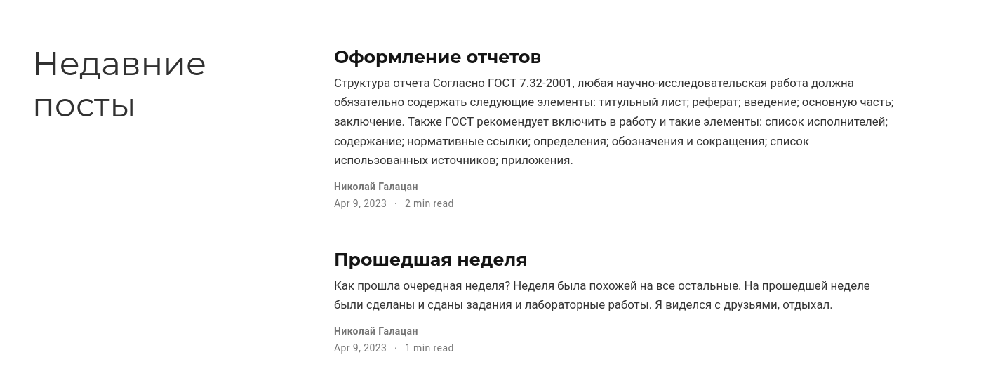

---
## Front matter
lang: ru-RU
title: Презентация по выполнению этапа №4
subtitle: Индивидуальный проект
author:
  - Галацан Николай
institute:
  - Российский университет дружбы народов, Москва, Россия

## i18n babel
babel-lang: russian
babel-otherlangs: english

## Formatting pdf
toc: false
toc-title: Содержание
slide_level: 2
aspectratio: 169
section-titles: true
theme: metropolis
header-includes:
 - \metroset{progressbar=frametitle,sectionpage=progressbar,numbering=fraction}
 - '\makeatletter'
 - '\beamer@ignorenonframefalse'
 - '\makeatother'
---

## Докладчик

  * Галацан Николай
  * 1032225763
  * уч. группа: НПИбд-01-22
  * Факультет физико-математических и естественных наук
  * Российский университет дружбы народов

## Цели и задачи

Добавить к сайту ссылки на научные и библиометрические ресурсы. Написать два поста.

## Выполнение работы

Запускаю Hugo вводом команды `~/bin/hugo`. После этого получаю ссылку на локальный сайт с помощью команды `~/bin/hugo server`. 

Открываю каталог `~/blog/content/authors/admin` и редактирую файл `index.md`, чтобы добавить необходимые данные. Редактирую блок со ссылками.

## Выполнение работы

{ #fig:1 width=95% }

## Выполнение работы

Для добавления постов перехожу в каталог `posts`. Создаю каталог для нового поста по прошедшей неделе с файлом `index.md` и редактирую его. Аналогичным образом создаю каталог и файл для поста про оформление отчетов, редактирую файл `index.md`. Проверяю изменения на сайте.

## Выполнение работы

{ #fig:2 width=70% }

## Выполнение работы

После внесения всех изменений закрываю локальный сайт, вновь ввожу `~/bin/hugo` для сборки сайта, сохраняю и отправляю все изменения из каталогов `blog` и `public` на удаленный репозиторий, опубликовываю изменения. Спустя некоторое время на сайте в интернете обновляется информация.

## Результаты

 На сайте `ngalacan.github.io ` обновляется информация.

## Вывод

Были добавлены ссылки на ресурсы. Написаны два поста: пост по прошедшей неделе и пост про оформление отчетов. Все изменения были опубликованы на сайте.

