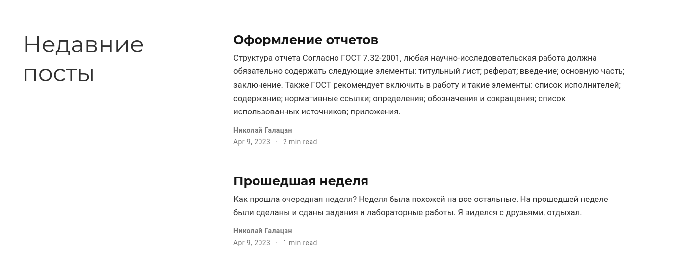

---
## Front matter
title: "Отчет по этапу №4"
subtitle: "Индивидуальный проект"
author: "Галацан Николай, НПИбд-01-22"

## Generic otions
lang: ru-RU
toc-title: "Содержание"

## Bibliography
bibliography: bib/cite.bib
csl: pandoc/csl/gost-r-7-0-5-2008-numeric.csl

## Pdf output format
toc: true # Table of contents
toc-depth: 2
lof: true # List of figures
fontsize: 12pt
linestretch: 1.5
papersize: a4
documentclass: scrreprt
## I18n polyglossia
polyglossia-lang:
  name: russian
  options:
	- spelling=modern
	- babelshorthands=true
polyglossia-otherlangs:
  name: english
## I18n babel
babel-lang: russian
babel-otherlangs: english
## Fonts
mainfont: PT Serif
romanfont: PT Serif
sansfont: PT Sans
monofont: PT Mono
mainfontoptions: Ligatures=TeX
romanfontoptions: Ligatures=TeX
sansfontoptions: Ligatures=TeX,Scale=MatchLowercase
monofontoptions: Scale=MatchLowercase,Scale=0.9
## Biblatex
biblatex: true
biblio-style: "gost-numeric"
biblatexoptions:
  - parentracker=true
  - backend=biber
  - hyperref=auto
  - language=auto
  - autolang=other*
  - citestyle=gost-numeric
## Pandoc-crossref LaTeX customization
figureTitle: "Рис."
tableTitle: "Таблица"
listingTitle: "Листинг"
lofTitle: "Список иллюстраций"
lolTitle: "Листинги"
## Misc options
indent: true
header-includes:
  - \usepackage{indentfirst}
  - \usepackage{float} # keep figures where there are in the text
  - \floatplacement{figure}{H} # keep figures where there are in the text
---

# Цель работы

Добавить к сайту ссылки на научные и библиометрические ресурсы. Написать два поста.

# Задание

* Зарегистрироваться на соответствующих ресурсах и разместить на них ссылки на сайте:
      
* Сделать пост по прошедшей неделе.

* Добавить пост на тему по выбору:
   1. Оформление отчёта.
   2. Создание презентаций.
   3. Работа с библиографией.

# Выполнение четвертого этапа

Запускаю Hugo вводом команды `~/bin/hugo`. После этого получаю ссылку на локальный сайт с помощью команды `~/bin/hugo server`. 

Открываю каталог `~/blog/content/authors/admin` и редактирую файл `index.md`, чтобы добавить необходимые данные. Редактирую блок со ссылками (рис. @fig:1). 

{ #fig:1 width=70% }

Для добавления постов перехожу в каталог `posts`. Создаю каталог для нового поста по прошедшей неделе с файлом `index.md` и редактирую его. Аналогичным образом создаю каталог и файл для поста про оформление отчетов, редактирую файл `index.md`. Проверяю изменения на сайте (рис. @fig:2). 

{ #fig:2 width=70% }

После внесения всех изменений закрываю локальный сайт, вновь ввожу `~/bin/hugo` для сборки сайта, сохраняю и отправляю все изменения из каталогов `blog` и `public` на удаленный репозиторий, опубликовываю изменения. Спустя некоторое время на сайте в интернете обновляется информация.

Ссылка на сайт: `ngalacan.github.io`

# Выводы

Были добавлены ссылки на ресурсы. Написаны два поста: пост по прошедшей неделе и пост про оформление отчетов. Все изменения были опубликованы на сайте.

